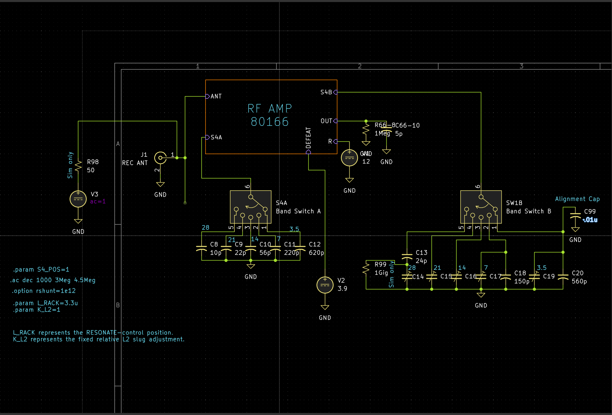
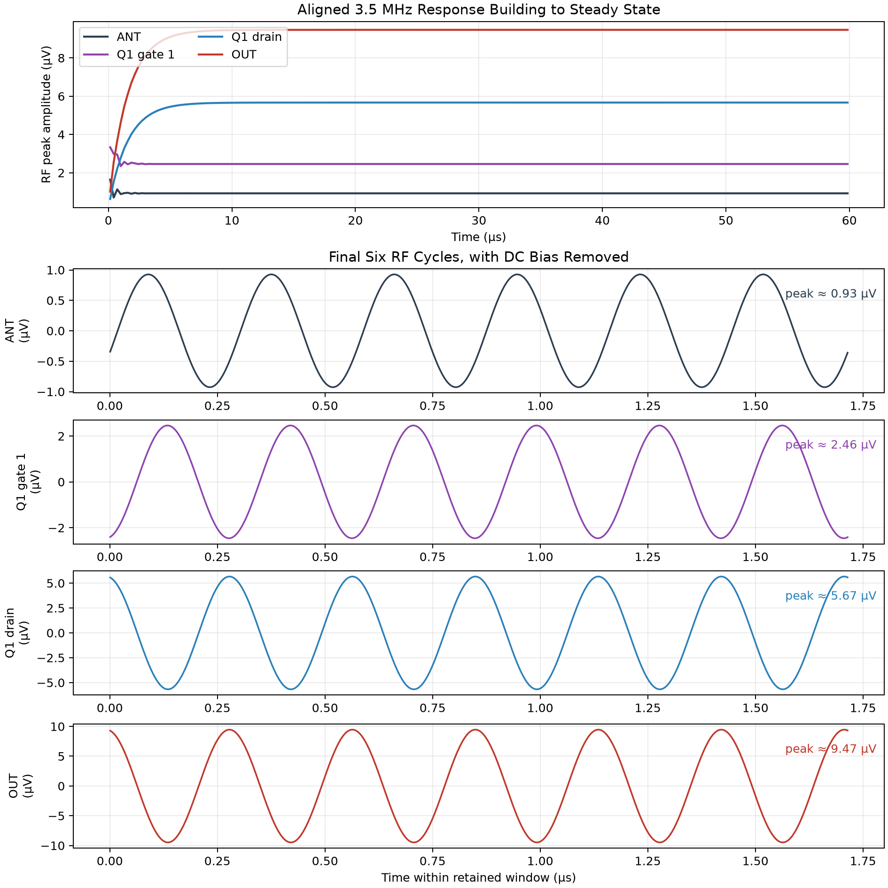
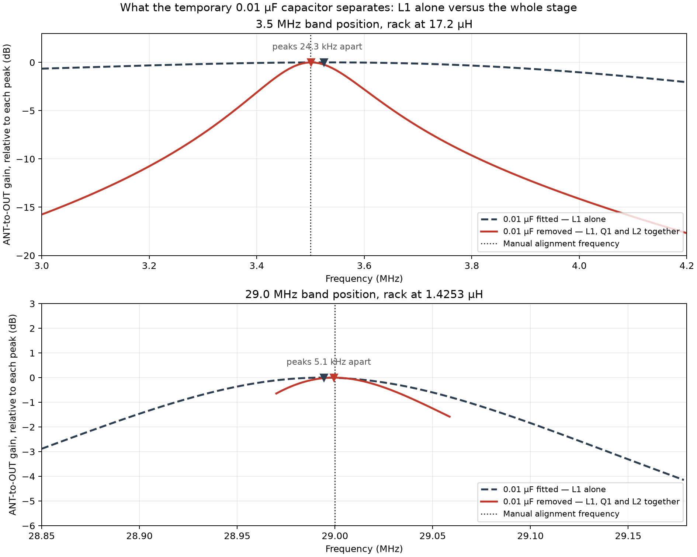
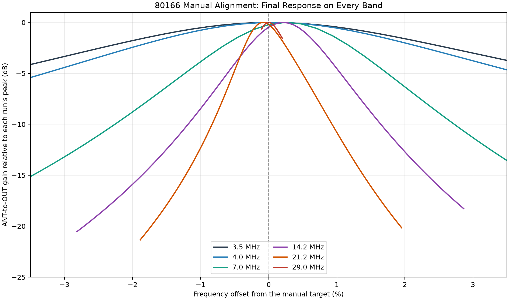
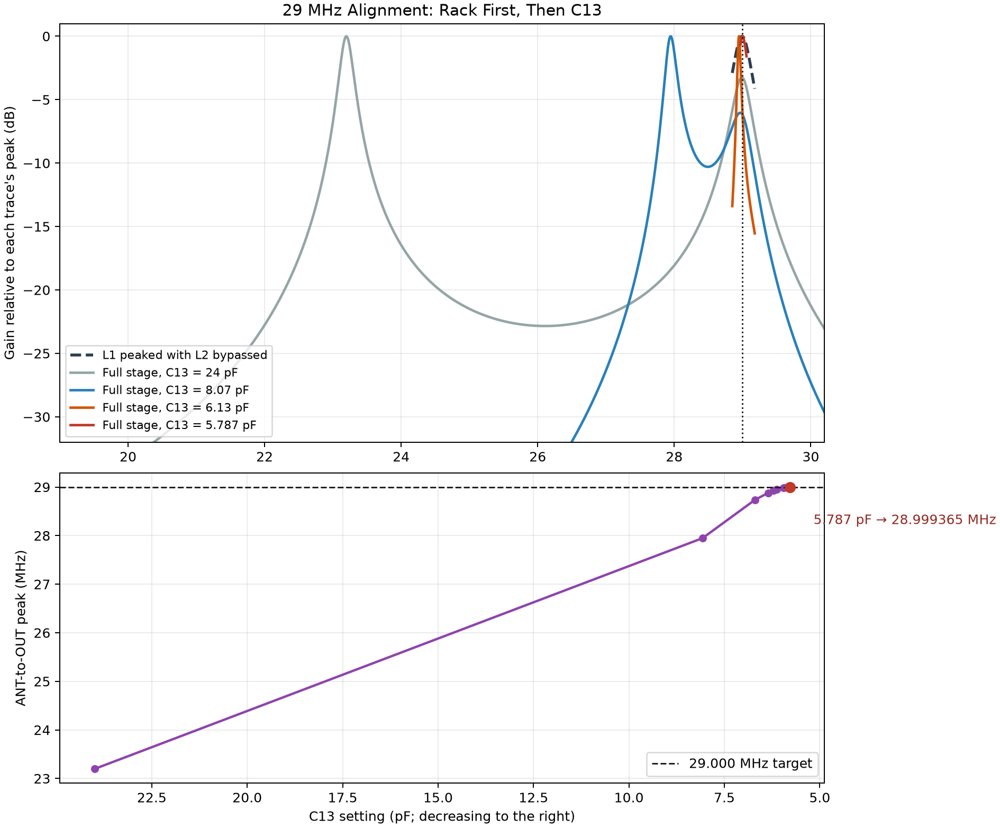
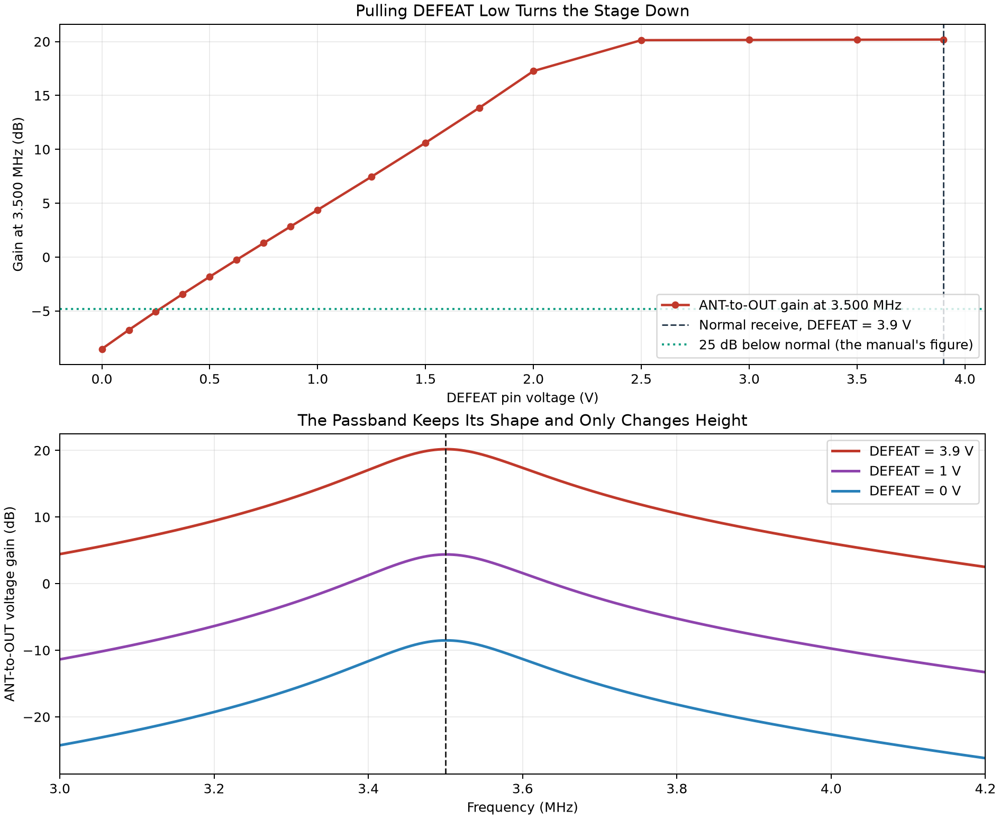
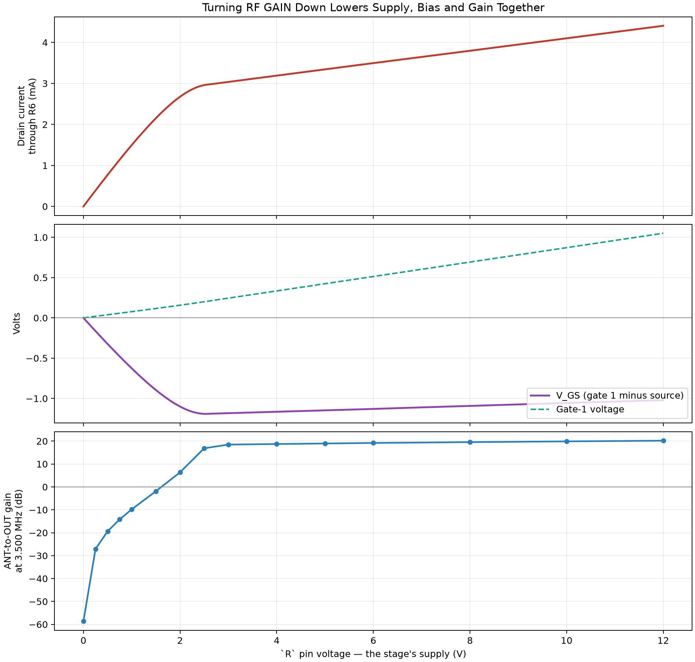
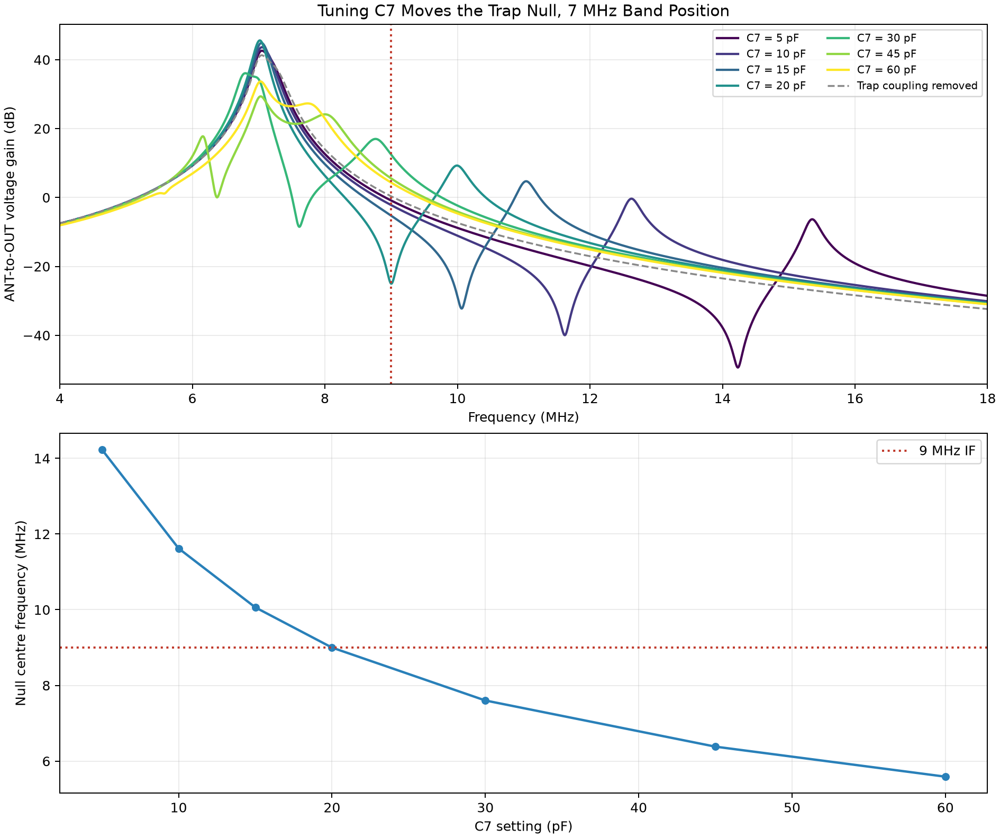
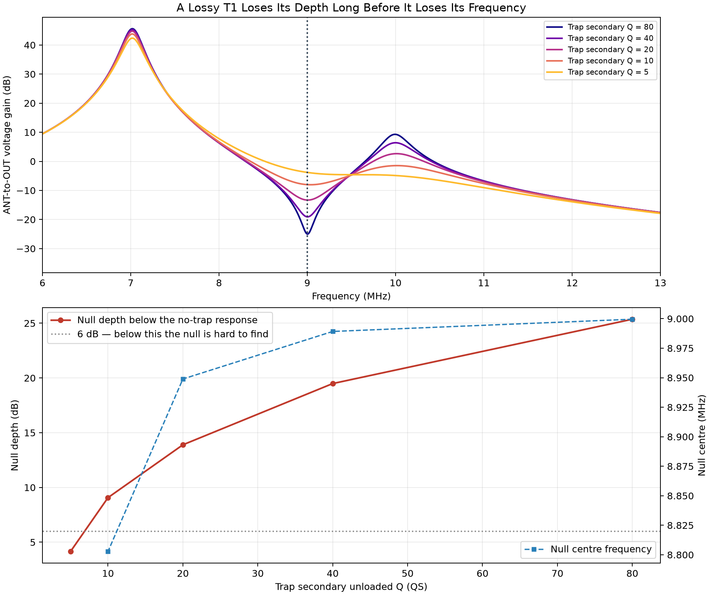
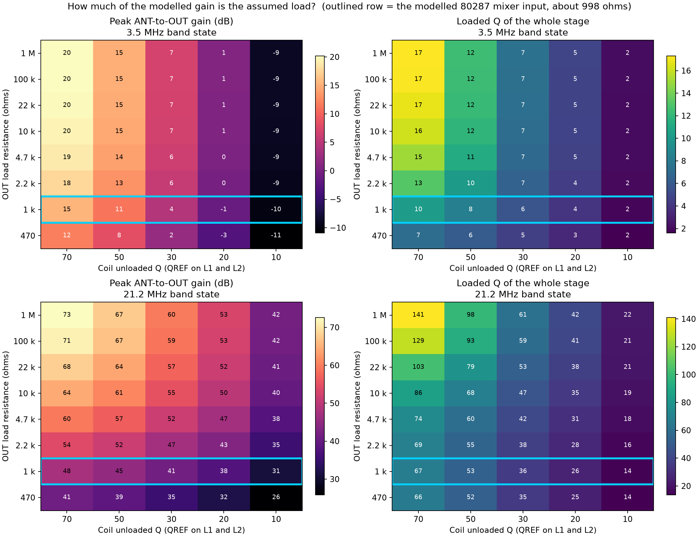

# 80166 RF Amplifier

## What the board is for

The 80166 assembly is the Triton 540 receiver's tunable RF amplifier. It is the
first active stage the antenna signal meets. Its job is not simply to make every
antenna signal larger. It does four things, in this order:

1. **Rejects 9 MHz.** A trap in the antenna lead removes signals sitting on the
   receiver's own 9 MHz intermediate frequency, which would otherwise leak
   straight through the rest of the receiver.
2. **Selects the wanted part of the band.** A tuned circuit ahead of the
   transistor favours the frequency chosen by the BAND switch and the RESONATE
   knob, and rejects everything else.
3. **Amplifies.** One dual-gate MOSFET adds gain.
4. **Selects again on the way out.** A second tuned circuit after the transistor
   repeats the filtering and couples the result to the following mixer.

Ten-Tec describes it as a "single stage, dual gate MOSFET" amplifier with tuned
input and output coils (PDF p. 24 / printed p. 3-8).

Selecting before amplifying matters as much as the amplifying does. A receiver
front end that amplified everything would hand the mixer a pile of strong
out-of-band signals, and the mixer would turn them into spurious products inside
the passband. Filtering first keeps the mixer working on the signal you actually
want.

## The board's pins

Everything in this document that is described as measurable is measured at one of
these pins. They are the accessible, safe places to put a probe: the board itself
lives on the RESONATE subchassis and its internal nodes are inside tuned circuits
that a probe will detune.

| Pin | Name | What it carries | Bench notes |
|:--|:--|:--|:--|
| `ANT` | Antenna | RF in from the antenna jack | Drive here, and measure the drive here — the input is not a flat 50 Ω |
| `R` | RF GAIN | The stage's **variable** DC supply, from the front-panel RF control | A DC point; measure with a meter, not a scope. [Simulation 5](#simulation-5-rf-gain-as-the-stages-supply) sweeps it |
| `DEFEAT` | Gain defeat | Gate-2 control voltage; the crystal calibrator pulls it low | DC point. [Simulation 4](#simulation-4-the-defeat-gain-reduction) sweeps it |
| `CAL` | Calibrator | The calibrator's marker signal, injected through the gimmick | Tiny signal, high impedance |
| `S4A` | Bandswitch, input | Connects the off-board fixed capacitor across L1 | RF hot; part of the tuned circuit |
| `S4B` | Bandswitch, output | Connects the off-board trimmer across L2 | The alignment `0.01 µF` clips to this terminal |
| `OUT` | Output | Selected, amplified RF to the 80287 mixer | Best scope point; the 80287 `Rx In` pin is the same net and is easier to reach |
| — | Ground | Chassis | Keep probe ground leads short |

`R` deserves emphasis because it is easy to mistake for a fixed 12 V rail. The
manual is explicit: *"The stage is powered through the RF GAIN terminal, which
connects to a variable DC voltage obtained from RF control."* Turning the
front-panel RF GAIN knob down literally lowers this board's supply voltage. The
service voltage table is taken with **RF CONTROL fully clockwise**, which is the
maximum-supply, maximum-gain condition, and every simulation in this document
uses that condition unless it says otherwise.

## How the circuit works, part by part

Signal path, in one line:

```text
ANT → C1 → T1/C7 9 MHz trap → L1 (tuned by S4A) → C2 → Q1 gate 1
    → Q1 drain → L2 (tuned by S4B) → OUT
```

### The antenna input and the 9 MHz trap: C1, T1, C7

**C1 (0.01 µF)** couples RF from the antenna jack onto the board while blocking
any DC path to the antenna. At 3.5 MHz its reactance is only about 4.5 Ω, so it
is effectively a piece of wire to RF and an open circuit to DC.

Reactance — the opposition a capacitor offers to an AC signal, measured in ohms —
falls as either frequency or capacitance rises:

$$
X_C = \frac{1}{2\pi fC}
$$

In plain text, **X_C = 1/(2πfC)**. This one formula explains most of the
capacitors on this board: the big ones (0.01 µF, 0.1 µF) have a few ohms or less
of reactance at these frequencies and act as RF short circuits, while the small
ones (1 pF to 620 pF) have hundreds to thousands of ohms and act as deliberate,
controlled couplings or as tuning elements.

**T1 and C7** form the 9 MHz trap. T1 is a small transformer whose primary
winding sits in series with the antenna path; **C7**, a 5–60 pF trimmer, resonates
its secondary. At the frequency where the secondary resonates, energy is drawn
out of the primary and the series path becomes strongly lossy — so a 9 MHz signal
arriving from the antenna is attenuated before it can reach anything else. Away
from 9 MHz the trap does almost nothing. The manual warns that the resulting null
is "very sharp" (PDF p. 24 / printed p. 3-8, "9 MHz Trap Adjustment," step 2),
which is another way of saying the trap is a high-Q circuit.

Why bother? 9 MHz is the receiver's intermediate frequency. A strong 9 MHz signal
picked up on the antenna could walk into the IF strip without ever being mixed,
appearing as a birdie or a permanent carrier that no amount of tuning removes.

### L1, the input preselector: L1, C3, and the switched capacitors

**L1** is the input tuned coil. It resonates with whatever capacitance the BAND
switch puts across it, and the RESONATE rack changes its inductance:

$$
f_0 = \frac{1}{2\pi\sqrt{LC}}
$$

In plain text, **f₀ = 1/(2π√(LC))**, where *L* is inductance and *C* is the
effective capacitance across the coil. Two consequences follow, and they are the
whole basis of tuning this board: more inductance or more capacitance gives a
lower resonant frequency; less of either gives a higher one.

**C3 (10 pF)** sits permanently across L1's top end and is never switched out. It
is the one L1/L2 tuning capacitor that lives on the PC board; the rest are
off-board on the bandswitch (PDF p. 24 / printed p. 3-8).

The BAND switch section `S4A` adds the coarse capacitance on top of it:

| `S4_POS` | Receiver band | Switched capacitor | Plus C3 | Total across L1 | Reactance at the band frequency shown |
|---:|---:|:--|--:|--:|--:|
| 1 | 3.5 MHz | C12, 620 pF | 10 pF | 630 pF | ≈ 72 Ω |
| 2 | 7 MHz | C11, 220 pF | 10 pF | 230 pF | ≈ 99 Ω |
| 3 | 14 MHz | C10, 56 pF | 10 pF | 66 pF | ≈ 172 Ω |
| 4 | 21 MHz | C9, 22 pF | 10 pF | 32 pF | ≈ 237 Ω |
| 5 | 28 MHz | C8, 10 pF | 10 pF | 20 pF | ≈ 284 Ω |

That last column is why the manual calls C3 "the 28.0 MHz antenna capacitor." On
80 m, 10 pF beside 620 pF moves the resonant frequency by under 1% and nobody
would notice. On 28 MHz it *doubles* the capacitance across the coil, so it is
effectively half of that band's tuning — hence the name, even though the part is
physically present on every band.

These are still component values, not the complete effective capacitance. Coil
self-capacitance, switch and wiring capacitance, and Q1's own input capacitance
all add to the totals above, which is why the LC formula gives a starting estimate
and a direction to move rather than a final answer.

**L1 is tapped.** Instead of connecting the antenna and the transistor across the
whole winding, each connects to a point partway along it. A tapped coil behaves
as an autotransformer: it matches a low-impedance antenna and a
particular-impedance gate to a resonant circuit without either of them dragging
the circuit's Q down. **Q** (quality factor) is the ratio of a resonant circuit's
centre frequency to its −3 dB bandwidth; high Q means a narrow, selective,
high-peak response, and anything that dissipates energy in the circuit — including
loads connected across it — lowers it.

**C2 (22 pF)** carries the selected signal from L1's tap to Q1's gate 1 and blocks
L1's DC path from disturbing the gate-1 bias. It is deliberately small: 22 pF is
about 2.1 kΩ at 3.5 MHz, so it also *loosens* the coupling between the tuned
circuit and the transistor, preserving L1's Q.

### Q1, the amplifier: Q1, R3, R4, R6, C5

**Q1 is an RCA 40823 dual-gate, N-channel, depletion-mode MOSFET**
([datasheet](datasheets/RCA_40823_SC-15_1971.pdf)). Unpacking that:

- **MOSFET** — a transistor controlled by a voltage on an insulated gate rather
  than by a current. Almost no current flows into the gate, so it barely loads the
  tuned circuit driving it.
- **Depletion-mode** — it conducts with zero gate-to-source voltage, and is turned
  *down* by making the gate more negative relative to the source. (An
  enhancement-mode device is the opposite: off until you turn it on.)
- **Dual-gate** — there are two control gates in series in the same channel. Gate 1
  takes the signal; gate 2 takes a separate control voltage. Drain current depends
  on both, which is exactly what you want for a gain-controlled RF stage. Gate 2
  also screens gate 1 from the drain, which reduces the stray capacitance that
  would otherwise feed drain signal back to the input and make the stage unstable.

**R4 (470 kΩ) and R3 (47 kΩ)** form a voltage divider that sets gate 1's DC
voltage. R4 runs from the decoupled supply node, so gate-1 bias is a fixed
fraction of the RF GAIN voltage:

$$
V_{G1} = V_\mathrm{supply}\left(\frac{47\ \mathrm{k\Omega}}{470\ \mathrm{k\Omega}+47\ \mathrm{k\Omega}}\right)
= 0.0909\,V_\mathrm{supply}
$$

**R6 (470 Ω)** is the source resistor. Drain current flowing through it lifts the
source above ground, which makes the gate *negative with respect to the source* —
this is **self-bias**, and it is self-correcting: more current raises the source
voltage, which turns the device down again. What the transistor actually responds
to is the difference:

$$
V_{GS} = V_{G1} - V_{S}
$$

**C5 (0.01 µF)** bypasses R6 — about 4.5 Ω of reactance at 3.5 MHz against R6's
470 Ω, so the source is held at RF ground even though it sits at about 1.6 V DC.
Without C5, the RF signal would develop a voltage across R6 that opposes the input
signal (negative feedback, called *source degeneration*) and the stage would lose
most of its gain. C5 is therefore not a minor part: it is what lets R6 set the DC
operating point without also throttling the RF gain.

The gain a stage like this produces is approximately:

$$
A_v \approx g_m Z_\mathrm{drain}
$$

where **g_m** — transconductance — is how many milliamps of drain current change
you get per volt of gate change, and *Z*_drain is the impedance the drain works
into. Both terms matter, and on this board the drain load is a resonant circuit
whose impedance is high only near resonance. That is why the stage is selective
*and* has gain at the same frequency.

### Gate 2 and the DEFEAT line: R1, C4

**Gate 2 is the gain-control electrode.** Raising it increases drain current and
transconductance; lowering it does the reverse.

**R1 (33 kΩ)** pulls the DEFEAT line, and therefore gate 2, toward ground when
nothing is driving it. **C4 (0.01 µF)** grounds gate 2 for RF while leaving the DC
control voltage untouched — about 4.5 Ω against R1's 33 kΩ at 3.5 MHz. An
RF-grounded gate 2 is what makes the stage behave like a cascode: the signal goes
in at gate 1, the output comes off the drain, and the grounded electrode between
them keeps the two from interacting. That is the stability half of the dual-gate
device's value; the gain-control half is the DC voltage on the same pin.

In normal reception the DEFEAT terminal sits at about 3.9 V. When the crystal
calibrator is energized, a TTL gate on that assembly pulls DEFEAT low, and the
manual says stage gain drops by about 25 dB (PDF p. 24 / printed p. 3-8). 25 dB is
a voltage ratio of about 18:1:

$$
\frac{V_2}{V_1} = 10^{-25/20} \approx \frac{1}{17.8}
$$

The purpose is not to mute the receiver. It suppresses the normal antenna-to-mixer
path while the calibrator is in use, so that antenna noise and strong stations
cannot mask or compete with the small calibration marker, and so that a strong
antenna signal cannot overload the mixer while the operator is trying to zero the
dial.

### The calibrator gimmick: C8 (on board), 1 pF estimated

The calibrator does not connect to Q1 through an ordinary wire. Its output lead is
simply laid close to an insulated wire going to Q1's drain. The two conductors form
a very small capacitor — the "gimmick" — so a little RF crosses the insulation and
nothing else does. There is no DC connection at all.

Loose coupling is the point. At 1 pF the gimmick is about 45 kΩ at 3.5 MHz and
5.5 kΩ at 29 MHz — high enough that it barely loads L2 or lowers its Q. A larger
capacitor would inject a stronger marker but would also detune the output circuit
and could overdrive the mixer. The combination of a nearly invisible injection
point and the 25 dB DEFEAT cut is what lets the calibrator be heard without the
calibrator becoming a permanent load on the RF amplifier.

The manual does not state the gimmick's capacitance. The 1 pF in the model is an
explicitly estimated starting value.

### L2, the tuned drain load and output: L2 and the switched trimmers

**L2** is the output tuned coil and it does two jobs at once. Near resonance it
presents a high impedance to Q1's drain, so the drain current swing becomes a large
voltage swing — this is the *Z*_drain in the gain formula above. At the same time
it filters, rejecting the broadband output Q1 produces outside the passband.

L2 is tapped like L1: Q1's drain connects at one point and `OUT` at another, so the
mixer's loading is transformed down and does not flatten the tuned circuit.

Bandswitch section `S4B` selects the output tuning:

| `S4_POS` | Receiver band | L2 trimmer (5–60 pF) | Fixed padding in parallel |
|---:|---:|:--|:--|
| 1 | 3.5 MHz | C19 | C20, 560 pF |
| 2 | 7 MHz | C17 | C18, 150 pF |
| 3 | 14 MHz | C16 | none |
| 4 | 21 MHz | C15 | none |
| 5 | 28 MHz | C13 | in series with C14, 30 pF |

The padding capacitors matter for a hobbyist reading the alignment procedure: on
80 m and 40 m the trimmer is only a small trimming fraction of a much larger fixed
capacitance, so turning it moves the peak comparatively little. On 28 MHz the
trimmer is in *series* with C14, so the two together always come out smaller than
either one; turning C13 changes an already-small effective capacitance, which is
why that band is the twitchiest to align.

### Powering the stage: R5, C6

**R5 (100 Ω)** and **C6 (0.1 µF)** are a supply decoupling network. C6 is about
0.45 Ω at 3.5 MHz, so it holds the junction of R5, C6, L2's cold end and R4 firmly
at RF ground. Two things follow:

- **L2 gets a proper RF return.** DC reaches Q1's drain through R5 and the
  continuous L2 winding, but at RF the winding's far end is grounded through C6, so
  the same winding is free to act as a resonant tank.
- **Amplified RF stays on the board.** R5 and C6 form a low-pass filter that keeps
  this stage's RF out of the receiver's supply wiring, where it could find its way
  into another stage and cause instability.

R4's connection to this node is the reason RF GAIN controls gain twice over: turning
the knob down lowers the drain supply *and* lowers gate-1 bias, reducing drain
current and transconductance together.

### Why two tuned circuits, and why they must track

L1 tunes the signal before Q1; L2 tunes it again after. Using both gives far better
rejection than one, and lets each be tapped for the impedance it actually faces —
antenna on one side, mixer on the other.

The price is that both must peak at the same frequency. They share one mechanical
rack, so RESONATE moves both slugs together; a slug is a movable magnetic core that
raises the coil's inductance as it goes further in and lowers it as it withdraws.
The BAND switch makes the coarse jump between bands by changing capacitance; the
rack tunes continuously within the band by changing both inductances.

If L1 peaks at one frequency and L2 at another, the stage loses gain even though
each circuit is resonating perfectly well. That failure is called **mistracking**,
and preventing it is what the entire alignment procedure exists to do.

These functions are documented in the *Triton IV Model 540 Owner's Manual*, PDF
page 24 / printed page 3-8, under "80166 R.F. Amplifier." The board schematic and
transistor-voltage table are on PDF page 25 / printed page 3-9. The off-board
bandswitch capacitors appear on PDF page 21 / printed page 3-4.

## What a healthy board looks like

Before any simulation or measurement, this is what should be true of a working
80166:

- With RF GAIN fully clockwise and the receiver in receive, Q1's four pins sit near
  11.4 V (drain), 3.9 V (gate 2), 1.1 V (gate 1) and 1.6 V (source).
- With the transmitter keyed, all four go to approximately zero and the stage draws
  no current.
- A signal at the antenna jack produces a larger signal at `OUT`, and turning
  RESONATE moves the frequency at which that is true.
- The ANT-to-OUT response is a single, symmetric hump — not flat-topped and not
  double-humped.
- Turning RF GAIN down reduces the output smoothly.
- Energizing the calibrator drops the antenna-path gain by roughly 25 dB.
- A 9 MHz signal at the antenna jack produces a deep, sharp notch at `OUT`.

The simulations below test all seven. The first four are covered by Simulations 1
to 3; the DEFEAT reduction is Simulation 4, the RF GAIN behaviour is
Simulation 5, and the 9 MHz notch is Simulation 6.

## Alignment: what each adjustment is actually doing

The manual's procedure (PDF p. 24 / printed p. 3-8) reads as a list of knobs to
turn. Underneath it, there are only ever **two** adjustments and **one** problem.

The problem is mistracking: L1 and L2 must peak together across the rack's whole
travel, not just at one spot.

The two adjustments are:

| Adjustment | What it physically changes | What it fixes |
|:--|:--|:--|
| The 3.5 MHz trimmer, **C19** | L2's capacitance | Where L2 peaks at the **low** end of the band |
| The **L2 slug** | L2's inductance, and how fast L2's frequency moves as the rack turns | How well L2 *follows* L1 toward the **high** end |

Two adjustments, two frequencies to satisfy (3.5 and 4.0 MHz) — that is exactly the
number of degrees of freedom needed to make two tuned circuits agree at two points,
and if they agree at two points they agree tolerably everywhere in between. That is
why the manual alternates between the two frequencies and says to repeat "until
there is no increase in output." Each adjustment slightly disturbs the other, so the
pair converges rather than being set once.

L1 is not adjusted at all. The manual is explicit: *"(L1 should not need any change
from factory setting.)"* L1 is the reference; L2 is made to follow it.

### The temporary 0.01 µF capacitor

For the first half of each band adjustment, the manual clips a temporary 0.01 µF
capacitor from that band's L2 trimmer terminal to chassis. At 3.5 MHz that
capacitor is about 4.5 Ω, and at 29 MHz about 0.55 Ω — thousands of times smaller
than the 5–620 pF tuning capacitors it sits beside. It swamps L2's tuning
capacitance, so L2 no longer resonates anywhere near the band.

That leaves the response dominated by L1 alone, and **that** is the whole trick:
without it, a sweep from `ANT` to `OUT` shows the product of L1, Q1 and L2 and you
cannot tell which coil is off. With it, you can set L1 (via the rack) on its own,
then remove it and set L2 against a known-good L1.

In the simulation this temporary part is called C99.



**Figure 66-3.** Placement of the temporary 0.01 µF L2-bypass capacitor for the 3.5 MHz alignment step

Figure 66-3 shows the exact connection: C99 goes from the selected 3.5 MHz contact
on S4B to chassis ground. It is not connected across L1, across Q1, or at the
antenna input.

> The manual writes this capacitor as ".01 mF". In 1970s US usage `mF`/`mfd` means
> **microfarad**. It is 0.01 µF, not a typo.

### The manual's steps, and what each one is for

| Manual step | What you do | What it is doing |
|---:|:--|:--|
| 1 | Connect an AC meter to the receiver's **audio** output | Uses the whole receiver as the detector, so no probe touches the RF board and nothing is detuned |
| 2 | Generator on the antenna terminal, T/R-REC switch to T/R, BAND and generator to 3.5 MHz | Establishes the known input the alignment is referenced to |
| 3 | Clip the 0.01 µF to the 3.5 MHz trimmer terminal; generator at several hundred µV; peak RESONATE, keeping the level low enough that the S-meter does not register | Swamps L2, so peaking RESONATE sets **L1** alone. The S-meter caution matters: if the AGC starts acting, it reduces gain as the signal rises and flattens the very peak you are hunting for |
| 4 | Remove the 0.01 µF, drop the generator to about 1 µV, peak the **3.5 MHz trimmer** | Restores L2 and sets its capacitance to agree with L1 at the low end. The level drops because the stage is now at full gain again — 1 µV keeps the receiver out of AGC and out of compression |
| 5 | Move to 4.0 MHz, refit the capacitor, re-peak RESONATE, remove it, then peak the **L2 slug** | Same split, at the other end of the band. Here the slug — L2's inductance — is the adjustment, because it controls how L2's frequency *moves with* the rack |
| 6 | Repeat 4 and 5 until nothing improves | Converges the two-point fit. This is the step that "tracks L2 to L1" |
| 7 | 7.0 MHz: same split, adjust only the 7.0 MHz trimmer. *"No further adjustment of L2 is necessary"* | The mechanical L1/L2 relationship is already set. Each higher band has its own trimmer, so its error is corrected without touching the slug and undoing the low-band work |
| 8 | Repeat for 14.200, 21.200 and 29.000 MHz | Same reasoning, band by band |

Note that the 28 MHz position is aligned at **29.000 MHz**, not 28.000 MHz.

### The 9 MHz trap adjustment

The manual treats this as a separate procedure: set the receiver to 7.0 MHz, peak
RESONATE, then — *without changing those settings* — move the generator to 9 MHz,
raise its level until the signal is heard, and tune C7 for a null.

Three things are worth explaining:

- **Why 7.0 MHz?** The trap has to be adjusted while you can actually hear its
  effect. On the 7 MHz band position, the front end's response is close enough to
  9 MHz that unwanted 9 MHz energy still gets through to be heard; a band position
  further away would attenuate the 9 MHz test signal for the wrong reason and you
  would be nulling something you could not hear in the first place.
- **Why raise the generator level?** You are trying to hear a signal the receiver is
  designed to reject. It has to be made loud enough to find before it can be nulled.
- **Why is the null so sharp?** The trap is a high-Q resonant circuit, so its
  rejection is deep but very narrow. Use an insulated tuning wand: a metal
  screwdriver near a high-Q coil adds its own capacitance and shifts the very null
  you are setting.

The trap null is the one adjustment on this board whose *depth* matters more than
its position. Getting the null on frequency but shallow means the trap's Q has
fallen — a lossy or damaged T1 — and no amount of C7 adjustment will fix it.

[Simulation 6](#simulation-6-the-9-mhz-trap) models all of this. Figure 66-9
shows the null moving as C7 is turned, Figure 66-10 shows what a lossy T1 looks
like, and the band-position table there gives the measured reason for choosing
7.0 MHz.

## Simulation evidence

The simulations use the reconstructed KiCad schematic and the project-local
empirical RCA 40823 model. That model is suitable for checking bias and
gain-control trends; it is not a factory RCA model. The manual's values are treated
as the historical reference throughout, and simulated results are never presented
as measurements of an original board.

Each simulation below is followed by a **bench check**: a proposed measurement at
the board pins that would corroborate it, and a table for the result. Bench check
1 now contains the first partial hardware results; the other checks remain
unperformed proposals.

---

### Simulation 1: DC operating point

#### How this part of the circuit works

The DC path is simple: `R` feeds R5 into the decoupled node, from there through
L2's winding to Q1's drain and through R4/R3 to gate 1; drain current returns to
ground through R6. `DEFEAT` sets gate 2 through R1. Nothing here is frequency
dependent — the capacitors are all open circuits at DC.

#### What a working circuit should show

The manual's transistor-voltage table, taken with RF CONTROL fully clockwise and
the rack plate removed (PDF p. 25 / printed p. 3-9):

| Q1 pin | Transmit | Receive |
|:--|--:|--:|
| 1 — Drain | 0.05 V | 11.4 V |
| 2 — Gate 2 | 0 V | 3.9 V |
| 3 — Gate 1 | 0 V | 1.1 V |
| 4 — Source | 0 V | 1.6 V |

Gate 1 should be very close to 9.09% of the supply, from the R4/R3 divider. The
source should sit above gate 1 — a depletion device self-biasing to a negative
V_GS. On transmit everything should collapse to zero and the stage should draw no
current.

#### How the simulation tests it

Two operating-point runs at 27 °C: normal receive with `/R = 12 V` and
`/DEFEAT = 3.9 V`, and the transmit/off condition with both at 0 V. A
simulation-only 1 GΩ resistor ties the otherwise floating C13–C14 junction to
ground so the solver has a DC reference for that node; at 1 GΩ it cannot load the
RF circuit meaningfully.

#### What the simulation showed

Normal receive:

| Q1 terminal | Manual | Simulation | Difference | Assessment |
|:--|--:|--:|--:|:--|
| Pin 1 — Drain | 11.4 V | 11.552 V | +0.152 V (+1.3%) | Very close |
| Pin 2 — Gate 2 | 3.9 V | 3.900 V | 0.000 V | The applied control voltage |
| Pin 3 — Gate 1 | 1.1 V | 1.051 V | −0.049 V (−4.5%) | Close |
| Pin 4 — Source | 1.6 V | 2.071 V | +0.471 V (+29.5%) | Model conducts more current |

Gate 1 follows the divider exactly. Using the simulated 11.556 V supply node:

$$
V_{G1}
= 11.556
  \left(\frac{47\ \mathrm{k\Omega}}
  {470\ \mathrm{k\Omega}+47\ \mathrm{k\Omega}}\right)
= 1.051\ \mathrm{V}
$$

The disagreement is entirely in the source voltage, and it is best read as a
difference in gate-to-source bias rather than as a voltage error:

| | Gate 1 | Source | V_GS | Drain current through R6 |
|:--|--:|--:|--:|--:|
| Manual | 1.1 V | 1.6 V | −0.5 V | 3.40 mA |
| Simulation | 1.051 V | 2.071 V | −1.02 V | 4.41 mA |

$$
I_S = \frac{2.071\ \mathrm{V}}{470\ \Omega} = 4.41\ \mathrm{mA}
$$

The empirical model needs about twice the negative gate-to-source bias to settle,
and lands about 30% higher in drain current. Simulated supply current from `/R` was
4.441 mA.

Transmit/off:

| Q1 terminal | Manual | Simulation | Assessment |
|:--|--:|--:|:--|
| Pin 1 — Drain | 0.05 V | ≈0 V | Ideal simulated supply removes the residual |
| Pin 2 — Gate 2 | 0 V | ≈0 V | Matches |
| Pin 3 — Gate 1 | 0 V | ≈0 V | Matches |
| Pin 4 — Source | 0 V | ≈0 V | Matches |
| `/R` supply current | Not specified | ≈0 A | Stage is off |

Values in the femtovolt and femtoampere range are numerical roundoff and are
physically zero.

At DC, `OUT` also sits near the drain voltage, because `OUT` is a tap on the same
continuous L2 winding. This does not mean DC is delivered down the receiver signal
chain; the following stage's coupling blocks it.

#### Does it meet expectations?

**Pass, with one documented model limitation.** The reconstructed bias network
reproduces the service data at three of four terminals and shuts down completely on
transmit. The source-voltage difference is a property of the empirical 40823 model,
not of the resistor network — early dual-gate MOSFETs had wide device-to-device
spread, so a real 40823 sitting 30% either side of the manual's example is
unremarkable. It is retained as an explicit limitation rather than hidden by
adjusting the circuit to force a match.

#### Limits and evidence status

- **Documented:** the manual's four pin voltages in both states.
- **Calculated:** the divider result and the R6 currents.
- **Fitted/model-dependent:** the source voltage and hence drain current.
- **Consequence:** absolute gain predictions from this model must be treated
  cautiously, because g_m scales with drain current.

#### Bench check 1 — DC operating point on the real board

*Partially performed. Receive-state Q1 pin voltages have been recorded; the board
input voltages, transmit reading, and RF GAIN sweep remain to be measured.*

| Item | Setting |
|:--|:--|
| Equipment | One DC voltmeter (10 MΩ input or better) |
| Access | RESONATE subchassis, rack plate removed (Figure 1, p. 3-6) |
| Radio state | Receive, antenna disconnected, key and mic unplugged, CALIBRATE **off**, blanker off |
| RF GAIN | Fully clockwise for the receive readings |
| Reference | Chassis ground close to the board |

Procedure: measure the `R` and `DEFEAT` pins first, since those are the board's own
inputs and set everything else. Then measure Q1's four pins — the manual's own test
points. Repeat with the transmitter keyed into a dummy load for the transmit
column. Finally, sweep RF GAIN from fully clockwise to fully counter-clockwise and
record the `R` pin voltage at a few knob positions; that establishes the real
range of the stage's supply, which the simulation currently assumes to be 12 V.

| Measurement point | Manual | Simulation | **Measured** | **Notes** |
|:--|--:|--:|:--|:--|
| `R` pin, RF GAIN full CW | — | 12.000 V (assumed) | | |
| `DEFEAT` pin, calibrator off | — | 3.900 V (assumed) | | |
| Q1 pin 1 — Drain, receive | 11.4 V | 11.552 V | 12.27 V | Reported bench reading |
| Q1 pin 2 — Gate 2, receive | 3.9 V | 3.900 V | 2.4 V | Reported bench reading |
| Q1 pin 3 — Gate 1, receive | 1.1 V | 1.051 V | 1.534 V | Reported bench reading |
| Q1 pin 4 — Source, receive | 1.6 V | 2.071 V | 1.53 V | Reported bench reading |
| Implied V_GS, receive | −0.5 V | −1.02 V | +0.004 V | Calculated from pins 3 and 4; recheck because their 4 mV difference is small |
| Implied drain current | 3.40 mA | 4.41 mA | 3.26 mA | Calculated as 1.53 V / 470 Ω; strictly the source current |
| Q1 pin 1 — Drain, transmit | 0.05 V | ≈0 V | | |
| `R` pin, RF GAIN full CCW | — | 0 V assumed; see Simulation 5 | | |

The measured source voltage and implied current are close to the manual's example
and substantially below the empirical model's result. The reported gate-1 and
source readings, however, imply only +4 mV of gate-to-source bias rather than the
manual's −0.5 V. Repeating those two readings without moving the meter ground, and
recording `R` and `DEFEAT` in the same radio state, would show whether that small
difference is repeatable before it is used to re-scale the gain model.

---

### Simulation 2: normal operation at 3.5 MHz

#### How this part of the circuit works

This is the whole signal path working together at one frequency: the antenna signal
enters at `ANT`, passes the trap (which does nothing at 3.5 MHz), is selected and
stepped up by the tapped L1, is coupled through C2 to gate 1, is amplified by Q1
into L2's resonant impedance, and is tapped off L2 to `OUT`.

The RESONATE rack is the operator's control over all of it: it moves both coils'
inductances together and therefore slides the whole passband up and down.

#### What a working circuit should show

- A single peak in the ANT-to-OUT response, near 3.5 MHz when the rack is set for it.
- Increasing rack inductance moves the peak **down** in frequency; decreasing it
  moves the peak **up**. This is `f₀ = 1/(2π√(LC))` with C held fixed.
- Gain at 3.500 MHz that is greatest when the peak is on 3.500 MHz and falls off
  either side.
- A signal at `OUT` that is larger than the signal at `ANT`, in phase agreement with
  a normal amplifier's behaviour, and free of clipping at receiver-sized inputs.

The manual gives no gain figure for this board. From the empirical model's nominal
transconductance and the expected loading of a tapped tuned circuit, **10–20 dB**
overall is a reasonable engineering expectation. That is an inferred range with low
confidence, not a Ten-Tec specification.

#### How the simulation tests it

The manual-aligned 3.5 MHz state: `S4_POS=1`, `L_RACK=17.2 µH`, C19 = 36 pF,
`/R=12 V`, `/DEFEAT=3.9 V` — normal receive, not the DEFEAT or transmit condition.
The output carries the schematic's provisional `1 MΩ || 5 pF` simulation load.

Two analyses:

- **AC sweeps** at several rack settings, plotting the ANT-to-OUT voltage ratio.
  This is the frequency-domain view and is what a swept bench measurement produces.
- **A transient run** with a 3.5 MHz, 10 µV-peak sine generator feeding the board
  through 50 Ω, showing the actual waveforms. This is the oscilloscope view.

#### What the simulation showed — the passband moves with RESONATE


**Figure 66-1.** Changing the RESONATE rack moves the 3.5 MHz passband

The upper panel of Figure 66-1 compares three rack positions. More rack inductance
moves the response lower in frequency; less moves it higher — exactly as the
resonance formula requires. This is the operating meaning of turning RESONATE: the
operator slides the common passband onto the station.

The lower panel is the same information as the operator experiences it — gain at a
fixed 3.500 MHz versus rack setting. It peaks broadly, which is why RESONATE is
easy to set by ear: being a little off costs very little.

At the fitted 17.2 µH setting the response peaks at 3.5012 MHz with 20.189 dB at
exactly 3.500 MHz. The sampled rack sweep found 20.240 dB at 17.0 µH — 0.052 dB
more, which is well below the precision the provisional coil-loss and output-load
models justify.

#### What the simulation showed — the signal at the pins

The two board pins are the measurable pair, so they are given first:

| Board pin | RF peak | Ratio | Gain |
|:--|--:|--:|--:|
| `ANT` | 0.927 µV | 1.000× | 0.000 dB |
| `OUT` | 9.469 µV | 10.220× | 20.189 dB |

$$
A_v = \frac{V_\mathrm{OUT}}{V_\mathrm{ANT}}
= \frac{9.469\ \mu\mathrm{V}}{0.927\ \mu\mathrm{V}} = 10.220
$$

$$
G_v = 20\log_{10}(10.220) = 20.189\ \mathrm{dB}
$$

A note on that 0.927 µV: the generator's open-circuit setting was 10 µV peak, but
the tuned input network loads the 50 Ω source heavily, so only 0.927 µV actually
appears at the board's `ANT` node. Every gain here is referenced to the voltage
that really arrives at the pin — which is also why the bench procedure insists on
measuring the drive rather than trusting the generator's dial.

Inside the board, where the simulation can look but a probe should not, the same
signal breaks down like this:

| Internal node | What is happening there | RF peak | Gain from `ANT` |
|:--|:--|--:|--:|
| Q1 gate 1 | L1 has selected and stepped up the signal | 2.459 µV | 8.477 dB |
| Q1 drain | Q1 working into L2's tuned drain load | 5.669 µV | 15.733 dB |

Splitting the total three ways:

$$
\underbrace{8.477}_{\text{L1 step-up}}
+ \underbrace{7.256}_{\text{Q1 into L2}}
+ \underbrace{4.456}_{\text{L2 output tap}}
= 20.189\ \mathrm{dB}
$$

The first term is **not** transistor gain — it is resonant voltage transformation in
the tapped L1 network, the same effect that makes a crystal set's tuned circuit
produce more volts than the antenna delivers. Only the middle term is Q1 doing work.

These two nodes are listed as simulation-only for a reason. Gate 1 is a very
high-impedance node inside a tuned circuit; a ×10 probe's 10–15 pF across it would
shift the tuning it is supposed to be reporting. The drain sits directly on L2's
tank with the same problem. `ANT` and `OUT` are low enough in impedance to tolerate
a probe, which is why every bench check in this document measures there.



**Figure 66-2.** Small 3.5 MHz signal building up and passing through the aligned RF amplifier

The upper panel of Figure 66-2 shows the resonant response building after the sine
source is switched on, reaching steady state in roughly 10 µs in this model — that
is tuned circuits filling with energy, not an AGC time constant. The lower four
panels show the final six RF cycles with each node's DC level subtracted, so that
microvolts of RF can be seen at all; in reality gate 1 sits near 1.05 V and the
drain and `OUT` near 11.55 V.

#### Does it meet expectations?

**Pass on behaviour, unproven on absolute gain.** The intended sequence is
demonstrated:

```text
small antenna signal
    → L1 selects it
    → Q1 supplies active gain
    → L2 selects and transforms the amplified signal
    → larger selected signal at OUT
```

The rack moves the passband in the correct direction and the aligned setting is at
the top of the gain-versus-rack curve. The 20.19 dB figure lands inside the
inferred 10–20 dB expectation, but that agreement should not be over-read: with a
`1 MΩ || 5 pF` load this model is far more lightly loaded than a real mixer input,
and elsewhere in this document the same model produces peaks above 70 dB.
[Simulation 7](#simulation-7-output-loading-and-coil-q-sensitivity) measures the
real mixer input at about 1 kΩ and shows that correcting the load takes this
figure to 15.3 dB.

#### Limits and evidence status

- **Documented:** the topology, the alignment frequency, the bandswitch arrangement
  and the normal receive bias.
- **Fitted:** the rack inductance and the L2 tracking equation, from the alignment
  study.
- **Calculated:** every amplitude and gain above, from the retained transient CSV.
- **Provisional:** coil Q, tap ratios, the 40823 model, and the `1 MΩ || 5 pF`
  output load. The result demonstrates circuit action and relative gain; it is not
  a loaded power gain and not a factory specification.

Retained CSVs, settings and the reproduction command are in the
[3.5 MHz operation-study README](spice/studies/80166/operation-3p5mhz/README.md)
and [manifest](spice/studies/80166/operation-3p5mhz/manifest.csv).

#### Bench check 2 — gain and RESONATE behaviour at the pins

*Not yet performed. This is the proposal.*

| Item | Setting |
|:--|:--|
| Generator | Siglent SDG1032X on the antenna jack (SO-239 centre lug), 3.500 MHz sine |
| Level | Start at 10 mVpp; verify linearity by halving it and confirming the gain is unchanged within 0.5 dB |
| Scope CH1 | Direct coax to the same antenna jack — the drive reference, `×1` |
| Scope CH2 | ×10 probe on the 80166 `OUT` pin, or the 80287 `Rx In` pin (same net), short ground lead |
| Radio | Receive, T/R-REC to T/R, BAND 3.5 MHz, RF GAIN fully clockwise, CALIBRATE off, blanker off |
| Safety | **Do not transmit** — the generator is on the antenna jack |

Procedure: peak RESONATE for maximum CH2, record the ANT and OUT amplitudes, then
step RESONATE to a few marked positions either side and record again. The result is
the lower panel of Figure 66-1 in measured form: gain at a fixed 3.500 MHz versus
RESONATE position.

| RESONATE position | ANT (CH1) Vpp | OUT (CH2) Vpp | Gain (dB) | Notes |
|:--|:--|:--|:--|:--|
| Peaked | | | | |
| One dial mark below | | | | |
| Two dial marks below | | | | |
| One dial mark above | | | | |
| Two dial marks above | | | | |

| Derived result | Simulation | **Measured** |
|:--|--:|:--|
| Peak ANT-to-OUT gain at 3.500 MHz | 20.19 dB | |
| Gain change for one dial mark off peak | not yet extracted | |
| Linearity check passed at drive level | n/a | |

The measured peak gain is the number that would finally allow or refute an absolute
gain claim for this board. Record the RESONATE dial reading as well as the gain, so
the fitted `L_RACK` parameter can eventually be related to a real dial position.

---

### Simulation 3: what the manual's alignment does

#### How this part of the circuit works

This simulation reproduces the manual's own procedure on the model. The circuit
elements involved are L1 with its switched fixed capacitor, L2 with its switched
trimmer, and the temporary C99 that swamps L2 — plus the ganged rack that moves both
slugs at once.

#### What a working circuit should show

- With C99 fitted, the response should become **broad**, and its peak should follow
  the rack. A broad response is the signature of a single, heavily loaded tuned
  circuit — L1 alone, seen through Q1.
- With C99 removed, the response should become **sharp** and its peak should be
  settable, by the trimmer, onto the alignment frequency.
- Once aligned, both peaks should sit close together. How close is "close enough"
  is judged against the passband width, not in kilohertz alone.
- The alignment should hold across all six alignment frequencies using only the
  trimmers after the low-band tracking is done.

#### How the simulation tests it

Every run uses `/R=12 V`, `/DEFEAT=3.9 V`, an `AC 1` source through 50 Ω at `ANT`,
and the provisional `1 MΩ || 5 pF` load at `OUT`. The plotted quantity is the
ANT-to-OUT voltage ratio — the same pin-to-pin ratio a bench sweep produces.
`Q1_GATE1 / ANT` is retained in every CSV as well, so the input circuit can be
inspected separately.

The relative L1/L2 slug relationship is fitted at 3.5 and 4.0 MHz, then the higher
bands move only the rack and their own L2 trimmer. Files, settings and provenance
are indexed in the
[`manifest.csv`](spice/studies/80166/manual-alignment/manifest.csv).

#### What the simulation showed — the 0.01 µF trick, seen at the pins



**Figure 66-6.** ANT-to-OUT response with the alignment capacitor fitted and removed, on 3.5 and 29 MHz

Figure 66-6 is the clearest single picture of what the alignment procedure is
doing, and it is the figure the bench sweep is designed to reproduce. Both curves
are ANT-to-OUT and each is normalized to its own peak, because the shape and the
peak position are what the alignment cares about.

With the capacitor fitted (dashed), the response is very broad — on 3.5 MHz it is
barely 2 dB down across the whole 3.0–4.2 MHz window. That is L1 alone, damped by
Q1's input and by the swamped output network. With the capacitor removed (solid),
the response snaps into a sharp hump: L2 has come back and the two tuned circuits
are multiplying.

The broadness of the L1-only curve is also a practical warning. A very flat peak is
hard to find precisely by ear, which is why the manual has you set L1 at a
*several hundred µV* signal level in step 3 and only then drops to 1 µV for the fine
L2 peak in step 4.

#### What the simulation showed — the aligned result on every band

| Band position | Manual target | Fitted `L_RACK` | L2-side adjustment | Peak, C99 fitted | Peak, C99 removed | Peak separation | Loss at target |
|:--|--:|--:|:--|--:|--:|--:|--:|
| 3.5 MHz | 3.500 MHz | 17.2 µH | C19 = 36 pF, then tracking fit | 3.52469 MHz | 3.50043 MHz | 24.3 kHz | 0.00 dB |
| 3.5 MHz high end | 4.000 MHz | 7.7 µH | L2 tracking fit | 3.99303 MHz | 4.00223 MHz | 9.2 kHz | 0.00 dB |
| 7 MHz | 7.000 MHz | 3.43 µH | C17 ≈ 68 pF effective | 7.01700 MHz | 7.01700 MHz | < 16 kHz | 0.19 dB |
| 14 MHz | 14.200 MHz | 2.84 µH | C16 = 47.2 pF | 14.21930 MHz | 14.23020 MHz | 10.9 kHz | 0.54 dB |
| 21 MHz | 21.200 MHz | 2.06 µH | C15 = 16.94 pF | 21.19600 MHz | 21.17860 MHz | 17.4 kHz | 0.28 dB |
| 28 MHz | 29.000 MHz | 1.4253 µH | C13 = 5.787 pF, with C14 = 30 pF | 28.99429 MHz | 28.999365 MHz | 5.1 kHz | ≈0.00 dB |

"Peak separation" is the tracking error: how far apart L1's peak and the full
stage's peak ended up. On its own a kilohertz figure means little; what matters is
how it compares with the width of the passband it sits in:

| Band position | Peak separation | Simulated −3 dB bandwidth | Separation as a fraction of bandwidth |
|:--|--:|--:|--:|
| 3.5 MHz | 24.3 kHz | 202 kHz | 12% |
| 4.0 MHz | 9.2 kHz | 194 kHz | 5% |
| 7 MHz | < 16 kHz | 151 kHz | < 11% |
| 14.2 MHz | 10.9 kHz | 170 kHz | 6% |
| 21.2 MHz | 17.4 kHz | 151 kHz | 12% |
| 29.0 MHz | 5.1 kHz | not resolved — sweep window too narrow | — |

Every band lands within about an eighth of a bandwidth, which is why the loss at
the manual's own target frequency never exceeds 0.54 dB. A hobbyist reading of that
last column: **after alignment, no band gives up more than about half a decibel at
the frequency the manual aligns it to.** Half a decibel is roughly a 6% change in
voltage — inaudible.

A precision caution that belongs with these numbers: the retained sweeps are sampled
on a logarithmic grid whose spacing ranges from 8 kHz on 3.5 MHz to 0.45 kHz on
29 MHz. Peak frequencies are therefore quantized to that grid, and errors quoted
below one grid step — the "+0.43 kHz" at 3.5 MHz, for instance — are artifacts of
picking the largest sample, not resolved measurements. Only the 29 MHz run has the
resolution to support sub-kilohertz claims.



**Figure 66-4.** Normalized final response for all six manual alignment frequencies

Figure 66-4 puts all six final responses on one axis. Each is shifted so its own
maximum is 0 dB and its frequency axis is expressed as percentage offset from its
own target, so alignment accuracy and relative response width can be compared
without implying that the model's absolute gain is accurate. The vertical dashed
line is the manual target. All six peak essentially on it.

The traces are normalized deliberately. The raw peaks in this lightly loaded model
run from 20 dB on 3.5 MHz to over 70 dB on 21 and 29 MHz, with simulated loaded Q
values reaching about 140 on 21 MHz — figures that are useful for *finding*
resonance and meaningless as predictions of received-signal gain. Real coil
loss, real mixer loading, wiring and a real 40823 will all lower and broaden
the response.
[Simulation 7](#simulation-7-output-loading-and-coil-q-sensitivity) puts numbers
on how much: correcting the output load alone takes the 21 MHz peak from 72.6 dB
to 47.6 dB and its loaded Q from 141 to 67.

#### What the simulation showed — the 29 MHz adjustment in detail

The 28 MHz position is aligned at 29.000 MHz and is the hardest of the six, because
C13 works in series with the fixed 30 pF C14.

With C99 fitted, reducing `L_RACK` to 1.4253 µH put the L1-dominated peak at
28.99429 MHz. After removing C99, the initial C13 = 24 pF setting placed the
full-stage peak at only 23.19690 MHz — far below target, because that much
capacitance drags L2's resonance right down. Reducing C13 raised it: 8.07 pF gave
27.94785 MHz, 6.13 pF gave 28.94815 MHz, and 5.787 pF gave 28.999365 MHz.



**Figure 66-5.** The 29 MHz rack adjustment and C13 convergence

The upper panel of Figure 66-5 shows the L1-dominated response with C99 fitted,
followed by full-stage C13 trials after C99 was removed. The lower panel plots the
resulting ANT-to-OUT peak frequency against C13, showing it climbing toward
29.000 MHz as C13 is reduced. This is `f₀ = 1/(2π√(LC))` in action: with L1 fixed
by the rack, less capacitance on L2 means a higher L2 resonance.

Series capacitance is why this band behaves differently. Two capacitors in series
combine as:

$$
C_\mathrm{eq} = \frac{C_{13}C_{14}}{C_{13}+C_{14}}
$$

At the final setting:

$$
C_\mathrm{series} = \frac{(5.787)(30)}{5.787+30} = 4.85\ \mathrm{pF}
$$

before switch, wiring and coil parasitics. Turning C13 therefore changes an
effective capacitance smaller than C13 itself; it does not place 5.787 pF across
the winding.

#### The arithmetic used while aligning

Rearranging the resonance formula gives either unknown:

$$
L = \frac{1}{4\pi^2 f_0^2 C}
\qquad
C = \frac{1}{4\pi^2 f_0^2 L}
$$

In plain text, **L = 1/(4π²f₀²C)** and **C = 1/(4π²f₀²L)**. These check the scale of
a trial value, but the complete circuit is not one ideal inductor and one ideal
capacitor — taps, transistor loading, model loss, switch capacitance and coil
parasitics all shift the answer.

The fastest correction came from scaling. With capacitance fixed, inductance scales
with the square of the frequency ratio:

$$
L_\mathrm{new} = L_\mathrm{old}\left(\frac{f_\mathrm{old}}{f_\mathrm{target}}\right)^2
$$

For the first 29 MHz rack trial, `L_RACK = 1.61 µH` produced an L1-dominated peak at
27.68365 MHz, so:

$$
\begin{aligned}
L_\mathrm{new}
&= 1.61\ \mu\mathrm{H}\left(\frac{27.68365}{29.00000}\right)^2 \\
&= 1.4672\ \mu\mathrm{H}
\end{aligned}
$$

The next run used 1.47 µH and peaked at 28.65478 MHz; repeating gave 1.4352 µH,
then the retained 1.4253 µH. The same square law applies to capacitance with
inductance held fixed:

$$
C_\mathrm{new} = C_\mathrm{old}\left(\frac{f_\mathrm{old}}{f_\mathrm{target}}\right)^2
$$

Scaling the 23.19690 MHz baseline toward 29.000 MHz predicted an effective series
value of about 8.53 pF from the initial 13.33 pF, which corresponds to an idealized
C13 of about 11.9 pF — a starting estimate only, since L2's own 6 pF, its taps,
losses, Q1 loading and the output load all intervene. Solving the series formula for
the adjustable member:

$$
C_{13} = \frac{C_\mathrm{eq}C_{14}}{C_{14}-C_\mathrm{eq}}
$$

Once two trials bracketed the target, linear interpolation was faster than another
LC estimate:

$$
x_\mathrm{new} = x_2 + (f_\mathrm{target}-f_2)\left(\frac{x_2-x_1}{f_2-f_1}\right)
$$

C13 = 6.13 pF gave 28.94815 MHz and C13 = 5.95 pF gave 28.98317 MHz, predicting
5.8635 pF; the next run used 5.865 pF, and a final interpolation against the
5.810 pF run produced 5.787 pF.

#### Does it meet expectations?

**Pass.** The C99 trick separates the two tuned circuits exactly as intended, the
two-adjustment/two-frequency logic converges, the higher bands need only their own
trimmer, and every aligned band peaks within about an eighth of a passband of its
target. What the study does **not** establish is absolute gain — see the limits
below.

One reported value needs its caveat repeated: C17's documented trimmer range ends
at 60 pF, but the simulation needed about **68 pF effective**, read as a 60 pF
setting plus roughly 8 pF of switch, wiring, coil and layout capacitance. It is not
a claim that the physical trimmer reaches 68 pF. The other trimmer settings fall
inside the documented 5–60 pF range; C13 finishes close to its minimum.

#### Limits and evidence status

- **Documented:** the alignment order and frequencies, the temporary 0.01 µF
  connection, "no further adjustment of L2 is necessary" after low-band tracking,
  "L1 should not need any change from factory setting," the input fixed capacitors,
  and the 5–60 pF trimmer range.
- **Calculated from the retained CSVs:** peak frequencies, peak separations,
  bandwidths and loss at target.
- **Fitted:** `L_RACK`, the L2 tracking equation, and the numerical trimmer values.
  The tracking relationship used was

$$
L_1 = L_\mathrm{RACK}
\qquad
L_2 = 1.97963\ \mu\mathrm{H} + 0.0849053\,L_\mathrm{RACK}
$$

  This reproduces the simulated endpoint tracking compactly. It is **not** a
  measurement of either Ten-Tec coil, and its small L2 slope must not be read as a
  physical slug-motion ratio; it absorbs undocumented winding geometry, tap
  positions, core response, loading and parasitic capacitance into two numbers.
- **Inferred:** roughly 8 pF of parasitic capacitance on the 7 MHz output circuit.
- **Not established:** actual L1/L2 inductance versus rack position, coil Q, tap
  ratios, real mixer loading, and any trustworthy absolute gain.

#### Bench check 3 — L1/L2 tracking on 80 m

*Not yet performed. The full procedure — instruments, connections, transceiver
settings, run order and how to read the overlay — is written up in
[`bench/80166/README.md`](bench/80166/README.md); this is the summary and the
result table.*

| Item | Setting |
|:--|:--|
| Method | Two swept ANT-to-OUT measurements at the same RESONATE position: one with 0.01 µF clipped from the 3.5 MHz trimmer terminal (C19) to chassis, one with it removed |
| Generator | SDG1032X on the antenna jack, swept, 10 mVpp with a linearity pre-check |
| Scope | CH1 direct on the antenna jack (drive reference), CH2 ×10 on `OUT` |
| Radio | BAND 3.5 MHz, RF GAIN fully clockwise, CALIBRATE off, receive only |
| Critical | Do not touch RESONATE between the two sweeps of a pair |

This measurement is the direct counterpart of Figure 66-6. Overlay the two curves;
the offset between their peaks is the tracking error.

| Band / rack position | L1-only peak (MHz) | Full-stage peak (MHz) | Separation (kHz) | Full-stage −3 dB BW (kHz) | Loaded Q | Peak gain (dB) |
|:--|:--|:--|:--|:--|:--|:--|
| 3.5 MHz, RESONATE peaked at 3.5 | | | | | | |
| 3.5 MHz, RESONATE peaked at 4.0 | | | | | | |

| Comparison | Simulation | **Measured** |
|:--|--:|:--|
| Peak separation at 3.5 MHz | 24.3 kHz | |
| Full-stage −3 dB bandwidth at 3.5 MHz | 202 kHz | |
| Loaded Q at 3.5 MHz | 17.3 | |
| Peak ANT-to-OUT gain at 3.5 MHz | 20.19 dB | |
| Peak separation at 4.0 MHz | 9.2 kHz | |
| Full-stage −3 dB bandwidth at 4.0 MHz | 194 kHz | |

The three 3.5 MHz rows carry the `1 MΩ || 5 pF` placeholder load. On the real
radio the mixer is connected, and
[Simulation 7](#simulation-7-output-loading-and-coil-q-sensitivity) puts the same
model with a 1 kΩ load at 341 kHz bandwidth, a loaded Q of 10.3 and 15.34 dB of
gain. **A measurement falling between the two pairs is the expected result**, and
where it falls is what picks the corner of Figure 66-11.

Measured bandwidth and Q are the most valuable numbers here. They are the direct
test of the coil-loss model, and getting them would convert the "provisional" label
on this study's absolute gain into either a supported figure or a corrected one.

---

### Simulation 4: the DEFEAT gain reduction

#### How this part of the circuit works

`DEFEAT` is the board's gain-control input, and it works on Q1's **gate 2** —
the second of the two control gates in series in the same channel. Gate 1 takes
the antenna signal; gate 2 takes a DC control voltage; the drain current depends
on both. R1 (33 kΩ) pulls the line toward ground when nothing drives it, and
C4 (0.01 µF) holds gate 2 at RF ground while leaving that DC voltage free to
move.

In normal reception `DEFEAT` sits near 3.9 V. Switching on the crystal
calibrator makes a TTL gate on that assembly pull the line low, and the manual
says stage gain then drops by about 25 dB (PDF p. 24 / printed p. 3-8). The
purpose is not muting: it suppresses the antenna-to-mixer path so that antenna
noise and strong stations cannot mask the small calibration marker, which
arrives separately through the C8 gimmick.

#### What a working circuit should show

- Roughly **25 dB** less gain with `DEFEAT` grounded than with it at 3.9 V.
  25 dB is a voltage ratio of about 18:1.
- A **smooth, one-way** curve between the two states — no jump, no reversal.
- Critically, **two response curves of the same shape at different heights**.
  Gate 2 should change how much the stage amplifies without changing what it is
  tuned to. If the passband broadened or moved when the gain came down, gate 2
  would be loading a tuned circuit, and switching the calibrator on would put the
  receiver off tune.

#### How the simulation tests it

The manual-aligned 3.5 MHz state — `S4_POS=1`, `L_RACK=17.2 µH`, C19 = 36 pF,
`/R=12 V` — with `/DEFEAT` stepped from 3.9 V to 0 V in seventeen steps, dense
below 1 V where the change was expected to be fastest. Each step is two runs: an
AC sweep from 3.0 to 4.2 MHz for the gain and shape, and a DC operating point for
the bias, so the electrical cause can be shown beside the effect. Drive is an
`AC 1` source through 50 Ω at `ANT`; the load is the schematic's provisional
`1 MΩ || 5 pF` at `OUT`.

An AC sweep is the right analysis here because the question is about *shape as
well as height*: a single-frequency measurement could show the gain falling and
would say nothing about whether the passband survived.

#### What the simulation showed



**Figure 66-7.** ANT-to-OUT gain against DEFEAT voltage, and the response curves
at 3.9 V and 0 V

| `DEFEAT` | Gain at 3.500 MHz | Change | Drain current | −3 dB bandwidth |
|--:|--:|--:|--:|--:|
| 3.900 V (normal) | 20.189 dB | 0.000 dB | 4.407 mA | 202.24 kHz |
| 2.500 V | 20.132 dB | −0.057 dB | 4.398 mA | 202.24 kHz |
| 2.000 V | 17.263 dB | −2.925 dB | 4.362 mA | 202.29 kHz |
| 1.500 V | 10.611 dB | −9.577 dB | 4.029 mA | 202.38 kHz |
| 1.000 V | 4.381 dB | −15.808 dB | 3.461 mA | 202.40 kHz |
| 0.500 V | −1.817 dB | −22.006 dB | 2.771 mA | 202.38 kHz |
| 0.250 V | −5.061 dB | **−25.249 dB** | 2.403 mA | 202.35 kHz |
| 0.000 V | −8.520 dB | −28.708 dB | 2.027 mA | 202.31 kHz |

The full seventeen-step table is in the
[study README](spice/studies/80166/defeat-gain-control/README.md).

**The manual's figure is reached.** A fully grounded `DEFEAT` gives 28.7 dB of
reduction — a voltage ratio of about 27:1 — and the manual's 25 dB is passed at
about 0.25 V, which is the sort of residual voltage a real TTL gate leaves when
it pulls a line low. In plain terms: a signal that produced 10 µV at `OUT` with
the calibrator off produces about 0.4 µV with it on.

**The passband does not move.** This is the part of Figure 66-7 worth studying.
The lower panel's three curves are the same curve at three heights. The −3 dB
bandwidth changes from 202.24 kHz to 202.31 kHz across the entire sweep — 0.03% —
and the peak frequency does not move by even one sample of the sweep's 0.81 kHz
grid. Gate 2 is changing the channel's transconductance and nothing else.

**Almost all the control happens below 2.5 V.** From 3.9 V down to 2.5 V the gain
moves 0.06 dB. That is the correct behaviour for this part: gate 2 here is a
switch driven to a logic level, not a volume control.

The drain-current column is the mechanism in a form a meter can read. Taking
gate 2 down closes part of the channel, so less current flows, and the
transconductance that sets the gain falls with it — from 4.41 mA to 2.03 mA.
Because R6 (470 Ω) sets the source voltage from that same current, the self-bias
relaxes as the current falls, which partly opposes the reduction and is why the
curve is a slope rather than a cliff.

#### Does it meet expectations?

**Pass.** All three expectations are met: the reduction reaches and exceeds the
documented 25 dB, the curve is smooth and one-way over the whole range, and the
passband keeps its shape to within a thirtieth of a percent of its bandwidth. The
last of those is the real result — it demonstrates *why* Ten-Tec used a dual-gate
device rather than switching an attenuator into the signal path.

#### Limits and evidence status

- **Documented:** the approximately 25 dB reduction, the dual-gate topology, the
  3.9 V normal value on `DEFEAT`, and the calibrator's TTL gate as the thing that
  pulls it low.
- **Calculated:** every gain, bandwidth, current and bias above, from the
  retained CSVs.
- **Fitted:** `L_RACK` and the L2 tracking equation.
- **Model-dependent:** the exact size of the reduction. The empirical 40823
  model's gate-2 section has an assumed threshold voltage, so the shape of the
  knee and the final 28.7 dB belong to that model rather than to an RCA device.
  What is established firmly is the direction, the order of magnitude, and the
  absence of a shape change.
- **Provisional:** coil Q, tap ratios, and the `1 MΩ || 5 pF` output load —
  though note that this result is a *difference* between two runs made under
  identical loading, so it is far less sensitive to that load than an absolute
  gain figure would be.

Retained CSVs, settings and the reproduction command are in the
[DEFEAT study README](spice/studies/80166/defeat-gain-control/README.md) and
[manifest](spice/studies/80166/defeat-gain-control/manifest.csv).

#### Bench check 4 — the DEFEAT reduction at the pins

*Not yet performed. This is the proposal.*

| Item | Setting |
|:--|:--|
| Generator | Siglent SDG1032X on the antenna jack (SO-239 centre lug), 3.500 MHz sine |
| Level | 10 mVpp, with the same halve-it linearity check as bench check 2 |
| Scope CH1 | Direct coax to the antenna jack — the drive reference, `×1` |
| Scope CH2 | ×10 probe on the 80166 `OUT` pin, or the 80287 `Rx In` pin (same net), short ground lead |
| Meter | DC voltmeter on the `DEFEAT` pin, chassis ground close to the board |
| Radio | Receive, T/R-REC to T/R, BAND 3.5 MHz, RF GAIN fully clockwise, blanker off |
| Control under test | **CALIBRATE**, which is part of the measurement |
| Safety | **Do not transmit** — the generator is on the antenna jack |

Procedure: with CALIBRATE **off**, peak RESONATE and record `DEFEAT`, ANT and
OUT. Then switch CALIBRATE **on** and record the same three without touching
RESONATE, the generator, or RF GAIN. The calibrator's own marker will appear at
`OUT` as well; keep the generator on 3.500 MHz and read the component at that
frequency, or offset the generator a few kilohertz so the two are distinguishable
on the scope. Take the difference of the two OUT readings.

| State | `DEFEAT` pin (V) | ANT Vpp | OUT Vpp | Gain (dB) |
|:--|:--|:--|:--|:--|
| CALIBRATE off | | | | |
| CALIBRATE on | | | | |
| **Reduction** | | | | |

| Comparison | Simulation | **Measured** |
|:--|--:|:--|
| `DEFEAT` with CALIBRATE off | 3.900 V (assumed) | |
| `DEFEAT` with CALIBRATE on | 0.000 V (assumed) | |
| Gain, CALIBRATE off | 20.19 dB | |
| Gain reduction with CALIBRATE on | 28.71 dB at 0 V | |
| −3 dB bandwidth, CALIBRATE off | 202.2 kHz | |
| −3 dB bandwidth, CALIBRATE on | 202.3 kHz | |

The two bandwidth rows are the ones worth the extra effort. The measured
reduction tests the manual's number, but measuring the bandwidth in *both* states
tests the claim this section actually rests on — that gate 2 does not detune
anything. The measured `DEFEAT` voltage in the "on" state is also needed to read
the reduction correctly, because Figure 66-7 shows the answer depends strongly on
how close to ground the calibrator's gate actually pulls the line.

---

### Simulation 5: RF GAIN as the stage's supply

#### How this part of the circuit works

The `R` pin is a **variable DC supply**, not a rail. It arrives from the
front-panel RF GAIN control, and the manual says so explicitly (PDF p. 24 /
printed p. 3-8).

Follow it into the board. R5 (100 Ω) feeds the decoupled node that C6 (0.1 µF)
holds at RF ground. Three things hang off that node: L2's cold end and, through
the winding, Q1's drain; and R4 (470 kΩ), which with R3 (47 kΩ) divides the node
down to set gate 1's DC voltage. So one knob moves two things at once:

- the **drain supply**, which limits how much voltage swing the tuned drain load
  can develop, and
- the **gate-1 bias**, which together with R6's self-bias sets the drain current
  and therefore the transconductance — the milliamps of drain-current change per
  volt of gate change that the stage's gain is proportional to.

Every other simulation in this document is taken at RF CONTROL fully clockwise,
which is the maximum-supply condition. This one asks what happens everywhere
else on the knob.

#### What a working circuit should show

- Drain current, gate-1 voltage and ANT-to-OUT gain all **falling as the supply
  falls**, smoothly, with no step anywhere.
- Gate 1 at **9.09% of the decoupled node** at every supply voltage, because
  that is what 470 kΩ and 47 kΩ do.
- The stage **fully off** near the bottom of the range: no current, no gain.

#### How the simulation tests it

The same manual-aligned 3.5 MHz state, with `/DEFEAT` held at 3.9 V so the only
thing moving is the supply, and `/R` stepped from 12 V to 0 V.

Two analyses, because one cannot do the job:

- **One DC sweep** stepping `/R` in 50 mV steps, 241 points, giving Q1's four
  terminal voltages at every supply voltage. Drain current is read as the voltage
  across R6 divided by 470 Ω, because R6 carries the whole of it — which is also
  the only way to get the current on real hardware without breaking a connection.
- **Fifteen separate AC sweeps**, one per supply voltage. An AC analysis
  linearizes the circuit about a single operating point, so it cannot itself
  sweep a DC supply; each gain figure needs its own run at its own bias.

#### What the simulation showed



**Figure 66-8.** Drain current, gate bias and gain against the RF GAIN supply
voltage

| `R` pin | Gate 1 | Source | V_GS | Drain current | Gain at 3.500 MHz | Change | −3 dB BW |
|--:|--:|--:|--:|--:|--:|--:|--:|
| 12.00 V | 1.051 V | 2.071 V | −1.021 V | 4.407 mA | 20.189 dB | 0.000 dB | 202.2 kHz |
| 10.00 V | 0.872 V | 1.928 V | −1.056 V | 4.101 mA | 19.883 dB | −0.305 dB | 202.2 kHz |
| 8.00 V | 0.693 V | 1.785 V | −1.092 V | 3.797 mA | 19.556 dB | −0.633 dB | 202.2 kHz |
| 6.00 V | 0.514 V | 1.643 V | −1.130 V | 3.496 mA | 19.204 dB | −0.985 dB | 202.2 kHz |
| 4.00 V | 0.335 V | 1.499 V | −1.165 V | 3.190 mA | 18.731 dB | −1.457 dB | 203.4 kHz |
| 3.00 V | 0.245 V | 1.427 V | −1.182 V | 3.037 mA | 18.491 dB | −1.698 dB | 203.4 kHz |
| 2.50 V | 0.200 V | 1.391 V | −1.191 V | 2.960 mA | 16.880 dB | −3.308 dB | 225.1 kHz |
| 2.00 V | 0.157 V | 1.258 V | −1.100 V | 2.676 mA | 6.390 dB | −13.799 dB | 396.4 kHz |
| 1.50 V | 0.117 V | 1.012 V | −0.895 V | 2.153 mA | −1.863 dB | −22.051 dB | 535.2 kHz |
| 1.00 V | 0.077 V | 0.704 V | −0.627 V | 1.498 mA | −9.780 dB | −29.968 dB | 651.9 kHz |
| 0.50 V | 0.038 V | 0.362 V | −0.323 V | 0.770 mA | −19.390 dB | −39.578 dB | 752.5 kHz |
| 0.00 V | 0.000 V | 0.000 V | 0.000 V | 0.000 mA | −58.676 dB | −78.864 dB | 840.6 kHz |

**Both mechanisms are visible and both work.** Gate 1 is 9.09% of the decoupled
node in every row — the divider doing exactly what the arithmetic in the
component walk-through says it does — and the drain supply falls with it. Drain
current follows, from 4.41 mA to zero, and gain follows the current.

**Nothing steps.** The 241-point DC sweep has no discontinuity anywhere, and the
gain curve falls in one direction from top to bottom. At 0 V the stage is
completely off: 58.7 dB of loss where there was 20.2 dB of gain, a swing of
about 79 dB or a voltage ratio near 9000:1.

**V_GS is the one quantity that is not one-way**, and it is worth understanding
rather than treating as an error. It deepens from −1.021 V at 12 V to about
−1.19 V near 2.5 V, then relaxes back toward zero. That is R6's self-bias working
in both directions: coming down from 12 V, gate 1 falls faster than the source
does, so the gate sits further below the source; below about 2.5 V there is no
longer enough drain voltage to sustain the current, the source voltage collapses,
and V_GS is dragged back up with it. The gain does not turn round with it — the
reversal is a symptom of the stage shutting down, not a second control.

**The control is very unevenly distributed.** Three quarters of the supply range,
from 12 V down to 3 V, is worth 1.7 dB. Everything else happens in the last 3 V.
Whether the front panel *feels* that way depends entirely on what the RF GAIN
control actually delivers to the `R` pin as it turns, which is a measurement
nobody has made — and is exactly why the last row of bench check 1 asks for it.

**The passband broadens as the supply falls**, from 202 kHz to 841 kHz, and the
peak drifts up by about 8 kHz. Q1's own input and output capacitances change with
bias and its output resistance falls, and both load the tuned circuits. On the
air this would show as the receiver going slightly broader and slightly off peak
with RF GAIN well down. It is normal, not a fault.

#### Does it meet expectations?

**Pass, with one expectation restated more precisely.** Drain current, gate-1
voltage and gain all fall smoothly and one-way with the supply, the divider
holds exactly, there is no step, and the stage is fully off at the bottom. The
proposal for this study also expected V_GS to fall monotonically; it does not,
and the reason — self-bias following a collapsing source voltage — is a property
of the circuit rather than a defect in it. The gain, which is what the expectation
was really about, is monotonic throughout.

#### Limits and evidence status

- **Documented:** that `R` is a variable supply from the RF control, and the
  receive pin voltages the manual tabulates with RF CONTROL fully clockwise.
- **Calculated:** the divider ratio and every current, bias, gain and bandwidth
  above, from the retained CSVs.
- **Fitted:** `L_RACK` and the L2 tracking equation.
- **Model-dependent:** where the knee sits and how steep it is. The empirical
  40823 model needs about twice the manual's negative V_GS to settle
  (Simulation 1), so the supply voltage at which this particular model gives up
  is not a prediction for an original device.
- **Not established:** the relationship between RF GAIN knob position and `R`
  pin voltage. Every voltage here is applied, not measured. This study answers
  "what does the stage do at a given supply voltage", not "what does the knob
  do".
- **Provisional:** coil Q, tap ratios and the `1 MΩ || 5 pF` output load.

Retained CSVs, settings and the reproduction command are in the
[RF GAIN study README](spice/studies/80166/rf-gain-supply/README.md) and
[manifest](spice/studies/80166/rf-gain-supply/manifest.csv).

#### Bench check 5 — gain against the RF GAIN control

*Not yet performed. This is the proposal.*

| Item | Setting |
|:--|:--|
| Generator | Siglent SDG1032X on the antenna jack, fixed 3.500 MHz sine, level untouched throughout |
| Level | 10 mVpp, checked for linearity at the fully-clockwise position first |
| Scope CH1 | Direct coax to the antenna jack — the drive reference, `×1` |
| Scope CH2 | ×10 probe on the 80166 `OUT` pin, or the 80287 `Rx In` pin (same net) |
| Meter | DC voltmeter on the `R` pin, chassis ground close to the board |
| Radio | Receive, T/R-REC to T/R, BAND 3.5 MHz, CALIBRATE off, blanker off |
| Control under test | **RF GAIN**, which supplies the stage and is the swept variable |
| Safety | **Do not transmit** — the generator is on the antenna jack |

Procedure: peak RESONATE with RF GAIN fully clockwise and then **do not touch
RESONATE again**. Record `R`, ANT and OUT together at each knob position, working
from fully clockwise downward so that any drift shows as a discontinuity when the
first point is repeated at the end. The `R` voltage and the gain must be read at
the same knob position; a table of gains without the matching voltages cannot be
compared with Figure 66-8.

| RF GAIN knob | `R` pin (V) | ANT Vpp | OUT Vpp | Gain (dB) |
|:--|:--|:--|:--|:--|
| Fully clockwise | | | | |
| 3/4 | | | | |
| 1/2 | | | | |
| 1/4 | | | | |
| Fully counter-clockwise | | | | |
| Fully clockwise (repeat) | | | | |

| Comparison | Simulation | **Measured** |
|:--|--:|:--|
| `R` pin, fully clockwise | 12.00 V (assumed) | |
| `R` pin, fully counter-clockwise | not modelled | |
| Gain at `R` = 12 V | 20.19 dB | |
| Gain at `R` = 6 V | 19.20 dB | |
| Gain at `R` = 2 V | 6.39 dB | |
| Gain change over the whole knob | 78.9 dB down to `R` = 0 V | |
| Q1 source voltage, fully clockwise | 2.071 V | |
| Q1 source voltage, half rotation | read from the `R` voltage measured | |

This is the measurement that would turn Figure 66-8 from a curve against an
applied voltage into a curve against a knob position. It would also pin down two
uncertain model parameters at once: the real span of the `R` supply, and — from
the source voltage, which is drain current across a known 470 Ω — whether the
empirical 40823 model's appetite for current matches this radio's actual device.

---

### Simulation 6: the 9 MHz trap

#### How this part of the circuit works

T1 and C7 are the first thing an antenna signal meets, and their whole job is to
throw one narrow slice of the spectrum away.

T1's **primary** is in series with the antenna path. Its **secondary** is a
separate winding with only C7, a 5–60 pF trimmer, across it. At the frequency
where that secondary resonates, it draws energy out of the primary, and the
series path the antenna signal has to travel through becomes strongly lossy.
Away from that frequency the secondary is off resonance, takes almost nothing,
and the trap is close to a piece of wire.

The frequency being removed is 9 MHz, the receiver's own intermediate frequency.
A strong 9 MHz signal picked up on the antenna could walk into the IF strip
without ever being mixed, and would appear as a birdie or a permanent carrier
that no amount of tuning removes.

The manual gives the trap its own alignment procedure and warns that the null is
"very sharp" (PDF p. 24 / printed p. 3-8), which is another way of saying the
trap is a high-Q circuit — see
[The 9 MHz trap adjustment](#the-9-mhz-trap-adjustment) above for what that
procedure is doing.

#### What a working circuit should show

- A **deep, narrow notch near 9 MHz** in the ANT-to-OUT response.
- The notch **moving in frequency as C7 is turned**, downward as C7 is increased,
  because that is `f₀ = 1/(2π√(LC))` with the inductance fixed.
- With T1's Q deliberately reduced, the notch **losing depth while barely moving
  in frequency**. That is the failure mode a restorer actually meets: a trap that
  still nulls in about the right place while doing a fraction of its job.

#### How the simulation tests it

A wide AC sweep, 3 to 20 MHz, on the manual's own alignment state: bandswitch on
7 MHz, `L_RACK = 3.43 µH`, C17 = 68 pF effective, normal receive supplies, the
`AC 1` source through 50 Ω at `ANT` and the provisional `1 MΩ || 5 pF` at `OUT`.
Then two sweeps of one parameter each: **C7** across its documented 5–60 pF range,
and **QS**, the trap secondary's unloaded Q, downward from the model's default 80.

Every run has a companion run with the transformer's coupling factor set to
effectively zero — the primary still in the antenna path, but doing nothing. Notch
depth is measured against that companion, so "depth" means how much the trap
removes, not how much lower one point is than its neighbours.

Locating the notch needs one precaution, and it is worth stating because it
affects how the numbers should be read. On the 7 MHz band position the front end
has a very sharp 40 dB peak of its own near 7.2 MHz. Putting the trap in shifts
that peak slightly, and the shift alone produces a 10 dB feature in any
before-and-after comparison that is not a notch at all. The measurement therefore
looks for a *local maximum* of attenuation, inside a window around where the trap
can physically resonate. The window is hundreds of kilohertz wide and the notch is
about a hundred kilohertz wide, so it does not prejudge the answer.

#### What the simulation showed



**Figure 66-9.** ANT-to-OUT response for seven C7 settings, and the resulting
null frequency

| C7 | Predicted null | Simulated null | Depth | −3 dB width |
|--:|--:|--:|--:|--:|
| 5 pF | 14.2353 MHz | 14.2305 MHz | 25.23 dB | 112.8 kHz |
| 10 pF | 11.6230 MHz | 11.6191 MHz | 24.44 dB | 112.9 kHz |
| 15 pF | 10.0658 MHz | 10.0617 MHz | 24.48 dB | 113.0 kHz |
| **20 pF** | 9.0032 MHz | **8.9996 MHz** | **25.36 dB** | **113.1 kHz** |
| 30 pF | 7.6091 MHz | 7.6019 MHz | 32.90 dB | 117.7 kHz |
| 45 pF | 6.3662 MHz | 6.3822 MHz | 15.97 dB | 138.7 kHz |
| 60 pF | 5.5835 MHz | 5.5888 MHz | 2.75 dB | not resolved |

**The null tracks C7 exactly as the resonance formula requires**, and 20 pF puts
it on 8.9996 MHz. The sweep's samples are 1.04 kHz apart at 9 MHz, so that
0.4 kHz is smaller than one grid step and must not be read as a measured offset —
the correct statement is "on 9 MHz to within the sweep's resolution."

A 25 dB notch means a 9 MHz signal arrives at the mixer about 18 times smaller in
voltage than it otherwise would.

Figure 66-9 shows something the arithmetic does not: **every null has a peak just
above it**. That is normal for a series trap — below resonance the impedance it
reflects into the antenna path has one sign, above it the other, and at one
frequency the reflected reactance partly cancels the path's own and the response
rises. Anyone sweeping the trap on a bench will see the pair, and should tune for
the dip, not the neighbouring hump.

At the bottom of the trimmer's range the trap stops being useful on this band
position: at 60 pF it is trying to resonate at 5.59 MHz, far down the front end's
skirt where there is little signal left to remove, and the null is only 2.75 dB
deep.



**Figure 66-10.** ANT-to-OUT response for five trap-Q settings, with null depth
and centre

| Trap secondary Q | Null centre | Depth | −3 dB width | The notch's own Q |
|--:|--:|--:|--:|--:|
| 80 | 8.9996 MHz | 25.36 dB | 113.1 kHz | 79.6 |
| 40 | 8.9892 MHz | 19.49 dB | 231.7 kHz | 38.8 |
| 20 | 8.9489 MHz | 13.90 dB | 510.1 kHz | 17.5 |
| 10 | 8.8028 MHz | 9.07 dB | 1963 kHz | 4.5 |
| 5 | no null found | 4.15 dB at 9.000 MHz | — | — |

**Depth collapses while frequency barely moves.** Taking the trap's Q from 80 down
to 10 costs 16 dB of depth and moves the centre by 197 kHz — about 2%. A lossy T1
therefore still nulls in roughly the right place and can be adjusted to *look*
correct while removing a tenth as much energy. Below a Q of about 5 there is no
identifiable null at all; the response merely sags.

**The notch's width reads the trap's Q directly.** Its centre divided by its
−3 dB width comes out at 79.6 for a modelled Q of 80 and 38.8 for a modelled 40.
That is the single most useful thing in this section for a restorer, because it
means a scope trace of the notch measures T1's condition with no model in
between.

Finally, the study measured **why the manual uses the 7 MHz band position** rather
than asserting it:

| Band position | 9.000 MHz response with the trap disabled | With the trap | Attenuation |
|:--|--:|--:|--:|
| 3.5 MHz | −31.01 dB | −52.46 dB | 21.45 dB |
| **7 MHz** | **+0.36 dB** | −25.00 dB | **25.36 dB** |
| 14 MHz | −0.37 dB | −12.97 dB | 12.60 dB |
| 21 MHz | −8.31 dB | −25.36 dB | 17.05 dB |
| 28 MHz | −12.67 dB | −31.04 dB | 18.38 dB |

You are being asked to listen for a signal the receiver exists to reject, so the
band position has to be one that still passes enough of it to be heard. The 7 MHz
position passes 9 MHz at essentially unity — the best of the five — and gives the
trap the most to work with. On 3.5 MHz the front end has already thrown away 31 dB
of the test signal before the trap sees it, so the null would be nulling something
that was never audible in the first place. That is also why the manual tells you to
*raise* the generator level for this step.

#### Does it meet expectations?

**Pass.** All three expectations are reproduced: a deep, narrow notch near 9 MHz,
a notch frequency that tracks C7 as `f₀ = 1/(2π√(LC))` requires, and a depth that
collapses with the trap's Q while the frequency barely moves. The study also
supplies the reason for the manual's choice of band position, which this document
previously explained by argument alone.

#### Limits and evidence status

- **Documented:** the trap's existence and purpose, the 5–60 pF trimmer range,
  the alignment procedure and its use of the 7 MHz band position, and the
  manual's warning that the null is very sharp.
- **Calculated:** every null centre, depth and width above, from the retained
  CSVs, and the predicted resonances from the model's own inductance and stray
  capacitance.
- **Model-dependent, and this is the important one:** T1's inductances, its
  coupling factor and its Q are **all estimates**, as the model library states.
  So the 25 dB depth, the 113 kHz width, and the fact that 20 pF is what lands
  the null on 9 MHz are outputs of those estimates and not predictions about a
  real T1. What the study establishes is the *behaviour*: how the null moves with
  C7, how depth and width move with Q, and that the width reads the Q.
- **Fitted:** `L_RACK` and the L2 tracking equation.
- **Provisional:** coil Q, tap ratios and the `1 MΩ || 5 pF` output load.

Retained CSVs, settings and the reproduction command are in the
[trap study README](spice/studies/80166/trap-9mhz/README.md) and
[manifest](spice/studies/80166/trap-9mhz/manifest.csv).

#### Bench check 6 — the 9 MHz notch at the pins

*Not yet performed. This is the proposal. It is the manual's own procedure with a
scope on `OUT` in place of an audio meter, so the alignment and the measurement
are the same operation.*

| Item | Setting |
|:--|:--|
| Generator | Siglent SDG1032X on the antenna jack, swept through 8–10 MHz |
| Level | Start well above the level used for the band alignments — this is a signal the receiver is built to reject. Raise it until the notch is clearly visible, then check linearity by halving it |
| Scope CH1 | Direct coax to the antenna jack — the drive reference, `×1` |
| Scope CH2 | ×10 probe on the 80166 `OUT` pin, or the 80287 `Rx In` pin (same net), short ground lead |
| Radio | Receive, T/R-REC to T/R, **BAND 7 MHz**, RF GAIN fully clockwise, CALIBRATE off, blanker off |
| Tool | **Insulated** tuning wand for C7 — a metal screwdriver near a high-Q coil adds its own capacitance and shifts the null being set |
| Safety | **Do not transmit** — the generator is on the antenna jack |

Procedure: with the generator on 7.0 MHz, peak RESONATE and then **do not touch
it again**. Move the generator to 9 MHz, raise the level until the response is
clearly visible, and sweep slowly through 8–10 MHz to record the response before
any adjustment. Then tune C7 for the deepest null and sweep again. Record the
notch centre, its depth relative to the response 500 kHz either side, and the
width between the points 3 dB up from the bottom.

| Measurement | Before adjusting C7 | After adjusting C7 |
|:--|:--|:--|
| Notch centre (MHz) | | |
| Response 500 kHz below the notch (dBV) | | |
| Response at the notch (dBV) | | |
| Depth (dB) | | |
| Frequencies 3 dB up from the bottom (MHz) | | |
| −3 dB width (kHz) | | |
| Implied trap Q (centre ÷ width) | | |

| Comparison | Simulation | **Measured** |
|:--|--:|:--|
| Notch centre | 8.9996 MHz, on 9 MHz to within the 1.04 kHz sweep step | |
| Notch depth relative to the nearby response | 20.8 dB | |
| Notch depth relative to the trap disabled | 25.4 dB | |
| −3 dB width | 113.1 kHz | |
| Implied trap Q | 79.6 | |
| 9.000 MHz response on BAND 7 MHz, trap adjusted | −25.0 dB relative to `ANT` | |

The width is the row that matters most. Everything about T1 in the model —
inductance, coupling and Q — is an estimate, and the measured width divided into
the measured centre gives the real Q in one reading. A width far larger than
113 kHz with the null still on frequency is the signature of a tired T1, which is
a repair, not an alignment. It is also the one measurement here that needs no
comparison against a model to be useful: sweep it, read the width, and you know
whether the trap is doing its job.

---

### Simulation 7: output loading and coil-Q sensitivity

#### How this part of the circuit works

Two things damp the 80166's tuned circuits, and this document has never had a
defensible value for either.

The first is **what the coils themselves lose**. Every real coil has resistance,
and a resonant circuit's sharpness — its Q, the ratio of centre frequency to
−3 dB bandwidth — is set by how much energy that resistance throws away each
cycle. In the model this is the `QREF` parameter on `80166_L1` and `80166_L2`.
Ten-Tec never published it.

The second is **what the next stage takes**. L2 is tapped, and the `OUT` tap
drives the 80287 receiver mixer. Whatever impedance that mixer presents appears
across the L2 tank, transformed by the tap ratio, and damps it. The schematic
carries a placeholder of `1 MΩ || 5 pF` there, which is not a load at all — it
is a way of saying "unknown".

Those two numbers set both the stage's gain and its selectivity, so until they
are bounded, every absolute gain figure elsewhere in this document is a
placeholder too. That is why every one of them is labelled *provisional*.

#### What a working circuit should show

- **Gain and Q both falling** as the load gets heavier and the coils lossier.
- The 21 MHz band, which the alignment study left peaking above 70 dB with a
  loaded Q near 140, coming down into the same order as the 3.5 MHz band — those
  two figures being the specific ones this study exists to explain.

#### How the simulation tests it

Two band states from the alignment study — 3.5 MHz (`S4_POS=1`,
`L_RACK=17.2 µH`, C19 = 36 pF) and 21.2 MHz (`S4_POS=4`, `L_RACK=2.06 µH`,
C15 = 16.94 pF) — swept two-dimensionally:

- **`R66-100`, the OUT load resistance**: 1 MΩ, 100 kΩ, 22 kΩ, 10 kΩ, 4.7 kΩ,
  2.2 kΩ, 1 kΩ, 470 Ω.
- **`QREF` on both coil models together**: 70, 50, 30, 20, 10.

That is 80 AC sweeps, each giving a peak gain and a −3 dB bandwidth.

Before sweeping blind, the study measured what the next stage actually presents.
The runner exports the 80287 mixer sub-sheet on its own, drives its `Rx In` pin —
the same net as this board's `OUT` — with a 1 V AC source, and divides by the
current the source delivers:

| Frequency | Resistance | Reactance | Magnitude |
|--:|--:|--:|--:|
| 3.5 MHz | 993.8 Ω | −89.2 Ω | 997.8 Ω |
| 14.2 MHz | 959.0 Ω | −175.8 Ω | 974.9 Ω |
| 29.0 MHz | 871.3 Ω | −295.8 Ω | 920.1 Ω |

About **1 kΩ**, set mainly by R87-8 and the receiver mixer-balance control R87-1
behind C87-1's 1000 pF coupling capacitor. The placeholder was a thousand times
too light. This is a property of the reconstructed 80287 rather than a
measurement of a real one, so it is a far better estimate than 1 MΩ — not a known
value.

#### What the simulation showed



**Figure 66-11.** Peak gain and loaded Q against OUT load resistance and coil Q,
on two band states

Four corners of Figure 66-11, in words:

| Corner | 3.5 MHz peak | 3.5 MHz loaded Q | 21.2 MHz peak | 21.2 MHz loaded Q | Band spread |
|:--|--:|--:|--:|--:|--:|
| 1 MΩ, `QREF`=70 — the schematic today | 20.19 dB | 17.3 | 72.55 dB | 140.8 | 52.4 dB |
| 1 kΩ, `QREF`=70 — the modelled mixer load | 15.34 dB | 10.3 | 47.62 dB | 66.9 | 32.3 dB |
| 1 kΩ, `QREF`=30 | 4.47 dB | 5.7 | 41.42 dB | 35.8 | 37.0 dB |
| 470 Ω, `QREF`=10 | −10.94 dB | 1.6 | 25.83 dB | 13.6 | 36.8 dB |

**The placeholder load was worth about 5 dB on 80 m and about 25 dB on 15 m.**
Correcting it to the modelled mixer input takes 21 MHz from 72.6 dB to 47.6 dB
and 3.5 MHz from 20.2 dB to 15.3 dB. The asymmetry has a clear cause: at 3.5 MHz
this model's coils are already so lossy that the tank's own resistance dominates
and an extra kilohm barely registers, while at 21 MHz they are modelled as very
low loss, so the external load is most of what damps them.

**Which exposes the real problem, and it is not the load.** The coil models
represent loss as a fixed series resistance sized at a reference frequency of
14.2 MHz:

$$
R_\mathrm{series} = \frac{2\pi F_\mathrm{REF} L_T}{Q_\mathrm{REF}}
\qquad\Longrightarrow\qquad
Q(f) = \frac{2\pi f L_T}{R_\mathrm{series}} = Q_\mathrm{REF}\frac{f}{F_\mathrm{REF}}
$$

The inductance cancels. **`QREF=70` does not mean "a coil with a Q of 70."** It
means a coil whose Q is 70 at 14.2 MHz, 17.3 at 3.5 MHz, and 143 at 29 MHz — Q
rising in direct proportion to frequency. Real slug-tuned coils of this era do
not behave that way; their Q is roughly flat across the HF range and often falls
at the top. That single modelling choice, not the output load, is what produces
the band-to-band gain spread.

**So lowering the coil Q does not close the gap — it widens it again.** Taking
`QREF` from 70 to 30 costs 3.5 MHz nearly 11 dB and 21.2 MHz only 6 dB, because
proportional loss takes proportionally more from the band that already has least.

At the modelled mixer load with default coils, 3.5 MHz gives 15.3 dB, which sits
comfortably inside the 10–20 dB this document infers for a stage of this kind.
21.2 MHz still gives 47.6 dB, which no single dual-gate MOSFET stage working into
a kilohm produces.

One practical observation for a restorer, visible in the retained CSVs: with very
lossy coils the peak does not merely shrink and broaden, it **moves** — on
3.5 MHz from 3.5009 MHz at `QREF`=70 to 3.3341 MHz at `QREF`=10 into 470 Ω. A
radio with tired coils needs re-aligning, not just accepting as quieter.

#### Does it meet expectations?

**Partial pass.** Gain and loaded Q both fall substantially as the load gets
heavier and the coils lossier, exactly as expected, and the study bounds how much
of the modelled gain was an artifact of the placeholder load. It does **not**
achieve the second expectation: correcting the load brings the band-to-band
spread down from 52 dB to 32 dB but does not bring the high bands into the same
order as 3.5 MHz, and making the coils lossier makes the spread worse rather than
better.

That is a useful negative result, because it locates the remaining error. The
absolute gain figures in this document are not going to become trustworthy by
picking a better load resistor; the coil-loss model's frequency behaviour has to
be corrected first, and the tap fractions checked after that. Both are now listed
under [Simulations still to be done](#simulations-still-to-be-done).

#### Limits and evidence status

- **Documented:** nothing here. The manual gives no gain, bandwidth or Q figure
  for this board.
- **Calculated:** every peak, bandwidth and loaded Q above from the retained
  CSVs, and the `Q(f)` relation from the model library's own expressions.
- **Model-dependent:** the 1 kΩ mixer input is the reconstructed 80287's
  impedance, not a measurement of a real one.
- **Not swept, and still unknown:** the tap fractions on both coils (`FANT`,
  `FG1`, `FDRN`, `FOUT`), which are schematic-based estimates and are the other
  obvious candidate for the residual band-to-band error.
- **Not established:** the real loaded Q of either coil at any frequency, and
  therefore any absolute gain figure for this board. Every gain in this document
  remains a relative one.

**Bench check 3 is what settles this**, and it already exists as a proposal
earlier in this document. Its measured −3 dB bandwidth and loaded Q on 80 m pick
the row and column of Figure 66-11 directly, because at 3.5 MHz the loaded Q is
almost entirely coil loss: a measured loaded Q near 17 means `QREF` ≈ 70, near 12
means 50, near 7 means 30. Repeating it on 21 MHz would then say immediately
whether coil Q really rises with frequency the way the model assumes. **That data
does not exist yet**, which is why this section presents a map rather than an
answer.

Retained CSVs, settings and the reproduction command are in the
[loading-sensitivity study README](spice/studies/80166/loading-sensitivity/README.md)
and [manifest](spice/studies/80166/loading-sensitivity/manifest.csv).

#### Bench check 7 — loaded Q with a real load, and with the mixer disconnected

*Not yet performed. This is the proposal. Run bench check 3 first; this one adds
two variants to it and reuses the same setup.*

| Item | Setting |
|:--|:--|
| Method | Swept ANT-to-OUT, exactly as bench check 3, repeated with the load at `OUT` changed |
| Generator | SDG1032X on the antenna jack, swept, 10 mVpp with a linearity pre-check |
| Scope | CH1 direct on the antenna jack (drive reference), CH2 ×10 on `OUT` |
| Radio | RF GAIN fully clockwise, CALIBRATE off, receive only |
| Variant A | Normal — the 80287 connected, which is the radio as built |
| Variant B | 80287 `Rx In` lead lifted, so the 80166 works into the probe alone |
| Critical | Do not touch RESONATE between the variants of a pair; note that the ×10 probe's own 10–15 pF is part of variant B's load |
| Safety | **Do not transmit** — the generator is on the antenna jack |

Procedure: peak RESONATE on 3.5 MHz, sweep and record the response; repeat on
21.2 MHz. Then lift the lead to the 80287 `Rx In` pin and repeat both without
retouching RESONATE. The difference between the variants is the mixer's loading,
measured rather than modelled.

| Band, variant | Peak gain (dB) | −3 dB BW (kHz) | Loaded Q | Peak frequency (MHz) |
|:--|:--|:--|:--|:--|
| 3.5 MHz, mixer connected | | | | |
| 3.5 MHz, mixer lifted | | | | |
| 21.2 MHz, mixer connected | | | | |
| 21.2 MHz, mixer lifted | | | | |

| Comparison | Simulation, 1 kΩ load and `QREF`=70 | Simulation, 1 MΩ load and `QREF`=70 | **Measured, mixer connected** |
|:--|--:|--:|:--|
| Peak gain at 3.5 MHz | 15.34 dB | 20.19 dB | |
| Loaded Q at 3.5 MHz | 10.3 | 17.3 | |
| −3 dB bandwidth at 3.5 MHz | 341 kHz | 202 kHz | |
| Peak gain at 21.2 MHz | 47.62 dB | 72.55 dB | |
| Loaded Q at 21.2 MHz | 66.9 | 140.8 | |
| −3 dB bandwidth at 21.2 MHz | 317 kHz | 150 kHz | |

Two measured loaded-Q values, one low in the range and one high, are enough to
say whether coil Q rises with frequency, stays flat, or falls — which is the
single unknown standing between this document and an absolute gain figure. The
connected-versus-lifted pair separates the mixer's contribution from the coils'
own loss, so the two unknowns can be pinned down independently instead of being
traded off against each other.

---

## Simulations still to be done

The four gaps this document previously listed here — the DEFEAT reduction, RF
GAIN as a supply, the 9 MHz trap, and output loading — are now Simulations 4 to 7
above. Simulation 7 opened two new ones in their place. Both are about the coil
models rather than about the board, and both stand between this document and any
absolute gain figure.

### 8. What the coil-loss model does with frequency

**What it would show.** Whether the coils can be modelled in a way that gives
plausible gain on every band at once. Simulation 7 established that they cannot
at present. `80166_L1` and `80166_L2` express loss as a fixed series resistance
sized at 14.2 MHz, which makes the modelled Q rise in direct proportion to
frequency:

$$
Q(f) = Q_\mathrm{REF}\,\frac{f}{F_\mathrm{REF}}
$$

so `QREF=70` is a Q of 17 on 80 m and 143 on 10 m. Real slug-tuned coils of this
era are roughly flat across HF and often fall at the top. That single choice, not
the output load, is what leaves 21 MHz peaking 32 dB above 3.5 MHz after the load
has been corrected.

**Method.** Replace the fixed series resistance in both coil subcircuits with a
frequency-dependent loss that holds Q approximately constant — in ngspice, a
behavioural resistance proportional to frequency, or an equivalent parallel
conductance. Then repeat the loading map of Simulation 7 and compare the
band-to-band spread with the present model's.

**Expected result.** With Q held constant across the bands, the spread between
3.5 MHz and 21.2 MHz should shrink substantially. If it does not, the remaining
error is in the tap fractions, which is gap 9.

**Bench counterpart.** Bench check 7 already asks for measured loaded Q on two
widely separated bands. Those two numbers are exactly what says whether the real
coils' Q rises, stays flat, or falls with frequency, and therefore which loss law
belongs in the model. No new measurement is needed for this gap; it needs the one
already proposed.

| Measurement | Present model | Constant-Q model | **Measured** |
|:--|--:|--:|:--|
| Loaded Q at 3.5 MHz | 10.3 | | |
| Loaded Q at 21.2 MHz | 66.9 | | |
| Peak gain difference, 21.2 MHz minus 3.5 MHz | 32.3 dB | | |

### 9. The coil tap fractions

**What it would show.** How much of the remaining band-to-band gain spread comes
from the assumed tap positions rather than from coil loss. `FANT=0.25` and
`FG1=0.70` on L1, and `FDRN=0.45` and `FOUT=0.75` on L2, are estimates read off
the schematic. Ten-Tec documents none of them, and they set both the voltage
step-up into gate 1 and how heavily the mixer loads L2 — the two terms that
Simulation 2 showed make up two thirds of the stage's modelled gain.

**Method.** Sweep the four tap fractions over plausible ranges at the corner of
Simulation 7's map that the bench data eventually supports, recording peak gain
and −3 dB bandwidth on 3.5 MHz and 21.2 MHz. Present it the same way, as a
sensitivity map rather than a single answer.

**Expected result.** A lower `FG1` and a lower `FOUT` should reduce gain and
raise loaded Q together, because both loosen the coupling between the tuned
circuits and the things that load them. Whether they can close the band-to-band
spread on their own is the question.

**Bench counterpart.** The tap positions are visible on the physical coils. With
the RESONATE subchassis out, count the turns from the grounded end of L1 to the
antenna tap and to the gate-1 tap, and similarly on L2, and photograph both. A
turns count is a direct measurement of the fraction and would replace all four
estimates outright — a much stronger result than any electrical fit.

| Coil and tap | Model estimate | **Measured turns** | **Fraction** |
|:--|--:|:--|:--|
| L1, ground to antenna tap (`FANT`) | 0.25 | | |
| L1, ground to gate-1 tap (`FG1`) | 0.70 | | |
| L2, DC end to drain tap (`FDRN`) | 0.45 | | |
| L2, DC end to output tap (`FOUT`) | 0.75 | | |

---

## Reproducing the simulation runs

Each study regenerates itself from the schematic with one command:

```powershell
python spice\tools\run_80166_operation.py            # Simulation 2
python spice\tools\run_80166_defeat_gain.py          # Simulation 4
python spice\tools\run_80166_rf_gain_supply.py       # Simulation 5
python spice\tools\run_80166_trap_9mhz.py            # Simulation 6
python spice\tools\run_80166_loading_sensitivity.py  # Simulation 7
```

Figures for Simulation 3 are regenerated from its retained CSVs with:

```powershell
python spice\tools\plot_80166_manual_alignment.py
```

All five runners share `spice/tools/run_80166_headless.py`, which exports the
netlist, applies the board-specific edits — bandswitch position, rack
inductance, component values, source voltages, coil and trap model parameters,
the temporary C99 alignment capacitor — and runs ngspice. Board-independent
helpers for reading raw files and measuring response curves live in
`spice/tools/ngspice_raw.py`.

### Which sheet is included in simulation

The root schematic can only usefully simulate one assembly at a time, and it
currently has **`RF_Amp_80166` included and the other three sub-sheets
excluded**. Running an 80279, 80287 or 80289 study means reversing that before
exporting. It is a deliberate change to a shared file: a fresh export made with
the 80166 sheet excluded contains no 80166 nets at all, and the runners now stop
with a clear message rather than producing an empty study.

Simulations 4 to 7 also needed three repairs to the shared schematic, all of
which had silently broken 80166 simulation during later work on the other
assemblies:

- **`S4B1`'s SPICE pin map.** The bandswitch is one physical rotary switch with
  two wafers, drawn as two units of a multi-unit symbol. When the symbol library
  was reworked, unit 2's pins were renumbered 7–12, but `S4B1`'s `Sim.Pins`
  property still mapped model pins to symbol pins 1–6. KiCad exported the switch
  with every terminal unconnected, so the whole L2 tuning network — C13 to C20 —
  hung off nothing. The property now reads `7=1 8=2 9=3 10=4 11=5 12=6`.
- **A missing `OUT` label** in the 80166 sub-sheet's simulation-fixture area,
  which left the provisional `1 MΩ || 5 pF` output load floating instead of
  connected to the `OUT` net.
- **`exclude_from_sim`** on the fixture symbols (`V7`, `R66-99`, `R66-100`,
  `C66-101`, `V66-1`, `V66-2`) and on the off-board bandswitch parts (`S4`,
  `S4B1`, `C8`–`C20`), all of which had been switched off.

The board pins `ANT` and `OUT` are wired on the root sheet to the chassis nets
`RCV2` and `RCV3`, and a root label outranks a sub-sheet one, so those two pins
now export under their chassis names. The retained CSVs from Simulations 2 and 3
were made before those labels existed and carry the sheet-derived names instead;
the runners accept either spelling and use whichever the raw file holds. **No net
moved and no evidence was invalidated** — only the name printed in a raw file
changed.

### Verification against the retained evidence

Two checks confirm the repaired schematic still produces what the earlier studies
recorded:

| Retained result | Value then | Value now | Agreement |
|:--|--:|--:|:--|
| 29 MHz aligned peak (Simulation 3) | 28.999365 MHz | 28.999790 MHz | Within one 0.45 kHz sweep step |
| Q1 drain, normal receive (Simulation 1) | 11.552 V | 11.547 V | −5 mV |
| Q1 source, normal receive (Simulation 1) | 2.071 V | 2.071 V | Exact |
| Drain current, normal receive (Simulation 1) | 4.41 mA | 4.407 mA | Exact |
| Peak gain at 3.500 MHz (Simulation 2) | 20.189 dB | 20.189 dB | Exact |

The 5 mV drain difference is the simulation-only 1 GΩ tie and ngspice's `rshunt`
option, both of which give the solver a DC reference for nodes that no component
grounds — the C13/C14 junction on bandswitch position 5, and the other
assemblies' switch wafers whose commons float while their sheets are excluded.

The schematic's own 80166 component values are saved in the final 29 MHz
alignment state: `S4_POS=5`, `L_RACK=1.4253u`, C13 = 5.787 pF, C14 = 30 pF. Each
runner sets whatever state its own study needs, so that saved state affects only
what a bare export produces.

## Bench measurement record

All simulation evidence above comes from the reconstructed schematic, not from
hardware. The measurement procedure for the real radio is written up in
[`bench/80166/README.md`](bench/80166/README.md), which covers instrument
connections, transceiver settings, run order and how to read the resulting overlay.

**No swept-frequency checks have been captured yet.** Bench check 1 contains a
partial set of measured receive-state Q1 DC voltages; its remaining readings and
all other bench checks are still open. The bench-check tables in each section are
the places those results belong when they exist.

Seven bench checks are tracked, and they are not equally urgent:

| Bench check | What it settles | Priority |
|:--|:--|:--|
| 3 — L1/L2 tracking on 80 m | Measured bandwidth and loaded Q, which pick the corner of Figure 66-11 and unblock every absolute gain figure | **First** |
| 7 — loaded Q with and without the mixer | Separates the mixer's loading from the coils' own loss, and says whether coil Q rises with frequency | **Second**; reuses bench check 3's setup |
| 1 — DC operating point | Whether this radio's 40823 matches the empirical model, and the real span of the `R` supply | Third; needs only a meter |
| 4 — the DEFEAT reduction | A documented factory figure, in five minutes | Any time |
| 6 — the 9 MHz trap | Whether T1's Q is still healthy, which is a real failure mode | Any time; the manual's own procedure |
| 2 — gain and RESONATE at the pins | Relates the fitted `L_RACK` to a real dial reading | After 3 |
| 5 — gain against RF GAIN | Turns Figure 66-8 into a curve against knob position | After 1 |

## Evidence status and open questions

### Documented in the manual

The single-stage dual-gate MOSFET topology; the RF GAIN terminal as the stage's
variable supply; the approximately 25 dB DEFEAT reduction; the gimmick coupling to
drain pin 1; the 9 MHz trap and its alignment; C3 as the 28.0 MHz antenna
capacitor and the only L1/L2 tuning capacitor on the PC board, alongside the
separate off-board 10 pF on bandswitch position 5; the five switched fixed
capacitors across L1 and five trimmers across L2; the 5–60 pF trimmer range; the
complete alignment order and frequencies; the temporary 0.01 µF connection;
"L1 should not need any change from factory setting"; "no further adjustment of
L2 is necessary" after low-band tracking; and Q1's transmit and receive pin
voltages.

### Calculated

All reactances quoted in the component descriptions; the R4/R3 divider result; drain
currents implied by the source voltage across R6; and every peak frequency, peak
separation, bandwidth, loaded Q and loss-at-target figure, computed from the
retained CSVs.

### Fitted or model-dependent

`L_RACK` and the L2 tracking equation; the numerical trimmer settings; the
empirical 40823 model and hence Q1's source voltage, drain current and the exact
size of the DEFEAT reduction and the RF GAIN knee; the coil models' `QREF` and
tap fractions; the trap model's `LS`, `KTRAP`, `QS` and `CPS`, and hence the
notch's depth and width; the provisional `1 MΩ || 5 pF` output load; and every
absolute gain figure that depends on them.

### Inferred

The 1 pF gimmick capacitance; roughly 8 pF of parasitic capacitance on the 7 MHz
output circuit; the 10–20 dB expectation for overall stage gain; and the
approximately 1 kΩ mixer input impedance, which is the reconstructed 80287's
value rather than a measured one.

### Open questions

- **Absolute gain.** Unresolved. Simulation 7 bounded what the placeholder output
  load was worth — about 5 dB on 80 m and 25 dB on 15 m — but showed that
  correcting it does not close the band-to-band spread. Until bench check 3
  supplies a measured bandwidth and loaded Q, and the coil-loss law of gap 8 is
  settled, treat every gain figure in this document as relative.
- **How coil Q behaves with frequency.** The present model makes it rise in
  proportion to frequency, which is almost certainly wrong. See gap 8.
- **The coil tap fractions.** Four estimated numbers that set two thirds of the
  modelled gain. They are countable on the physical coils. See gap 9.
- **Real coil inductance versus rack position.** The fitted `L_RACK` parameter has
  no established relationship to a RESONATE dial reading. Recording the dial
  position during bench check 2 would begin to establish one.
- **T1's real parameters.** The trap's inductance, coupling and Q are all
  estimates, so Simulation 6's notch depth and width are model outputs rather
  than predictions. Bench check 6 measures all three at once.

## Primary reference

Ten-Tec, *Triton IV Model 540 Owner's Manual*:
[local project copy](<literature/540 Triton Owner Manual.pdf>).
