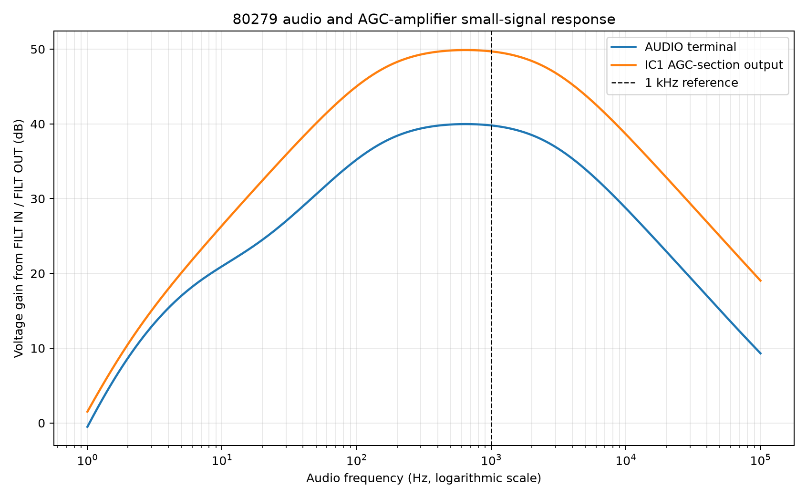
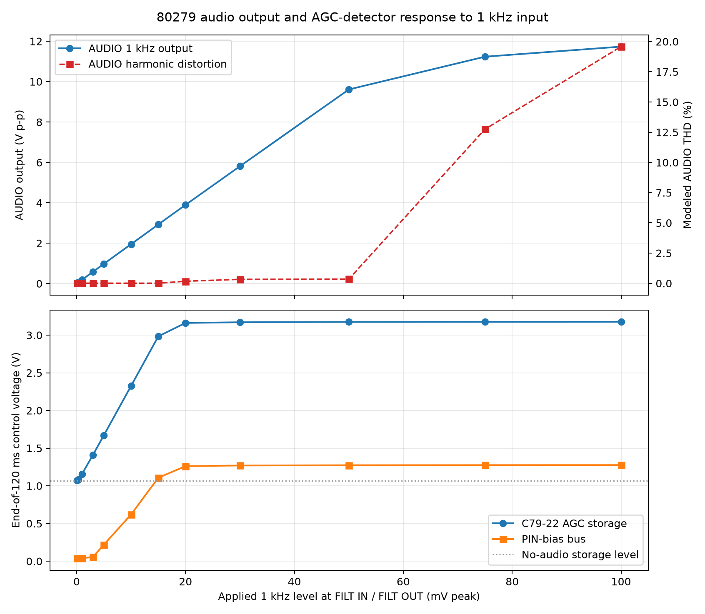
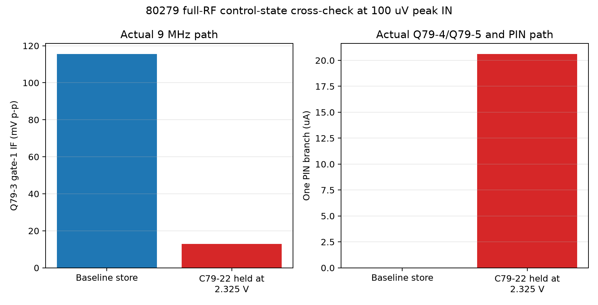
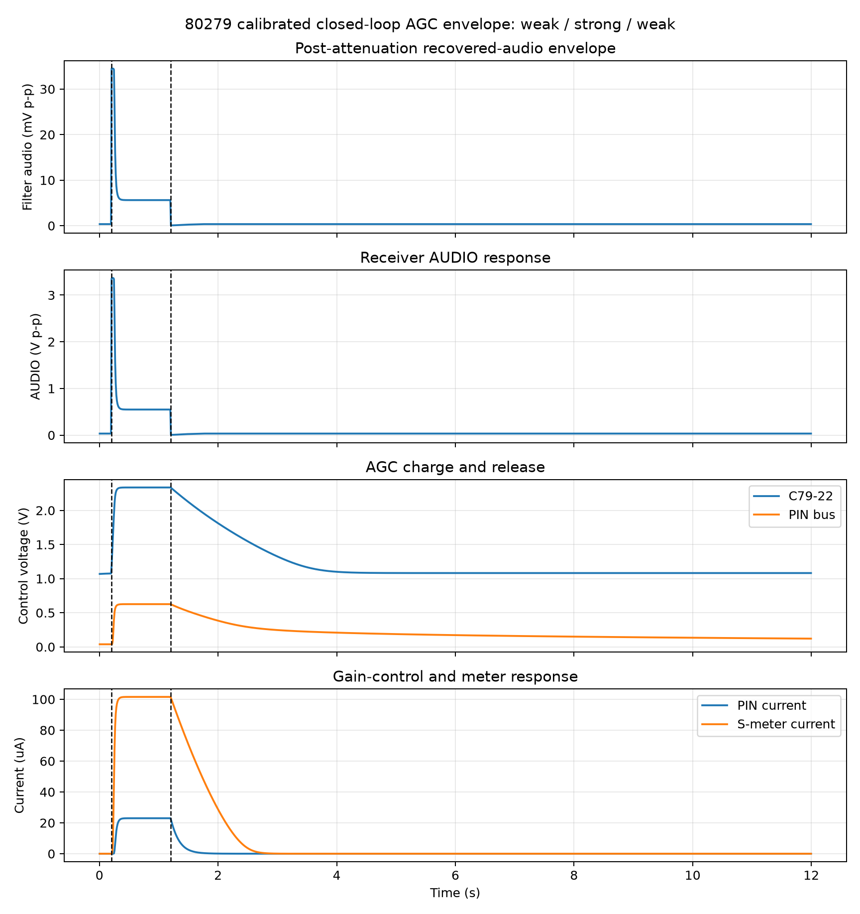

# 80279 IF-AGC and Product Detector

## Overview

The Ten-Tec 80279 assembly is the receiver's fixed-frequency IF gain, product
detector, audio preamplifier, automatic-gain-control, and S-meter board. It
accepts the 9 MHz signal selected by the 80282 crystal filter and delivers
recovered audio to the receiver audio chain while generating the control
current that reduces IF gain on strong signals.

```text
80287 receiver mixer -> 80282 crystal filter -> 80279 IN
    -> Q79-1 -> T79-1 -> Q79-2 -> T79-2
    -> Q79-3 product detector + BFO
    -> FILT IN -> optional CW filter or jumper -> FILT OUT
    -> IC1 audio section -> AUDIO
                       \-> IC1 AGC section -> D79-6
                           -> Q79-4/Q79-5 -> PIN diodes + S meter
```

Ten-Tec describes the board, its alignment, terminal voltages, and transistor
voltages on [PDF page 32, printed page 3-16](literature/540%20Triton%20Owner%20Manual.pdf#page=32).
The assembly schematic and IC1 voltage table are on
[PDF page 33, printed page 3-17](literature/540%20Triton%20Owner%20Manual.pdf#page=33).

## How the board works

### Two-stage 9 MHz IF amplifier

The filtered 9 MHz receiver signal enters at `IN`. Q79-1 and Q79-2 are
successive common-emitter IF stages. T79-1 couples and tunes the signal between
the stages; T79-2 supplies the final tuned coupling to the product detector.
The service alignment peaks both transformers at 9 MHz while keeping the
S-meter indication below S5 so that AGC action does not hide the true peak.

D79-1, D79-2, and D79-3 are HP 5082-3379 PIN diodes placed at three points in
the IF path. The AGC circuit drives them together. Increasing their forward
current lowers their RF resistance and shunts progressively more of the 9 MHz
signal, reducing receiver gain before later stages overload.

### Product detector and filter loop

Q79-3 is an RCA 40823 dual-gate MOSFET used as a product detector. T79-2
applies the received IF to gate 1 and the external BFO drives gate 2. Mixing
the BFO with the received sideband recreates the original audio-frequency
signal at the detector output.

Recovered audio leaves the board at `FILT IN` and returns at `FILT OUT`. These
terminals accept the optional Model 245 CW audio filter. When that filter is
not installed, the manual requires a jumper between the two terminals; that
is the configuration presently represented in the project.

The local Q79-3 symbol preserves the documented physical order
`1=D, 2=G2, 3=G1, 4=S/case`. Its drawing places pins 3 and 4 like the hand
schematic without changing their electrical identities. The linked primary
device literature is the archived
[RCA 40823 data](datasheets/RCA_40823_SC-15_1971.pdf).

### Audio and AGC paths

IC1 is an MC1747 dual internally compensated op amp. One section amplifies the
returned audio and drives `AUDIO`. The other supplies additional gain for AGC
detection. D79-6 rectifies that signal and the storage network converts it to
a slowly changing control voltage.

Q79-4 and Q79-5 form a Darlington-connected DC driver. Their output supplies
the common control current for the three PIN diodes and the S-meter circuit.
C79-22 is 4.7 uF and R79-24 is 680 kOhm, giving a simple RC product of about
3.20 seconds. The actual attack and release times also depend on D79-6, the
transistor junctions, the signal level, and the other charge and discharge
paths.

R79-20 calibrates S-meter sensitivity. The manual's S9 procedure uses a 50 uV
signal at the radio antenna on 14.100 MHz. That is an end-to-end receiver
condition, not a specification for 50 uV at this board's `IN` terminal.

### Receive/transmit control

The documented receive/no-signal control voltages are `R=12.1 V` and
`T=0.2 V`; on transmit they become `R=0 V` and `T=10.4 V`. Q79-6 responds to
the T line to reset or inhibit the stored AGC condition, and D79-4 isolates
the receive S-meter drive during transmit.

## Schematic simulation fixture

The simulation-only sources and loads are in the upper-right corner of
`80279_if_agc.kicad_sch`, enclosed by a red dashed rectangle labeled
**SIMULATION ONLY**. They are excluded from the BOM and PCB.

| Fixture | Saved setting | Purpose |
|---|---:|---|
| `+12` | 13.8 V DC | Documented receive supply |
| `+REG` | 8.0 V DC | Regulated board supply |
| `R` | 12.1 V DC | Receive control state |
| `T` | 0.2 V DC | Receive control state |
| `IN` source | `dc=0 ampl=1m f=9Meg ac=1` | No DC for `.op`; AC and transient IF stimulus |
| `BFO` source | `dc=6.5 ampl=100m f=9Meg ac=0` | Documented DC level and estimated RF starting amplitude |
| `PIN_BIAS` current source | Disabled normally | Simulation 3 open-loop control; enabled only while D79-5 is excluded |
| `AUDIO` load | 25 kOhm | Root-sheet volume-control load |
| `S MTR` load | 1 kOhm | Existing S-meter simulation load |
| Filter connection | `FILT IN` jumpered to `FILT OUT` | Normal configuration without the optional CW filter |
| Solver option | `.options rshunt=1e12` | Negligible DC reference for capacitor-only islands |

The 1 TOhm numerical shunt and ideal signal sources are simulation aids, not
original Ten-Tec parts.

## Simulation results

The KiCad schematic is the circuit source of truth. Each runner exports a
fresh SPICE netlist from the schematic before invoking ngspice; there is no
hand-maintained substitute circuit. Curated plots and data are under the
[80279 study directory](spice/studies/80279/README.md).

### Simulation 1: receive/no-signal DC operating point

This check establishes the supply rails, device pin mappings, and quiescent
bias before any RF or closed-loop AGC result is trusted. It uses the receive
voltages listed above, 27 degrees C, and a `.op` analysis.

The board terminals, both IF stages, the product detector, Q79-6, and all nine
documented IC1 pins reproduce the service data closely enough to proceed.
Selected results are:

| Device or node | Manual | Simulation | Assessment |
|---|---:|---:|---|
| Q79-1 C / B / E | 13.7 / 1.0 / 0.3 V | 13.638 / 1.046 / 0.362 V | Credible; emitter is 62 mV high |
| Q79-2 C / B / E | 13.3 / 1.8 / 1.1 V | 13.323 / 1.788 / 1.070 V | Pass |
| Q79-3 D / G1 / S / G2 | 3.0 / 0.6 / 2.0 / 2.0 V | 3.349 / 0.641 / 1.737 / 1.737 V | All within 15% |
| IC1 documented pins | See manual table | All within about 2% | Pass after wiring correction |
| Q79-5 emitter | 0.2 V | 0.040 V | Model discrepancy remains |

The Q79-5 result is not presently evidence of an incomplete emitter wire. The
saved topology agrees with the manual; the low value arises in the model's
very-low-current chain through D79-7, D79-6, Q79-4, and Q79-5. At a simulated
55 degrees C the existing generic junction models produce approximately
0.22 V at the emitter, which supports a temperature/model-sensitivity
explanation. A board-specific empirical model fitted to measured hardware may
be appropriate later, but the historical resistor and wiring topology should
not be changed merely to force the 27-degree result.

The complete comparison is
[80279-dc-operating-point.csv](spice/studies/80279/dc-operating-point/data/80279-dc-operating-point.csv).
Simulation 1 is therefore a **partial pass**: the signal and op-amp paths are
ready for further study, while absolute AGC levels retain the Q79-5 caveat.

### Simulation 2: 9 MHz IF response and signal walk

#### How this part of the circuit works

The crystal filter on the preceding 80282 board has already selected a narrow
slice of the receiver signal centered near 9 MHz. The job of this part of
80279 is to make that small filtered signal larger without losing it before it
reaches the product detector.

```text
IN -> first amplifier Q79-1 -> tuned transformer T79-1
   -> second amplifier Q79-2 -> tuned transformer T79-2
   -> Q79-3 gate 1
```

The parts along that path have distinct jobs:

1. **C79-1 admits the 9 MHz signal but blocks DC.** This keeps the bias voltage
   used inside the board from being sent back toward the crystal filter.
2. **Q79-1 is the first amplifier.** R79-1 and R79-2 set its base voltage;
   R79-3 stabilizes its emitter current. C79-3 bypasses R79-3 at radio
   frequency, allowing more AC gain without removing the resistor's DC
   stabilization.
3. **T79-1 passes the wanted frequency to Q79-2.** Its two windings, together
   with C79-5 and C79-6, form a resonant interstage network. Near 9 MHz it
   transfers the signal efficiently. Farther away, it transfers less. R79-5
   and R79-6 establish Q79-2's DC base bias independently of that RF coupling.
4. **Q79-2 supplies the second large increase in signal voltage.** R79-7
   stabilizes its DC emitter current and C79-9 bypasses that resistor for RF.
5. **T79-2 and C79-11/C79-12 select and couple the amplified signal to Q79-3.**
   Q79-3 gate 1 is the signal input of the product detector used in the next
   portion of the board.
6. **R79-4/C79-4 and R79-8/C79-8 keep RF out of the supply wiring.** The
   resistors feed DC to the stages while the capacitors provide a short path
   to ground for unwanted RF on the supply nodes.

D79-1, D79-2, and D79-3 are the AGC shunt diodes studied in Simulation 3. With
no AGC control current they have high RF resistance and should interfere very
little with this normal-gain test.

#### What a working circuit should show

With a small test signal swept across the 9 MHz region, a healthy circuit
should show all of the following:

- The response should be strongest very near 9.000 MHz, because that is where
  the manual says T79-1 and T79-2 are aligned.
- The signal should become substantially larger at each transistor collector.
- Some voltage can be lost between a collector and the following stage because
  a transformer must transfer energy into a loaded circuit. A modest drop at
  T79-1 or T79-2 is therefore not automatically a fault.
- The final signal at Q79-3 gate 1 should still be much larger than the signal
  applied at `IN`.
- Frequencies on either side of 9 MHz should receive less gain, producing a
  visible peak rather than a flat, broadband response.

This simulation reports voltage gain in decibels. For voltage ratios,
20 dB means 10 times larger, 40 dB means 100 times larger, and 60 dB means
1,000 times larger. A negative change between two points means that portion
of the path lost some voltage; it does not mean the complete board has stopped
amplifying.

#### How the simulation tests it

The AC source at `IN` is normalized to 1 V so every plotted voltage is also a
direct voltage ratio from the input. The sweep runs from 8.8 to 9.2 MHz and
observes the signal at both transistor collectors, at the input of Q79-2, and
at Q79-3 gate 1. This is a small-signal test: it shows linear gain and tuning,
not clipping or strong-signal behavior.

The manual documents 9 MHz alignment but does not give transformer
inductance, coupling, winding resistance, Q, or stray capacitance. The saved
model therefore uses an explicitly estimated alignment fit of 2.63 uH for
L79-3 through L79-6 and `K=0.25` for both transformers. The initial 2.6 uH
estimate peaked at 9.052 MHz; the 1.15% adjustment centers the modeled
transformers on the documented alignment frequency.

#### What the simulation showed

At exactly 9 MHz the signal progressed through the board as follows:

| Observation point | Gain from `IN` | Approximate voltage ratio | What this shows |
|---|---:|---:|---|
| Q79-1 collector | 30.393 dB | 33 times `IN` | The first transistor stage is amplifying |
| T79-1 secondary / Q79-2 base | 28.747 dB | 27 times `IN` | T79-1 loses only 1.646 dB while coupling into Q79-2 |
| Q79-2 collector | 60.596 dB | 1,070 times `IN` | The second transistor adds another 31.849 dB |
| T79-2 secondary / Q79-3 G1 | 55.066 dB | 567 times `IN` | T79-2 delivers a still-strong signal to the detector |

The frequency sweep produced these measurements:

| Measurement | Simulated result | Plain-language meaning |
|---|---:|---|
| Peak frequency | 8.9997 MHz | The strongest response is essentially at the required 9 MHz |
| Gain at 9.000 MHz | 55.066 dB | Q79-3 G1 receives about 567 times the input voltage |
| Lower / upper -3 dB points | 8.96291 / 9.04615 MHz | These are the frequencies where voltage has fallen to about 71% of the peak |
| -3 dB bandwidth | 83.240 kHz | The modeled IF amplifier passes an approximately 83 kHz-wide region around 9 MHz |
| Loaded Q | 108.1 | A compact measure of how sharply the complete modeled path is tuned |


**Figure 79-1.** Estimated 80279 9 MHz IF response

In Figure 79-1, the horizontal axis is frequency and the vertical axis is
voltage gain in dB from `IN`. Each colored trace follows one of the observation points listed in
the signal-walk table; the dashed vertical line marks 9.000 MHz.

The plot rises to its maximum at the dashed 9 MHz line, which is the expected
shape for correctly aligned IF transformers. The crystal filter ahead of this
board is much narrower and supplies the receiver's final voice selectivity;
the wider 80279 response lets that already-filtered signal pass without the IF
amplifier becoming the limiting filter.

#### Does it meet expectations?

**Yes, as a functional model.** Both transistor stages add substantial gain,
both transformers pass the signal onward, and the complete response is centered
on 9 MHz. This demonstrates the intended circuit action from `IN` to the
product-detector input.

It does **not** establish that an original board has exactly 55.066 dB of gain
or an 83.240 kHz bandwidth. The transformer values are fitted estimates, and
the reported voltage is measured at a lightly loaded internal node rather than
as matched power delivered to a standard load. The numerical gain, bandwidth,
and loaded Q are therefore model results—not Ten-Tec specifications.

Machine-readable results are the
[response summary](spice/studies/80279/if-response-9mhz/data/80279-if-response-summary.csv),
[full sweep](spice/studies/80279/if-response-9mhz/data/80279-if-response.csv),
and [signal walk](spice/studies/80279/if-response-9mhz/data/80279-if-signal-walk.csv).

Regenerate this study from a fresh KiCad export with:

```powershell
python spice/tools/run_80279_if_response.py
```

### Simulation 3: open-loop PIN-diode AGC attenuation

#### How this part of the circuit works

Automatic gain control, or AGC, keeps a strong station from becoming
uncomfortably loud or overloading the receiver. Later parts of 80279 detect
how strong the received signal is. IC1 amplifies that indication, D79-6
rectifies it, and Q79-4/Q79-5 provide the DC control drive. D79-5 then feeds
that drive to the common `PIN_BIAS` bus.

R79-17, R79-18, and R79-19 divide the control current among D79-3, D79-2, and
D79-1. Each is a PIN diode, a special RF diode that behaves approximately like
a resistor controlled by forward current:

- With almost no forward current, its RF resistance is high and the receiver
  signal can continue through the amplifier.
- With more forward current, stored charge in the diode lowers its RF
  resistance.
- Because each diode is connected as an RF shunt toward ground, lower
  resistance diverts more of the 9 MHz signal away from the amplifier path.

D79-1 shunts the board input. D79-2 shunts the input of the second stage
through C79-7. D79-3 shunts the second-stage output through C79-10 before the
signal reaches T79-2. C79-7 and C79-10 pass RF to their diodes while keeping
the DC control voltage out of the transistor bias circuits. Attenuating at
three locations produces much more total control than relying on one shunt
diode alone.

#### What a working circuit should show

When PIN-diode current is increased, a working attenuator should show:

- approximately equal current in all three diode branches because the three
  feed resistors are each 1 kOhm in this nominal model;
- decreasing modeled RF resistance in every PIN diode;
- a progressively smaller 9 MHz signal at Q79-3 gate 1;
- monotonic behavior—the signal should not become larger again as control
  current increases; and
- a less pronounced tuned peak at high current because the low-resistance
  shunts heavily load the IF circuits.

This is an open-loop test. It deliberately supplies the control current
instead of asking the detector and Q79-4/Q79-5 to generate it. That isolates
the three PIN diodes so their part of the AGC system can be checked first.

#### How the simulation tests it

D79-5 is opened only in the Simulation 3 fixture, disconnecting the normal AGC
driver. The disabled-by-default I79-SIM1 source then supplies the common
`PIN_BIAS` bus. It provides three times the desired per-diode current because
the current divides among the three equal 1 kOhm branches.

The simulation repeats the 8.8–9.2 MHz sweep at twelve control settings. It
records all three diode currents, each diode's modeled RF resistance, and the
signal reaching Q79-3 gate 1. Current is forced rather than voltage because
the empirical model is defined by forward current; ideal voltage forcing can
select two mathematical solutions near the diode's turn-on region.

#### What the simulation showed

The three branch currents remained equal and the signal fell at every increase
in control current:

| Current per diode | Modeled RF resistance | Attenuation at 9 MHz | Signal-voltage reduction |
|---:|---:|---:|---:|
| 0 | 8 MOhm numerical limit | 0.000 dB | Reference, full modeled gain |
| 10 uA | 800 Ohm | 8.888 dB | About 2.8 times smaller |
| 30 uA | 266.7 Ohm | 18.401 dB | About 8.3 times smaller |
| 100 uA | 80.0 Ohm | 35.705 dB | About 61 times smaller |
| 300 uA | 26.67 Ohm | 58.705 dB | About 860 times smaller |
| 1 mA | 8.00 Ohm | 87.557 dB | About 24,000 times smaller |
| 12 mA | 0.667 Ohm | 132.659 dB | Effectively off in this idealized model |

Here, “attenuation” is the reduction from the zero-current result. A larger
positive attenuation number means that less signal reaches the detector. This
is the opposite viewpoint from the gain column in Simulation 2, where a larger
number meant a larger signal.


**Figure 79-2.** 80279 open-loop PIN-diode attenuation

In Figure 79-2, the upper plot shows attenuation rising continuously with diode
current. The
lower plot shows why: forward current rises while the modeled RF resistance
falls. The horizontal current scale is logarithmic after its small linear
region so microampere and milliampere behavior can be seen on one plot. The
separate response-family plot in the detailed study also shows the 9 MHz peak
shrinking and flattening as the shunts become stronger.

#### Does it meet expectations?

**Yes, for the PIN-diode portion of the AGC system.** The model shares current
equally, resistance falls as current rises, and the 9 MHz signal decreases
monotonically. That is the control direction required for AGC: a stronger
detected station must ultimately cause less IF signal to reach Q79-3.

This result does **not** yet prove that the complete AGC loop regulates signal
strength correctly. It bypasses IC1, D79-6, Q79-4, Q79-5, and D79-5, and it
does not measure attack or release time. Those are later simulations.

The high-current numbers are also idealized small-signal isolation, not
measured receiver AGC range. The identical diode models, perfect grounds, and
absence of real board leakage make very large attenuation possible. The
20 mA model endpoint needs 20.87 V and cannot be reached from the 13.8 V
board. Even the 12 mA point requires 12.85 V before allowing for D79-5 voltage
drop and Q79-5 saturation, so it is only a supply-boundary checkpoint.

Complete evidence and KiCad Simulator setup are in the
[Simulation 3 README](spice/studies/80279/pin-agc-sweep/README.md).

### Simulation 4: product detector and audio recovery

#### How this part of the circuit works

The receiver does not send ordinary audio through its 9 MHz crystal filter.
Instead, speech is carried as small changes just above or below 9 MHz. Q79-3
recovers that speech by mixing the filtered IF signal with the beat-frequency
oscillator, or BFO.

T79-2 and C79-11/C79-12 deliver the amplified IF signal to Q79-3 gate 1.
C79-19 couples the BFO to gate 2 while R79-16 establishes the gate's DC bias.
The dual-gate MOSFET responds to both signals at once and produces two new
frequency components:

- their difference, which is the wanted audio frequency; and
- their sum, near 18 MHz, which is unwanted RF.

R79-14 and C79-17 form a low-pass network after the drain. It passes the much
slower audio variation while reducing the remaining 9 MHz and 18 MHz energy.
C79-18 then AC-couples the recovered audio to `FILT IN`, blocking Q79-3's
drain DC voltage. Because the optional CW filter is not installed, the saved
jumper carries this signal directly back through `FILT OUT` to IC1.

#### What a working circuit should show

With a 9.001 MHz IF signal and a 9.000 MHz BFO, a working product detector
should produce a clean 1 kHz difference tone because:

```text
9.001 MHz - 9.000 MHz = 0.001 MHz = 1 kHz
```

The tone should be visible at Q79-3's drain and at the jumpered filter loop.
It should become larger as BFO drive is increased, at least until the detector
begins to compress. With the BFO removed, or with the IF signal removed, the
1 kHz output should nearly disappear. Those two controls are important: a
waveform at the expected frequency is convincing evidence of mixing only if
it depends on both input signals.

The manual does not specify BFO RF amplitude, detector conversion gain, or
distortion. This test can therefore establish correct circuit action, but it
cannot establish a factory output level.

#### How the simulation tests it

The runner exports a fresh SPICE netlist from `80279_if_agc.kicad_sch`. The
board input is driven with an estimated 100 uV peak signal at 9.001 MHz. The
BFO terminal retains its documented 6.5 V DC level while its RF amplitude is
swept from zero to 1.5 V peak. A nominal 400 mV-peak case is also repeated
with the IF source turned off.

Each case uses a transient analysis, which follows voltage with time rather
than assuming that the circuit is linear. A short window resolves the 9 MHz
waveforms. A separate four-cycle audio window measures the recovered 1 kHz
tone and its harmonics. The maximum internal timestep is 1 ns; every case is
rejected if its IF amplitude at Q79-3 gate 1 differs by more than 3% from the
independently completed Simulation 2 result.

#### What the simulation showed

The transient IF amplitude at Q79-3 gate 1 was 112.24 mV peak-to-peak, only
about 0.96% below the Simulation 2 prediction. In the nominal 400 mV-peak BFO
case, the detector produced:

| Measurement | Fresh simulation result | Plain-language meaning |
|---|---:|---|
| Wanted tone at `FILT IN` / `FILT OUT` | 34.490 mV p-p at 1 kHz | The detector recovered the expected audio frequency |
| Wanted tone at Q79-3 drain | 112.352 mV p-p at 1 kHz | Mixing occurs in Q79-3 before the output filtering and coupling network |
| Total harmonic distortion at filter loop | 1.897% | The modeled waveform is predominantly the wanted 1 kHz tone |
| Second harmonic at filter loop | 0.649 mV p-p | The largest measured harmonic is about 53 times smaller than the wanted tone |
| Q79-3 drain DC | 3.458 V | 15.3% above the manual's 3.0 V no-signal value; this driven case is not the manual test condition |
| BFO off control | 0.0195 mV p-p at 1 kHz | About 1,765 times smaller than the nominal result |
| IF off control | 0.307 mV p-p at 1 kHz | About 112 times smaller than the nominal result |


**Figure 79-3.** 80279 product-detector waveforms

In Figure 79-3, the upper traces show the two RF inputs: 9.001 MHz at gate 1
and 9.000 MHz at
gate 2. The lower traces show the slowly varying 1 kHz difference signal at
the drain and after the output network. Time is shown in microseconds for the
RF traces and milliseconds for the recovered audio.


**Figure 79-4.** 80279 recovered-audio spectrum

In Figure 79-4, the horizontal axis is audio frequency. The vertical axis is
level in dB
relative to the wanted 1 kHz result, so 0 dB is the strongest recovered tone
and more-negative values are smaller unwanted products.

The BFO sweep produced 2.690, 10.471, 34.490, 59.270, and 88.137 mV p-p of
recovered 1 kHz audio for 25, 100, 400, 800, and 1,500 mV peak BFO drive.
Output therefore rises in the expected direction but no longer scales in
direct proportion at high drive, showing the beginning of detector
compression.

#### Does it meet expectations?

**Pass as a functional product-detector model.** Q79-3 produces the calculated
1 kHz difference frequency, the output depends strongly on both the IF and
BFO inputs, and recovered audio increases with BFO drive. The transient IF
level also agrees with Simulation 2, so the result is not caused by excessive
numerical damping of the tuned IF path.

#### Limits and evidence status

The 9.000 MHz BFO and the board's detector function are documented on manual
PDF page 32 / printed page 3-16. The 100 uV-peak board input, all BFO RF
amplitudes, and the nominal 400 mV-peak operating case are simulation choices,
not Ten-Tec specifications. The RCA 40823 model and transformer values are
empirical or fitted, so the reported conversion level, compression, and
distortion require measurement on an original board before they can be
treated as historical performance.

Complete data, plots, and regeneration instructions are in the
[Simulation 4 README](spice/studies/80279/product-detector/README.md).

### Simulation 5: audio amplifier and AGC detector

#### How this part of the circuit works

The signal returning from the optional-filter socket is audio, but it is still
too small to drive the rest of the receiver or operate the automatic gain
control. The two amplifiers inside IC1 perform those jobs.

C79-27 passes audio from the jumpered `FILT IN` / `FILT OUT` node into IC1
section B while blocking DC. R79-33 and R79-34 make a half-supply reference
near 6.9 V, and C79-25 holds that reference steady for audio. R79-30 connects
the section B input to this reference. R79-31 and R79-32 set the main
non-inverting voltage gain to approximately:

```text
1 + 100 kOhm / 1 kOhm = 101 times
```

C79-26 is connected across R79-32. At higher audio frequencies it increasingly
bypasses that feedback resistor, deliberately reducing gain. C79-21 removes
the op amp's 6.9 V DC bias and sends only the amplified audio to the `AUDIO`
terminal and its modeled 25 kOhm volume-control load.

C79-24 couples the first op amp's output into IC1 section A. R79-27 and R79-28
give this section an additional calculated gain of approximately:

```text
1 + 10 kOhm / 4.7 kOhm = 3.13 times
```

The total low-level gain available to the AGC detector is therefore about
101 x 3.13, or 316 times. C79-23 passes the amplified changes to D79-6. D79-7,
R79-25, and R79-26 establish the detector's reference level. Positive peaks
that exceed the stored voltage forward-bias D79-6 and charge C79-22. R79-24
provides the slow discharge path. Q79-4 and Q79-5 then turn that stored voltage
into control current for the three PIN diodes.

#### What a working circuit should show

A working audio path should show the following:

- Around 1 kHz, section B should produce close to 101 times the filter-loop
  voltage, and the second section should raise the total AGC-path gain to about
  316 times.
- Very low notes should receive less gain because the coupling capacitors and
  C79-25 cannot act as perfect AC paths at arbitrarily low frequency.
- High notes should roll off because C79-26 reduces section B's feedback gain.
- As the 1 kHz input is increased, `AUDIO` should initially rise in direct
  proportion and remain nearly sinusoidal. It should eventually flatten near
  the op amp's supply limits and develop harmonic distortion.
- D79-6 should rectify the more strongly amplified AGC signal, causing the
  voltage on C79-22 and the PIN-diode control current to rise monotonically.

The AGC section is expected to reach its output limit before the main AUDIO
path. It needs high sensitivity to weak changes in received signal strength;
once it has produced enough control, additional linear output is unnecessary.

#### How the simulation tests it

No new schematic source was required. In disposable netlist copies, the
existing V79-SIM5 source from the red **SIMULATION ONLY** rectangle is moved
from `IN` to the jumpered filter node and used as a controlled audio generator.
The saved KiCad schematic remains the circuit source of truth. BFO RF is
disabled while its documented 6.5 V DC condition is retained.

First, a small-signal AC sweep from 1 Hz to 100 kHz measures voltage gain at
the internal IC1 outputs and the loaded `AUDIO` terminal. Second, thirteen
transient cases apply a 1 kHz sine wave from zero through 100 mV peak. Each
case runs for 120 ms and records AUDIO amplitude and distortion, both op-amp
outputs, D79-6, C79-22, the PIN-bias bus, and the current in one of the three
equal nominal 1 kOhm PIN-feed branches. The reported control voltages and
current are averages over the final 5 ms, not attack or release-time
measurements.

#### What the simulation showed

The small-signal frequency sweep produced:

| Measurement | Simulated result | Plain-language meaning |
|---|---:|---|
| AUDIO gain at 1 kHz | 97.64 V/V, or 39.79 dB | A 1 mV change at the filter loop produces about 98 mV at AUDIO |
| Calculated AUDIO gain | 101 V/V | The simulation is about 3.3% below the resistor-only calculation |
| Complete AGC-amplifier gain at 1 kHz | 305.31 V/V, or 49.69 dB | The signal driving the detector is about three times larger than the AUDIO-stage output |
| Calculated complete AGC gain | About 316 V/V | The simulation is about 3.3% below the resistor-only calculation |
| AUDIO -3 dB frequencies | 138.8 Hz and 2.965 kHz | The modeled board emphasizes the main speech range and reduces bass and high-frequency noise |
| AGC-amplifier -3 dB frequencies | 140.4 Hz and 2.967 kHz | The AGC detector listens to essentially the same audio band |

The -3 dB points are where voltage has fallen to about 71% of the maximum.
The low-frequency loss occurs because C79-25 allows the half-supply reference
to move at very low frequencies; the op amp then sees less difference between
its signal and reference inputs. C79-26 and the op-amp model establish the
upper roll-off.



**Figure 79-5.** 80279 audio and AGC frequency response

In Figure 79-5, the horizontal axis is audio frequency on a logarithmic scale.
The vertical
axis is voltage gain in decibels. The orange AGC trace is about 10 dB above the
blue AUDIO trace; 10 dB is approximately a 3.16-times voltage increase, close
to section A's calculated 3.13-times gain.

Representative 1 kHz level-sweep results are:

| Filter input | AUDIO output | Modeled AUDIO THD | C79-22 after 120 ms | PIN bus after 120 ms | One PIN branch |
|---:|---:|---:|---:|---:|---:|
| 0 | 0 | — | 1.069 V | 0.038 V | 0 |
| 1 mV peak | 0.195 V p-p | 0.010% | 1.157 V | 0.038 V | effectively 0 |
| 5 mV peak | 0.976 V p-p | 0.010% | 1.670 V | 0.218 V | about 0 |
| 10 mV peak | 1.953 V p-p | 0.010% | 2.325 V | 0.620 V | 20.8 uA |
| 15 mV peak | 2.929 V p-p | 0.011% | 2.983 V | 1.106 V | 393 uA |
| 20 mV peak | 3.897 V p-p | 0.174% | 3.161 V | 1.261 V | 536 uA |
| 50 mV peak | 9.613 V p-p | 0.352% | 3.175 V | 1.273 V | 547 uA |
| 75 mV peak | 11.235 V p-p | 12.75% | 3.176 V | 1.275 V | 548 uA |

The AUDIO path remains close to its 97.6-times small-signal gain through
50 mV peak input. Between 50 and 75 mV peak it runs out of output swing:
the output grows much less than expected and distortion rises sharply. The
AGC section reaches its modeled output limits earlier, between 15 and 20 mV
peak input, causing the stored voltage and PIN current to level off.
Figure 79-6 plots both.



**Figure 79-6.** 80279 audio level and AGC response

Simulation 3 showed that tens of microamperes in each PIN diode already reduce
IF gain and hundreds of microamperes produce strong attenuation. Simulation 5
therefore shows that the audio detector can generate a useful control range
before the receiver's main AUDIO output clips.

#### Does it meet expectations?

**Functional pass.** Both IC1 sections have the expected gain direction and
closely match their resistor-calculated gains at 1 kHz. The response is shaped
into a speech band, the AUDIO output is clean over a substantial modeled input
range, D79-6 raises the AGC storage voltage monotonically, and Q79-4/Q79-5
deliver control current in the direction required by Simulation 3.

#### Limits and evidence status

The manual documents the two IC1 functions and D79-6/Q79-4/Q79-5 AGC path on
PDF page 32 / printed page 3-16, and the component topology on PDF page 33 /
printed page 3-17. It does not specify audio gain, bandwidth, clipping level,
distortion, detector threshold, or PIN current. Those numbers are calculated
or simulated results, not Ten-Tec specifications.

The MC1747 core does not model noise, production spread, temperature drift,
offset adjustment, or interaction between its two physical sections. The
ideal audio source bypasses the product detector's output impedance and the
optional CW filter. Absolute PIN-bias voltage and current retain the Q79-5
low-current model caveat identified in Simulation 1. Finally, the 120 ms cases
show detector drive but do not establish AGC attack or release timing; that is
the purpose of Simulation 6.

Complete data, plots, and regeneration instructions are in the
[Simulation 5 README](spice/studies/80279/audio-agc/README.md).

### Simulation 6: closed-loop AGC attack and release

#### How this part of the circuit works

Automatic gain control is a negative-feedback loop: a strong received signal
creates a control signal that reduces receiver gain. “Negative” here means
that the circuit acts against the original change rather than making it still
larger.

The loop around 80279 is:

```text
stronger 9 MHz IF -> stronger recovered audio from Q79-3
  -> more gain from both IC1 sections -> D79-6 charges C79-22
  -> Q79-4/Q79-5 raise the PIN-bias bus
  -> D79-1/D79-2/D79-3 shunt more IF signal
  -> less signal reaches Q79-3
```

D79-6 provides the fast charging path. During a strong signal, repeated audio
peaks add charge to C79-22. Q79-4 and Q79-5 follow that stored voltage and
supply current through R79-17, R79-18, and R79-19 to the three PIN diodes.
The same control stage drives the S meter through R79-20 and D79-4.

When the strong signal disappears, D79-6 stops charging C79-22. The capacitor
then discharges through R79-24 and the connected transistor/diode paths. The
simple R79-24 x C79-22 product is 680 kOhm x 4.7 uF, or about 3.20 seconds, but
that is not itself an attack or release specification: the other current paths
alter the actual curve.

A faster attack prevents a suddenly strong station from remaining excessively
loud. A slower release prevents gain from jumping up during every brief pause
in speech, which would make background noise “pump” up and down.

#### What a working circuit should show

For a weak/strong/weak input sequence, a healthy loop should show:

- an immediate AUDIO rise when the strong signal first arrives, followed by a
  reduction as C79-22 charges and PIN current increases;
- much less change at AUDIO than the change applied at the board input;
- increasing S-meter current during the strong interval;
- attack that is faster than release;
- gradual gain recovery after the signal returns weak; and
- no sustained oscillation or large overshoot after release.

The actual 9 MHz path should also become smaller when C79-22 is at a strong-
signal control voltage. This physical-path check is important because a slow
envelope approximation by itself could have the correct mathematics while a
PIN diode or transistor was wired in the wrong direction.

#### How the simulation tests it

The study is divided into two time scales.

The first test uses the complete 9 MHz schematic with a 9.001 MHz IF and
9.000 MHz BFO. A short weak/strong/weak run confirms carrier and detector
behavior. Six milliseconds is not long enough for the modeled C79-22 voltage
to turn on Q79-5 appreciably, which agrees with the longer measured attack
time. A second full-RF cross-check therefore holds C79-22 at 2.325 V—the level
produced by Simulation 5 at 10 mV-peak audio—and compares the actual tuned IF
path with its baseline state. This retains Q79-4, Q79-5, D79-5, all three PIN
diodes, both IF transformers, and Q79-3.

The long test keeps the real IC1, D79-6, C79-22, Q79-4/Q79-5, PIN-bias, and
S-meter circuits but replaces billions of unnecessary 9 MHz carrier steps
with a 1 kHz envelope source. Its zero-control amplitude comes from Simulation
4's product-detector result. Its attenuation versus PIN-bias voltage is
piecewise interpolated from Simulation 3. The incoming board-level envelope
steps from 1 uV peak to 100 uV peak at 0.2 seconds and returns to 1 uV at
1.2 seconds.

Attack is measured as the time for C79-22 to move from 10% to 90% of its
weak-to-strong change. Release is the time to fall from 90% to 10% after the
signal returns weak. These definitions make the reported times reproducible.

#### What the simulation showed

The actual full-RF control-state comparison produced:

| Full-RF condition at 100 uV peak `IN` | One PIN branch | Q79-3 gate-1 IF |
|---|---:|---:|
| Baseline C79-22 state | Essentially 0 | 115.486 mV p-p |
| C79-22 held at 2.325 V | 20.60 uA | 12.819 mV p-p |

That is a **19.09 dB** reduction, or about nine times less IF voltage reaching
the detector. It demonstrates that Q79-4/Q79-5 and the three physical PIN
branches act in the required gain-reducing direction.



**Figure 79-7.** 80279 full-RF AGC control-state cross-check

The calibrated weak/strong/weak envelope in Figure 79-7 produced:

| Measurement | Simulated result | Plain-language meaning |
|---|---:|---|
| Applied input change | 40.00 dB | The strong board-input voltage is 100 times the weak voltage |
| Weak AUDIO | 0.03366 V p-p | Normal low-level output before the step |
| First strong AUDIO peak | 3.365 V p-p | The signal jumps before AGC has time to react |
| Regulated strong AUDIO | 0.54825 V p-p | AGC reduces the initially large strong-signal output |
| Final AUDIO change | 24.24 dB | AUDIO rises about 16.3 times instead of 100 times |
| Gain compression | 15.76 dB | This much of the 40 dB input change is removed by modeled AGC action |
| C79-22 weak / strong | 1.074 / 2.336 V | The detector stores a larger control voltage for the strong signal |
| PIN current weak / strong | Approximately 0 / 22.98 uA per branch | The strong signal turns on all three modeled attenuators |
| S-meter current weak / strong | Approximately 0 / 101.57 uA | The meter path responds in the same direction as AGC |
| C79-22 attack, 10%-90% | 59.0 ms | Gain reduction builds in a small fraction of a second |
| C79-22 release, 90%-10% | 1.991 s | Gain returns much more slowly after the signal disappears |
| Post-release AUDIO overshoot | 0.0035% | No meaningful modeled overshoot above the original weak level |

The initial strong AUDIO peak is about 514% above the later regulated strong
level. That is the expected uncorrected signal before the loop charges, not a
sustained instability. The output then settles smoothly. After the strong
signal ends, gain recovers without exceeding the original weak-signal level.



**Figure 79-8.** 80279 modeled AGC attack and release

In Figure 79-8, the dashed lines mark the transitions to strong and back to
weak. The upper
plots show the recovered audio and AUDIO terminal. The lower plots show the
stored/control voltages and the resulting PIN and S-meter currents. Attack is
visibly much faster than the long, smooth release.

#### Does it meet expectations?

**Functional pass with a split-model qualification.** The actual 9 MHz path
loses 19.09 dB when the real Q79-4/Q79-5/PIN control chain is placed at a
strong-signal state. The calibrated closed loop compresses a 40 dB input step
by 15.76 dB, attacks faster than it releases, moves the S meter in the correct
direction, and returns without oscillation or meaningful overshoot.

#### Limits and evidence status

The manual documents the AGC topology and purpose on PDF page 32 / printed
page 3-16, but it gives no attack time, release time, compression curve, or
board-input calibration. The 1 uV/100 uV step is a simulation choice and is
not an S-unit or antenna-terminal specification.

The long envelope combines three model results: the Simulation 4 detector
transfer, the Simulation 3 PIN attenuation table, and the physical Simulation
5 audio/control circuit. It does not reproduce RF distortion or PIN carrier
storage during every 9 MHz cycle. A fully dynamic high-drive RF attempt was
stopped after more than two hours and about 8.9 GB of memory without producing
an output file; no result from that aborted run is used here. The staged
full-RF cross-check provides the physical feedback-direction evidence instead.

Absolute attack, release, compression, PIN current, and S-meter current remain
model predictions. They depend on the empirical PIN and 40823 models, fitted
transformers, the generic MC1747 core, and especially the Q79-5 low-current
model discrepancy. Measurements on an original aligned board are required
before treating them as Ten-Tec performance specifications. S-meter current
is not converted to S units here; that is Simulation 7.

Complete data, plots, and regeneration instructions are in the
[Simulation 6 README](spice/studies/80279/closed-loop-agc/README.md).

### Simulation 7: S-meter adjustment and transmit inhibit

#### How this part of the circuit works

The S meter does not measure the 9 MHz signal directly. It reuses the DC
control voltage produced by the automatic gain control. A stronger received
signal produces more recovered audio, D79-6 charges C79-22 farther, and
Q79-4/Q79-5 supply more control current. That current both increases the
PIN-diode attenuation and moves the S meter.

R79-20 is the meter-calibration trimmer. Its wiper is tied to one end, so it
acts as an adjustable series resistance between the Q79-5 output and D79-4.
Changing R79-20 changes how much current reaches the meter without being the
part that creates the AGC voltage. D79-4 is the one-way connection between
this receive meter drive and the `S MTR` terminal.

The radio uses its front-panel meter for a different purpose on transmit. The
80279 receive indication must therefore disappear when the transmitter is
enabled. The `T` line rises through R79-22 and turns on Q79-6. Q79-6 rapidly
discharges C79-22, which turns off Q79-4/Q79-5 and removes the receive AGC and
meter drive. At the same time the `R` supply falls to zero and removes receive
bias from Q79-1 and Q79-2. D79-4 isolates the inactive receive-meter path from
the transmit meter circuitry elsewhere in the radio.

The manual instructs the technician to adjust R79-20 for S9 with a 50 uV
signal at the radio **ANTENNA** terminal on 14.100 MHz. That signal still has
to pass through the RF amplifier, receiver mixer, and eight-pole crystal
filter before reaching 80279. Therefore 50 uV at the 80279 `IN` pin is not the
manual's S9 condition.

#### What a working circuit should show

A working receive meter path should show:

- increasing meter current as modeled board-input signal strength increases;
- a useful range of meter-current adjustment as R79-20 is moved;
- little change in C79-22 or PIN current when only R79-20 is adjusted, because
  the trimmer should calibrate the indication rather than substantially alter
  receiver gain; and
- a compressed response at high signal levels because AGC is reducing IF gain
  while the incoming signal is increasing.

When the radio changes to transmit, Q79-6 should turn on, C79-22 should reset,
PIN-diode control current should disappear, and receive S-meter current should
fall essentially to zero. The change should occur even if the strong test
signal remains present; otherwise a falling meter indication could merely be
the result of removing the test source.

#### How the simulation tests it

The runner exports the saved KiCad schematic afresh. It reuses the existing
sources in the red **SIMULATION ONLY** rectangle and modifies them only in
disposable netlists. No new schematic fixture was required.

The meter sweep uses the calibrated 1 kHz envelope established in Simulation
6. The envelope uses Simulation 4's product-detector scale and Simulation 3's
attenuation-versus-PIN-bias curve, while the actual IC1, D79-6, C79-22,
Q79-4/Q79-5, Q79-6, D79-5, R79-20, D79-4, PIN-bias, and 1 kOhm meter-load
circuits remain present.

Modeled 80279 input is increased through 0.5, 1, 2, 5, 10, 20, 50, 100, and
200 uV peak. Each level is held for 350 ms and measured during the final
50 ms. R79-20 is tested at normalized positions 0.05, 0.25, 0.50, 0.75, and
0.95. These are model positions, not screwdriver angles.

For the transmit test, a 100 uV-peak modeled board input first establishes a
strong receive state. At 0.300 seconds, the supplies change from the manual's
receive values, `R=12.1 V` and `T=0.2 V`, to the documented transmit values,
`R=0 V` and `T=10.4 V`. The strong signal remains applied throughout.

A separate transmit-state isolation check reuses the red-box V79-SIM5 source
at the external `S MTR` terminal and applies 1 V there. This asks whether a
voltage from the radio's transmit-meter circuitry can feed backward through
D79-4 into the receive AGC network.

#### What the simulation showed

At the saved R79-20 midpoint, the receive sweep produced:

| Modeled 80279 `IN` | Meter current | C79-22 | One PIN branch | Plain meaning |
|---:|---:|---:|---:|---|
| 1 uV peak | 0.00087 uA | 1.079 V | approximately 0 | The meter remains at its modeled zero for a weak board signal |
| 10 uV peak | 3.270 uA | 1.540 V | 0.00064 uA | The detector is beginning to respond |
| 20 uV peak | 66.054 uA | 2.090 V | 1.764 uA | Meter indication and gain control are now active |
| 50 uV peak | 91.424 uA | 2.267 V | 11.853 uA | The response continues upward but is being compressed by AGC |
| 100 uV peak | 101.567 uA | 2.336 V | 22.977 uA | A stronger signal gives a larger, but not proportional, indication |
| 200 uV peak | 111.092 uA | 2.402 V | 39.520 uA | Doubling input produces only a modest further meter increase |

The 50 uV row is a **board-input test point**, not an S9 prediction. The
manual's 50 uV calibration signal is applied at the antenna and includes the
gain and loss of the preceding receiver stages.

At 100 uV peak modeled board input, moving R79-20 from position 0.05 to 0.95
changes meter current from 60.20 to 368.68 uA, a 6.12-to-1 adjustment range.
Across the same sweep C79-22 changes only from 2.335 to 2.345 V, and PIN
current changes by less than 1%. The trimmer therefore strongly changes the
indication while barely disturbing the modeled AGC state.


**Figure 79-9.** 80279 S-meter response and R79-20 adjustment

In Figure 79-9, the horizontal axis is modeled voltage at the 80279 input on a
logarithmic
scale. It is not an antenna S-unit scale. The vertical axis is current through
the 1 kOhm S-meter fixture. Each colored curve is a different R79-20 position.

The receive-to-transmit step produced:

| Measurement | Receive | Transmit | What changed |
|---|---:|---:|---|
| `R` / `T` lines | 12.1 / 0.2 V | 0 / 10.4 V | The documented radio state changes were applied |
| Q79-6 base | 0.047 V | 0.707 V | Q79-6 turns on |
| C79-22 stored AGC | 2.336 V | 0.0805 V | Q79-6 resets the stored receive control |
| PIN-bias bus | 0.626 V | 0.285 V | The control bus falls below useful PIN drive |
| One PIN branch | 22.96 uA | 0.00627 uA | Receive attenuation current falls by more than 3,000 times |
| Meter current | 101.56 uA | effectively zero | Receive meter drive is removed |

C79-22 completed 90% of its fall in **168 us**. The absolute time is a model
prediction, but the reset is thousands of times faster than the approximately
two-second receive AGC release measured in Simulation 6. That is the intended
difference: normal AGC releases slowly between stations, while transmit
switching deliberately clears it almost immediately.


**Figure 79-10.** 80279 receive-to-transmit AGC reset

In Figure 79-10, the top plot shows `R`, `T`, and the Q79-6 base. The middle
plot shows stored AGC and PIN bias. The lower plot shows receive meter current disappearing at
the dashed transmit transition. The input signal was not turned off.

In the separate transmit isolation check, the external `S MTR` terminal was
held at 1.000 V while D79-4's board-side anode remained at only 3.01 uV. The
diode therefore had almost exactly 1 V of reverse bias. C79-22 remained reset
at 0.0806 V and the settled PIN-bias bus was only 0.0000006 V. This confirms
that transmit-side meter voltage does not feed backward into the receive AGC
path in the model.

#### Does it meet expectations?

**Functional pass with factory-calibration qualification.** Meter current
rises with modeled signal strength, R79-20 provides substantial adjustment
without materially changing the AGC loop, and the documented transmit state
turns on Q79-6, rapidly resets C79-22, removes PIN current, and eliminates the
80279 receive-meter drive. The separate reverse-bias check also confirms that
D79-4 isolates the receive circuit from an applied transmit-side meter voltage.

The factory S9 calibration itself is not reproduced. That requires the gain
and loss from the antenna through the preceding receiver stages, the original
meter movement, the fully clockwise RF-gain condition, and an actual 50 uV
14.100 MHz antenna source.

#### Limits and evidence status

The S9 antenna-level procedure, R79-20 purpose, D79-4 transmit isolation,
Q79-6 topology, and receive/transmit supply voltages are documented on manual
PDF page 32 / printed page 3-16. The operating instructions repeat the 50 uV
antenna condition on PDF page 13 / printed page 2-8.

The board-input sweep levels, 1 kOhm meter fixture, normalized trimmer
positions, 168 us reset time, and all currents are simulation choices or model
results, not factory specifications. The envelope retains the Simulation 3/4
calibration limits, and absolute values depend on the empirical PIN and
transistor models, generic MC1747 model, and the unresolved Q79-5 low-current
discrepancy. The original meter's full-scale current, movement damping, scale
law, and transmit SWR switching are outside this board study.

Complete data, plots, and regeneration instructions are in the
[Simulation 7 README](spice/studies/80279/s-meter-tx/README.md).

## Simulation program status

All seven planned board-level studies are complete. The factory S9 antenna
calibration and the remaining historical uncertainties below require a
whole-receiver model and/or measurements on original hardware; they are not
additional stand-alone 80279 simulations.

## Evidence status and remaining uncertainties

### Documented

- The 9 MHz two-stage IF path, PIN-diode gain control, product detector,
  optional CW-filter loop, two MC1747 functions, AGC action, S-meter
  calibration method, and receive/transmit behavior.
- Board terminal, transistor, and connected IC1 pin voltages in the specified
  service conditions.
- Q79-3 is an RCA 40823 and the HP 5082-3379 parts are PIN diodes.

### Calculated or simulation-fitted

- The 3.20-second simple R79-24/C79-22 time-constant product.
- The 2.63 uH winding inductances and `K=0.25` coupling used to center the
  estimated IF model at 9 MHz.
- The reported 55.066 dB transfer, 83.240 kHz bandwidth, and loaded Q of 108.1.
- The Simulation 4 input levels, detector output amplitudes, harmonic
  distortion, and BFO-drive response.
- The Simulation 5 audio and AGC gain, -3 dB frequencies, clipping levels,
  distortion, storage voltages, and PIN currents.
- The Simulation 6 split-model attack, release, compression, overshoot,
  control-current, S-meter, and full-RF control-state results.
- The Simulation 7 meter-current sweep, R79-20 adjustment range, Q79-6 reset,
  PIN-current removal, and receive-meter inhibit results.

### Inferred

- The functional division of individual bias and decoupling components where
  the topology and manual description agree but the manual does not describe
  each part separately.
- The Q79-5 voltage disagreement is predominantly generic low-current junction
  and temperature behavior rather than a wiring fault. This has medium
  confidence until compared with a measured original board.

### Not yet established

- Original T79-1/T79-2 winding inductance, coupling, resistance, Q, turns
  ratios, and parasitic capacitance.
- Calibrated PIN-diode RF resistance, distortion, noise, and temperature
  behavior across the installed devices' production spread.
- Original product-detector conversion gain, installed BFO injection
  amplitude, measured-hardware AGC attack/release curves, and board-input
  level corresponding to each S unit.
- Noise figure, large-signal blocking behavior, and complete-radio AGC range.

Those values require a whole-receiver study and, for historical accuracy,
measurements from an original aligned 80279 assembly.
