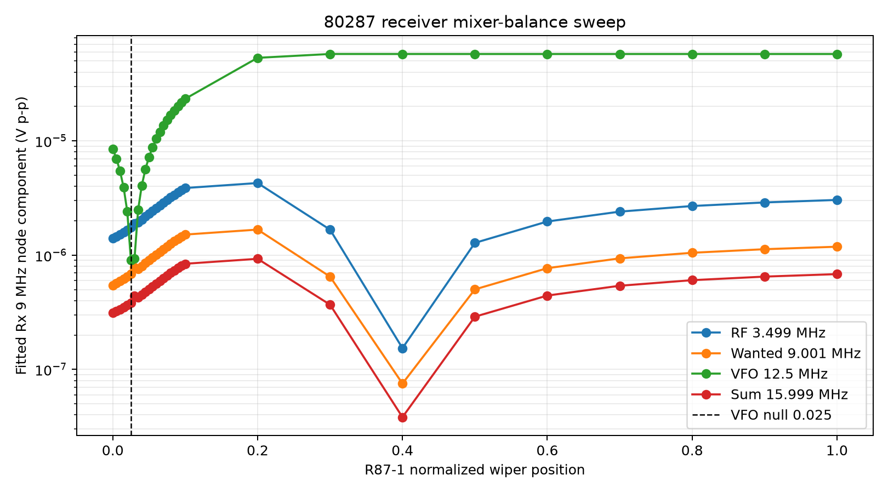
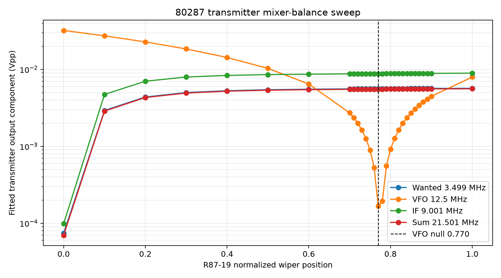
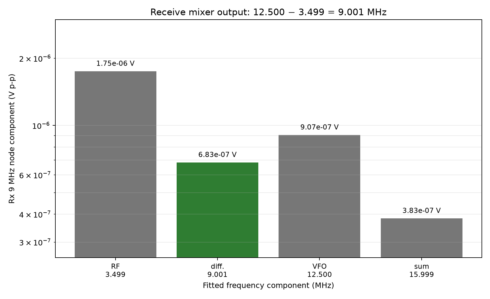
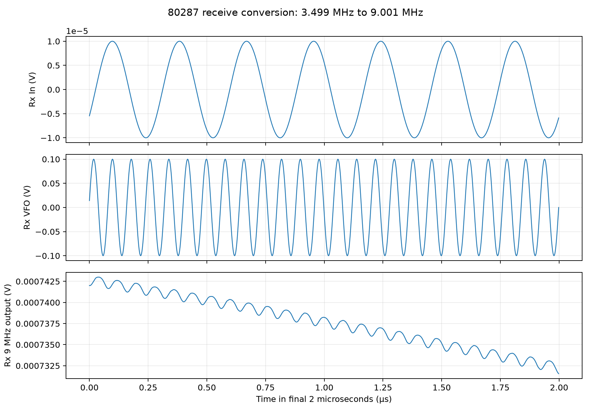
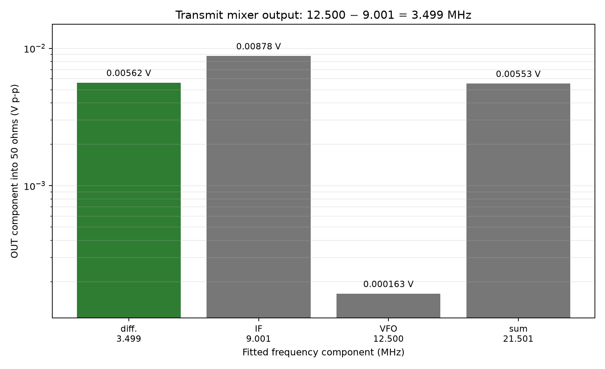
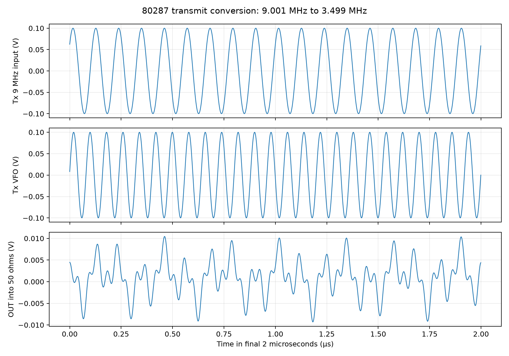

# 80287 TX-RX Mixer

## Overview

The Ten-Tec 80287 assembly is the frequency-conversion bridge between the
radio's tunable RF circuits and its fixed 9 MHz SSB/IF circuits. It contains
two MC1496 double-balanced mixers:

```text
RECEIVE
Antenna -> 80166 RF amplifier -> Rx In -> U87-1 x Rx VFO
        -> 9 MHz tuned output -> 80282 crystal filter -> 80279 IF/AGC
        -> product detector and audio

TRANSMIT
Microphone -> 80282 balanced modulator and crystal filter -> Tx 9MHz
           -> U87-2 x Tx VFO -> OUT -> 80291 selected-band filter
           -> 80285 low-level driver -> driver/final amplifier -> antenna
```

The board does not merely amplify these signals. Each MC1496 multiplies its
signal-port voltage by the VFO waveform. Multiplication produces components at
the sum and difference of the two input frequencies:

```text
fOUT = fVFO + fSIGNAL and |fVFO - fSIGNAL|
```

Inside the MC1496, a lower differential pair converts the signal input to a
differential current. The VFO drives an upper transistor switching quad, which
alternately steers that current between the two collector outputs. Reversing
the current at the VFO rate is multiplication in the time domain and therefore
creates the sum and difference products in the frequency domain. The balanced
topology ideally cancels direct signal and VFO feedthrough; the balance
adjustments compensate for real-device and component mismatch.

Using a fixed 9 MHz IF lets one crystal filter provide the radio's narrow,
stable selectivity on every amateur band. The VFO and mixers translate the
selected operating frequency to 9 MHz on receive and translate the filtered
9 MHz SSB spectrum back to the selected band on transmit. Ten-Tec describes
the mixer on [PDF page 30, printed page 3-14](literature/540%20Triton%20Owner%20Manual.pdf#page=30)
and shows the assembly on [PDF page 31, printed page 3-15](literature/540%20Triton%20Owner%20Manual.pdf#page=31).

## Receive signal-chain walkthrough

1. The antenna signal has already passed through the 80166 RF amplifier and
   its band-tuned circuits. That board's output enters 80287 at `Rx In`.
2. C87-1 couples `Rx In` to the signal port of U87-1. R87-1 is the receiver
   mixer-balance control; the surrounding resistors establish signal-port DC
   bias and permit adjustment of a residual receiver birdie.
3. `Rx VFO` comes from the internal 80289 VFO, or from an external VFO through
   the ACCESSORIES connector and its jumper. C87-4 and R87-9 couple it to
   U87-1's carrier port. R87-5 through R87-8 establish the carrier-port bias.
4. With the 80-metre simulation values, U87-1 receives a 3.499 MHz RF spectral
   component and a 12.500 MHz VFO signal. It produces both 9.001 MHz and
   15.999 MHz products. The wanted conversion is:

   ```text
   12.500 MHz - 3.499 MHz = 9.001 MHz
   ```

5. C87-5 and L87-3 form a collector load tuned near 9 MHz, favoring the wanted
   difference product. D87-1 is reverse-biased while `R` is present; when `R`
   is removed for transmit, D87-1 conducts and shorts/mutes this receiver
   output. C87-8 couples the result to `Rx 9MHz`.
6. The signal next enters the eight-pole crystal lattice filter on the 80282
   SSB Generator. The filter supplies the receiver selectivity and rejects
   out-of-passband mixer products. Its output goes to the 80279 IF-AGC board,
   whose gain-controlled 9 MHz stages feed the product detector and audio
   chain. This routing is documented on [PDF page 32, printed page 3-16](literature/540%20Triton%20Owner%20Manual.pdf#page=32)
   and [PDF page 38, printed page 3-22](literature/540%20Triton%20Owner%20Manual.pdf#page=38).

## Transmit signal-chain walkthrough

1. Microphone audio is amplified on the 80282 SSB Generator and applied to its
   MC1496 balanced modulator with the approximately 9 MHz carrier oscillator.
   This first produces double-sideband suppressed-carrier modulation.
2. The same eight-pole crystal lattice filter used on receive removes the
   unwanted sideband and further suppresses the carrier. The resulting SSB
   spectrum leaves 80282 and enters this board at `Tx 9MHz`.
3. C87-14 couples that signal to U87-2's signal port. `Tx VFO` reaches the
   carrier port through the documented series C87-18 22 pF capacitor and the
   L87-1/C87-15/C87-16/C87-17 network. R87-19 is the transmit mixer-balance
   control. The `T` voltage enables this stage.
4. For the same 80-metre example, U87-2 mixes 9.001 MHz with 12.500 MHz. It
   creates a wanted 3.499 MHz difference product and an unwanted 21.501 MHz
   sum product:

   ```text
   12.500 MHz - 9.001 MHz = 3.499 MHz
   12.500 MHz + 9.001 MHz = 21.501 MHz
   ```

   This conversion moves the modulation already formed and filtered at 9 MHz
   to the operating band without changing its audio information.
5. The differential collectors drive the center-tapped L87-2 transformer and
   C87-9 couples the result to `OUT`. The raw output still contains both mixer
   products plus residual 9 MHz and VFO feedthrough.
6. `OUT` goes to the 80291 assembly. Its band-switch-selected filter passes the
   desired operating-frequency product; 80 metres uses a five-pole low-pass
   filter and the other bands use double-tuned, overcoupled band-pass filters.
   The 80285 low-level driver then raises the filtered RF level for the driver
   and final-amplifier chain. See [PDF page 41, printed page 3-25](literature/540%20Triton%20Owner%20Manual.pdf#page=41)
   and [PDF page 42, printed page 3-26](literature/540%20Triton%20Owner%20Manual.pdf#page=42).

## Simulation setup

The KiCad hierarchy is the circuit source of truth. The runner exports a fresh
SPICE netlist from `triton_540.kicad_sch`, changes only the `R` and `T` control
voltages in generated copies, and runs ngspice. The top sheet supplies `+12`
from its saved ideal 13.28 V source.

The simulation-only fixtures on the 80287 sheet are excluded from BOM and
position files:

| Fixture | Applied value | Purpose |
|---|---:|---|
| `Rx In` | 10 µV peak at 3.499 MHz | One spectral component of a 3.5 MHz SSB signal |
| `Rx VFO` | 100 mV peak at 12.500 MHz | Receive local oscillator |
| `Tx 9MHz` | 100 mV peak at 9.001 MHz | One filtered SSB spectral component |
| `Tx VFO` | 100 mV peak at 12.500 MHz | Transmit local oscillator |
| R87-90 | 10 kΩ | Simulation-only receive IF load |
| R87-91 | 50 Ω | Simulation-only transmitter output load |

These single-tone tests show frequency translation; they are not voice,
two-tone linearity, noise, or dynamic-range tests. Source amplitudes are
deliberately modest because the transistor-level MC1496 model has not been
calibrated against a physical 80287 assembly.

The saved simulation positions are R87-1 = 0.025 and R87-19 = 0.77. These are
model-derived nulls, not physical shaft positions or factory settings.

### DC comparison with the service manual

The DC regression runs the complete hierarchy for 500 µs and averages the
last 20 µs. This avoids mistaking ngspice's initial startup solution for the
settled bias. The acceptance criterion is ±15% of a nonzero manual value and
±0.15 V for a zero value. A dagger marks a failed comparison.

Board connector/control measurements:

| Point | Manual TX (V) | Sim TX (V) | Manual RX (V) | Sim RX (V) |
|---|---:|---:|---:|---:|
| `+12` | 13.8 | 13.28 | 13.8 | 13.28 |
| `R` | 0.6 | 0.60 | 12.8 | 12.80 |
| `T` | 10.4 | 10.40 | 0.2 | 0.20 |
| `Rx VFO` | 0.05 | 0.000 | 0.05 | 0.000 |
| `Tx VFO` | 0.1 | 0.000 | 0.1 | 0.000 |
| `Rx 9MHz` | 0 | 0.000 | 0 | 0.001 |
| `Tx 9MHz` | 0 | 0.000 | 0 | 0.000 |
| `OUT` | 0 | 0.001 | 0 | 0.001 |

The ideal VFO sources are centered on 0 V, explaining their small difference
from the manual's 0.05 V and 0.1 V terminal readings. They are AC-coupled into
the biased MC1496 carrier ports.

MC1496 pin measurements:

| Pin | U87-1 manual TX | Sim TX | U87-1 manual RX | Sim RX | U87-2 manual TX | Sim TX | U87-2 manual RX | Sim RX |
|---:|---:|---:|---:|---:|---:|---:|---:|---:|
| 1 | 0.2 | 0.338 | 3.5 | **5.594†** | 6.5 | 6.311 | 6.7 | 6.683 |
| 2 | 0 | 0.006 | 2.7 | **4.773†** | 5.8 | 5.480 | 6.2 | 6.304 |
| 3 | 0 | 0.006 | 2.7 | **4.811†** | 5.8 | 5.509 | 6.2 | 6.304 |
| 4 | 0.2 | 0.338 | 3.4 | **5.640†** | 6.5 | 6.346 | 6.7 | 6.683 |
| 5 | 0.5 | 0.642 | 1.2 | **2.686†** | 3.0 | 3.170 | 0.2 | 0.200 |
| 6 | 0.7 | 0.658 | 11.8 | 11.117 | 12.8 | 12.545 | 13.4 | 12.966 |
| 8 | 0.4 | 0.498 | 6.5 | **8.350†** | 9.8 | 9.423 | 10.0 | 9.825 |
| 10 | 0.4 | 0.498 | 6.5 | **8.354†** | 9.8 | 9.428 | 10.0 | 9.825 |
| 12 | 0.7 | 0.658 | 11.8 | 11.117 | 12.8 | 12.544 | 13.4 | 12.966 |
| 14 | 0 | 0 | 0 | 0 | 0 | 0 | 0 | 0 |

The current result is 33 passes in 40 connected-pin/mode checks. Every U87-1
transmit point and every U87-2 point passes. The seven failures are confined to
U87-1's receive signal/carrier bias network; its two collectors pass. Because
the same device model reproduces U87-2, especially pin 5, changing a global
MC1496 parameter merely to force U87-1 onto the manual values is not yet
justified. This remains a manual/schematic/model discrepancy to investigate.

### Mixer-balance adjustment

Each balance potentiometer was swept through its complete normalized model
range, followed by a finer sweep around the lowest VFO component. The result
confirms that these controls primarily cancel VFO feedthrough rather than the
signal-port input:

| Control and setting | Wanted product | VFO feedthrough | Signal-port feedthrough |
|---|---:|---:|---:|
| R87-1 = 0.50 | 0.502 µV p-p | 57.6 µV p-p | 1.28 µV p-p RF |
| R87-1 = 0.025, saved null | 0.683 µV p-p | 0.907 µV p-p | 1.75 µV p-p RF |
| R87-19 = 0.50 | 5.435 mV p-p | 10.301 mV p-p | 8.551 mV p-p IF |
| R87-19 = 0.77, saved null | 5.613 mV p-p | 0.167 mV p-p | 8.782 mV p-p IF |

Both adjustments reduce their modeled VFO leakage by about 36 dB without
reducing the wanted difference product. Neither materially improves direct RF
or IF feedthrough, which depends on signal-port symmetry, transformer/loading
balance, and the following selective filter.





### Receive mixing

The receive run applies 20.0 µV p-p at 3.499 MHz. A simultaneous sine fit at
the four relevant frequencies measures 0.683 µV p-p at the wanted 9.001 MHz
difference product on `Rx 9MHz`.



The green bar is the conversion needed by the 9 MHz crystal filter. After the
R87-1 adjustment, modeled 12.500 MHz VFO leakage is 0.907 µV p-p instead of
57.6 µV p-p. Residual RF and VFO terms still show why the following narrow
crystal filter matters and why this isolated-board model must not be used as a
quantitative suppression prediction.

The corresponding steady-state waveforms show the applied RF and VFO signals
and the AC-coupled receive output:



### Transmit mixing

The transmit run applies 200 mV p-p at 9.001 MHz. At `OUT`, the simultaneous
fit measures 5.62 mV p-p at the wanted 3.499 MHz difference product. The raw
mixer also generates 5.53 mV p-p at the 21.501 MHz sum product:



The nearly equal sum and difference products are the expected unfiltered mixer
result. R87-19 reduces modeled 12.500 MHz leakage to 0.163 mV p-p, but the
9.001 MHz component remains 8.78 mV p-p. On 80 metres, the following 80291
five-pole low-pass filter selects 3.499 MHz and rejects 9.001 and 21.501 MHz.
Absolute suppression still depends strongly on loading and model accuracy.



## Magnetics and remaining limitations

- **Calculated:** With documented C87-5 = 150 pF, ideal 9 MHz resonance requires
  L87-3 = 2.08 µH. The schematic uses a rounded 2 µH starting value. Device,
  board, and winding capacitance will lower the required physical inductance.
- **Inferred:** L87-1 is presently 1 µH. The manual provides no inductance or
  construction data, so this is a simulation starting estimate.
- **Inferred:** The project-local L87-2 model preserves the documented
  continuous center-tapped winding with two estimated 10 µH halves, 1 Ω
  resistance per half, `K=0.98`, and 2 pF end-to-end capacitance.
- **Unknown:** Factory winding data, actual terminations, aligned conversion
  gain, balance, carrier rejection, intermodulation, noise, and temperature
  behavior require original-board measurements or primary construction data.
- A radio-level simulation should replace R87-90 and R87-91 with the actual
  80282 crystal-filter and 80291 selected-filter input impedances.

## Reproducing the simulations

From the project root, with KiCad 10 and ngspice installed:

```powershell
python spice\tools\run_80287_operation.py
python spice\tools\run_80287_rx_balance.py
python spice\tools\run_80287_tx_balance.py
python spice\tools\run_mc1496_dc_regression.py
```

The operation runner exports the current KiCad hierarchy and regenerates the
measurement CSV plus the transient and product figures under
`spice/studies/80287/operation-3p5mhz/`. The two balance runners record the
R87-1 and R87-19 sweeps as model evidence, not as recommended hardware
settings. The DC runner regenerates the settled service-voltage comparison under
`spice/studies/80287/dc-regression/`.

## Evidence status

- **Documented:** assembly topology, component values shown by Ten-Tec,
  nominal DC voltages, VFO routing, crystal-filter routing, and the adjacent
  receive/transmit assemblies.
- **Calculated:** mixer sum/difference frequencies and the ideal L87-3 value.
- **Inferred for simulation:** L87-1, the L87-2 coupled model, source amplitudes,
  top-sheet choke value, and isolated-board test loads.
- **Demonstrated by the present model:** generation of the intended receive and
  transmit difference products and correct `R`/`T` mode selection.
- **Not established:** factory RF performance or complete DC-model accuracy.
