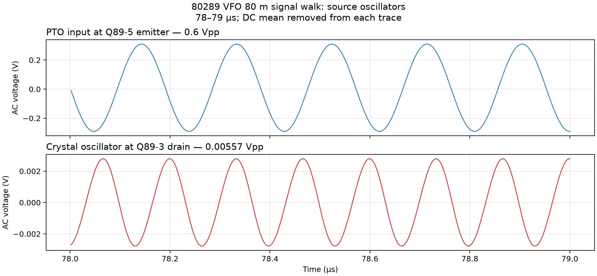
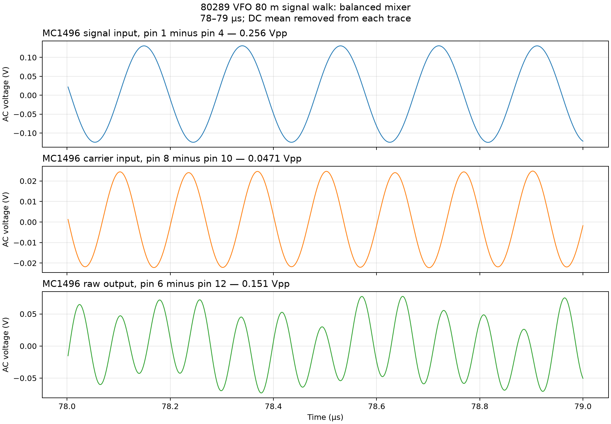
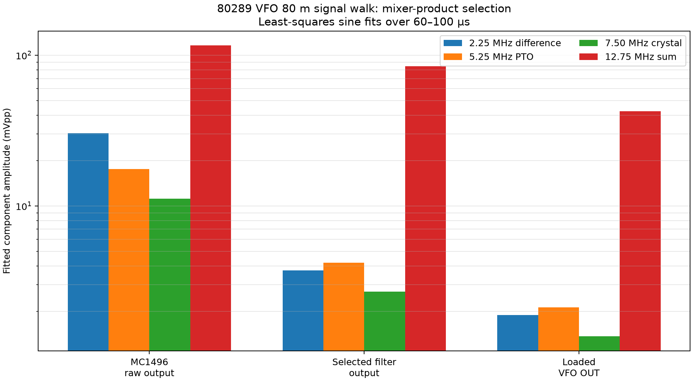
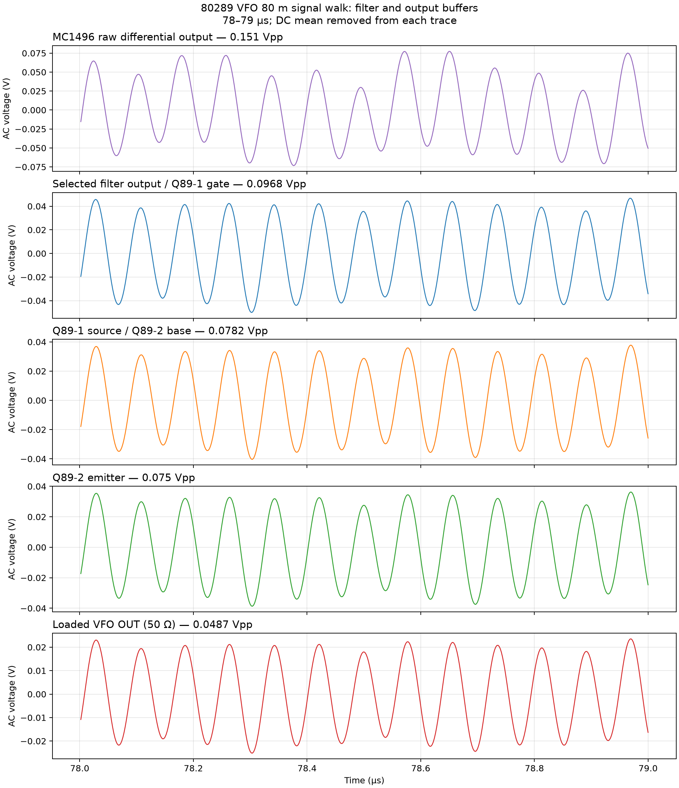
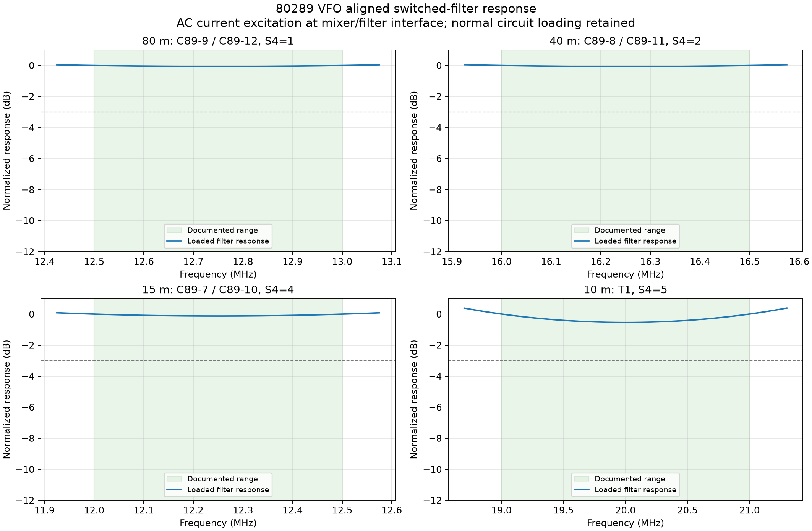
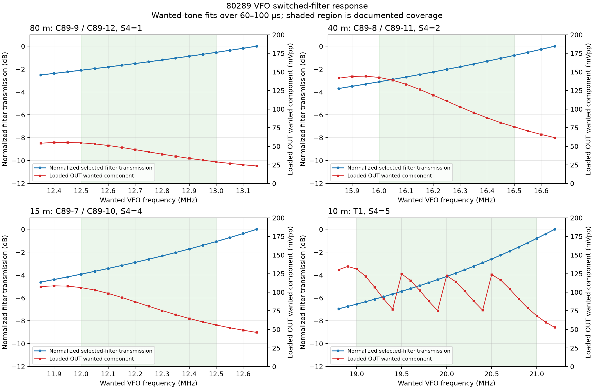
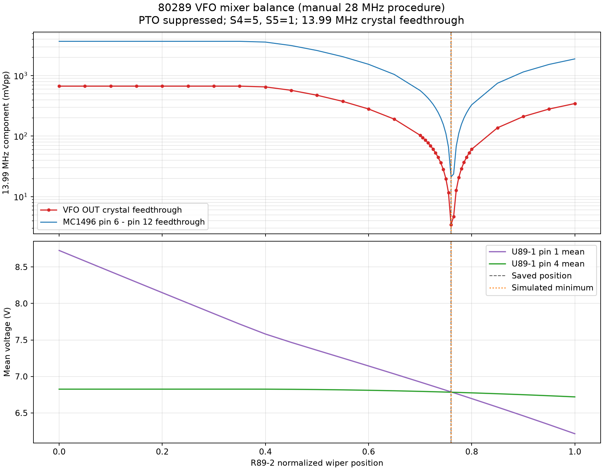
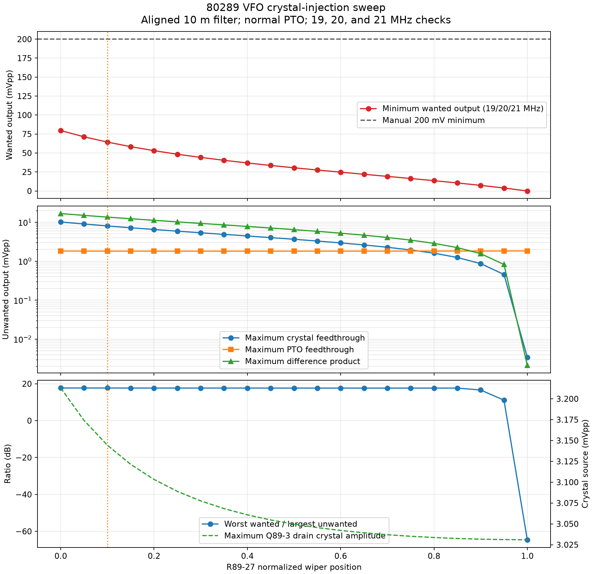
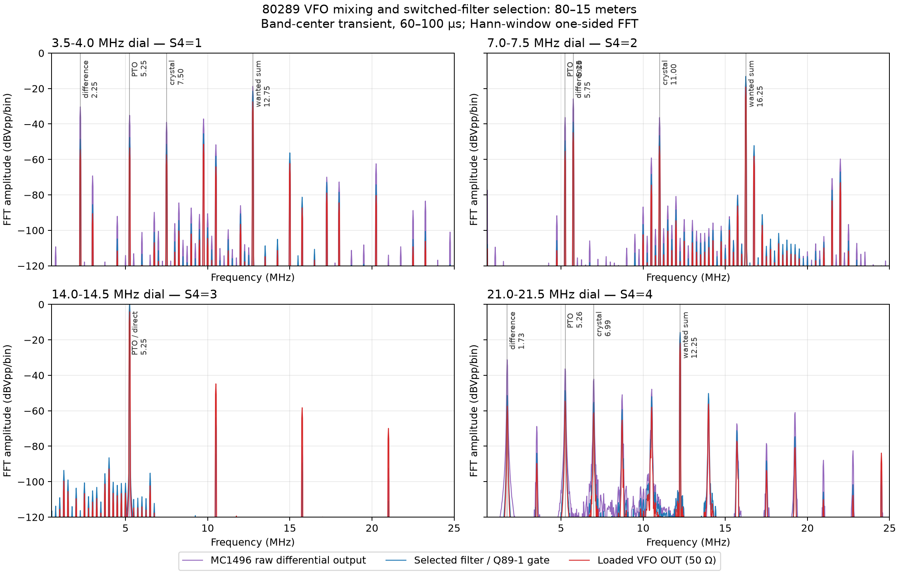
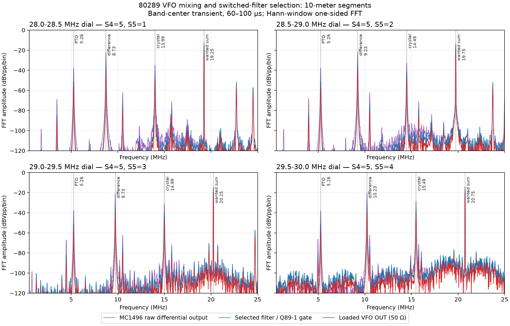

# 80289 VFO Assembly

## Purpose

The 80289 assembly generates the tunable local-oscillator signal used by both
the receiver and transmitter in the Triton IV Model 540. It does not oscillate
directly on every amateur band. Instead, it combines:

1. a continuously tunable, stable 5.0–5.5 MHz permeability-tuned oscillator
   (PTO), and
2. a bandswitch-selected crystal oscillator,

to produce the injection frequency required by the radio's 9 MHz intermediate-
frequency system.

The complete frequency-generation chain is:

```text
Main tuning knob
      ↓
80278 PTO subassembly
      └─ 80277 oscillator circuit board: 5.0–5.5 MHz master oscillator
                                      ↓
                        MC1496 double-balanced mixer
Crystal oscillator ───────────────────┘
      ↑                                ↓
 BAND switch                selected band-pass filter
                                      ↓
                              Q1/Q2 output follower
                                      ↓
                         internal/external-VFO switching
                                      ↓
                    receiver mixer and transmitter mixer
```

This description is based primarily on the service text and schematic in the
*Triton IV Model 540 Owner's Manual*, PDF pages 26–29 / printed pages 3-10
through 3-13. The way the resulting signal is used by the receiver and
transmitter is described on PDF page 30 / printed page 3-14.

## Assembly-number hierarchy

The manual uses the assembly numbers in a way that can initially appear
inconsistent:

- **80289** is the complete VFO subassembly shown by the outer boundary on the
  schematic. It includes the PTO, crystal oscillator, mixer, filters, output
  follower, bandswitch wafers, and adjustments.
- **80278** is the PTO subassembly. It includes the sealed, mechanically tuned
  oscillator system associated with the main tuning coil housing.
- **80277** is the oscillator circuit-board subassembly inside the PTO. It
  carries the active 5.0–5.5 MHz oscillator, its buffer, thermally compensating
  capacitors, and the varactor circuits.

The service-section heading calls the unit “80277 VFO,” while the schematic
labels the complete unit “VFO S/A 80289,” the nested unit “PTO S/A 80278,” and
the board “OSC CIRCUIT BD S/A 80277.” In this document, the schematic's nested
assembly labels are used so the physical and electrical boundaries remain
clear.

## Frequency plan

The radio uses a 9 MHz IF. The VFO output is therefore selected so that mixing
it with the received or transmitted signal produces the correct 9 MHz
difference. Ten-Tec gives the following output ranges:

| Dial band | 80289 output | Receiver relationship | Transmitter relationship |
|:--|:--|:--|:--|
| 3.5–4.0 MHz | 12.5–13.0 MHz | VFO − RF = 9 MHz | VFO − 9 MHz = RF |
| 7.0–7.5 MHz | 16.0–16.5 MHz | VFO − RF = 9 MHz | VFO − 9 MHz = RF |
| 14.0–14.5 MHz | 5.0–5.5 MHz | RF − VFO = 9 MHz | 9 MHz + VFO = RF |
| 21.0–21.5 MHz | 12.0–12.5 MHz | RF − VFO = 9 MHz | 9 MHz + VFO = RF |
| 28.0–28.5 MHz | 19.0–19.5 MHz | RF − VFO = 9 MHz | 9 MHz + VFO = RF |
| 28.5–29.0 MHz | 19.5–20.0 MHz | RF − VFO = 9 MHz | 9 MHz + VFO = RF |
| 29.0–29.5 MHz | 20.0–20.5 MHz | RF − VFO = 9 MHz | 9 MHz + VFO = RF |
| 29.5–30.0 MHz | 20.5–21.0 MHz | RF − VFO = 9 MHz | 9 MHz + VFO = RF |

The first two relationships can be checked directly. At 3.5 MHz,
12.5 MHz − 3.5 MHz = 9 MHz; at 7 MHz, 16 MHz − 7 MHz = 9 MHz. On the
upper bands the order reverses: 21 MHz − 12 MHz = 9 MHz and
28 MHz − 19 MHz = 9 MHz.

The 14 MHz band is the simplest case. The selected path sends the PTO's
5.0–5.5 MHz signal directly to the output chain rather than frequency
converting it. On the other bands, a fixed crystal frequency is added to the
PTO frequency in the MC1496 mixer. The BAND switch selects both the appropriate
crystal and the appropriate mixer-output filter. Separate crystals provide
the four 500 kHz ten-meter segments.

The frequency table is documented by Ten-Tec on PDF page 26 / printed page
3-10. The arithmetic relationships in the last two columns are calculated
from that table and the documented 9 MHz IF.

## How the 80278 PTO and 80277 oscillator board work

### Permeability tuning

The master oscillator covers only one octave fraction, 5.0–5.5 MHz, regardless
of the selected amateur band. Its frequency is controlled by the main tuning
mechanism rather than a conventional air-variable capacitor.

The tuned network contains L1, L2, and L3:

- **L3 is the main mechanically varied inductance.** Movement of the main
  tuning mechanism changes how far the magnetic core penetrates the coil and
  therefore changes its inductance.
- **L2 shunts L3.**
- **L1 is in series with the L2/L3 combination.**

L1 and L2 are slug-adjusted coils on the same form. Their adjustment determines
the end points and linearity of the 500 kHz tuning range. The manual identifies
L2 as the coil nearest the aluminum cover when the VFO is viewed from below.

The basic resonance relationship is:

$$
f_0 = \frac{1}{2\pi\sqrt{LC}}
$$

With the capacitance approximately fixed, moving the main core to increase
inductance lowers the oscillator frequency; withdrawing it decreases
inductance and raises the frequency. L1 and L2 let the factory or service
technician alter the effective inductance curve so the mechanical dial tracks
frequency from 5.000 to 5.500 MHz.

### Q5 oscillator and Q4 buffer

On oscillator circuit board 80277, Q5 (MPS6512 on the manual schematic) is the
active oscillator transistor. The L1/L2/L3 network and its associated
capacitors provide the frequency-selective feedback. The capacitor markings
include temperature coefficients such as N750 and N1500. These parts
deliberately change capacitance with temperature to oppose the temperature
coefficient of the coil, transistor, and other capacitors. They are part of
the VFO's stability design and should not be replaced solely on the basis of
capacitance value.

Q4 (MPS6514) buffers and amplifies the oscillator signal before it leaves the
80277 board. C24 couples the Q5 oscillator into Q4, while L4 serves as Q4's RF
collector load and helps isolate the signal from the supply. Buffering is
important because a changing load at the MC1496 mixer would otherwise pull the
master oscillator and move the radio's frequency.

The PTO receives a regulated supply through RF chokes and several local
decoupling capacitors. The sealed construction, supply isolation, buffer, and
temperature-compensating components all reduce frequency changes caused by
voltage, load, temperature, or nearby circuitry.

This component-level interpretation follows the topology on PDF page 29 /
printed page 3-13. Ten-Tec explicitly documents the 5.0–5.5 MHz range,
L1/L2/L3 relationship, sealed board, and linearity adjustments on PDF page 26 /
printed page 3-10.

### Two different offset functions

There are two separate varactor actions in the PTO, and they should not be
confused.

#### Operator OFFSET tuning

The front-panel OFFSET control changes the receiver frequency by approximately
±5 kHz without changing the transmitter frequency. Its control voltage enters
the PTO at the `OFFSET` connection and changes the capacitance of a varactor in
the oscillator tank. The push-pull switch disables this function when pulled
out. The control board removes the receive offset during transmission, which
is why the front-panel OT lamp goes out when the transmitter is keyed.

Changing varactor capacitance shifts the same master oscillator used for normal
tuning. The difference is that this bias is applied only to the receive
condition, allowing the operator to move the receiver slightly while the
transmitted carrier remains on the original dial frequency.

The operating behavior is documented on PDF page 11 / printed page 2-6. The
varactor connection appears on the schematic at PDF page 29 / printed page
3-13.

#### Fixed 21/28 MHz correction

Ten-Tec deliberately chose the crystal-oscillator frequencies for the 21 and
28 MHz ranges 10 kHz lower than the nominal values to move band-edge birdies.
When those bands are selected, switch S1B applies an adjustable bias to the
second varactor circuit. R22 sets the amount of correction so the PTO
contribution compensates for the deliberately low crystal frequency.

The alignment test makes the function clear: with the dial untouched, the
technician first verifies 5.000 MHz on the 14 MHz band, then selects 21 MHz and
adjusts R22 for exactly 12.000 MHz at the VFO output. This is a fixed
band-dependent calibration correction, not the operator's receive-only OFFSET
control. It is documented on PDF page 27 / printed page 3-11.

## Crystal oscillator and MC1496 mixer

Q3 is the crystal-oscillator transistor. S1A and the other bandswitch contacts
select the crystal appropriate to the chosen band or ten-meter segment.
R27, identified in the chassis photograph as `XTAL INJ.`, controls the
crystal-oscillator injection into the MC1496.

The MC1496 is used as a double-balanced mixer. It receives:

- the continuously variable 5.0–5.5 MHz signal from the buffered PTO, and
- the selected fixed crystal-oscillator signal.

Its output contains the wanted sum and difference products, residual input
signals, and higher-order products. The following tuned circuits select only
the desired VFO range. R2, marked `MIXER BAL.`, balances the MC1496 to minimize
crystal-oscillator feedthrough. Ten-Tec's alignment procedure disables the PTO
temporarily and adjusts R2 for minimum residual RF at the VFO output.

R27 must not simply be advanced for maximum output. The manual specifies
setting it so the lowest output point is about 200 mV and warns that excess
injection increases unwanted mixer products without improving radio
performance.

## Band-selected filtering

The mixer is followed by switched, double-tuned band-pass networks:

- T1 covers the ten-meter VFO range. Its two resonators are intentionally
  overcoupled to give a broad, double-peaked response across 19–21 MHz.
- C7–C12 adjust the paired resonators used for the 3.5, 7, and 21 MHz bands.
  Each pair is adjusted for a reasonably symmetrical response over its
  assigned 500 kHz range.
- The 14 MHz position uses the 5.0–5.5 MHz PTO signal directly.

The filters are broad enough to cover an entire amateur-band segment but
narrow enough to suppress the unwanted MC1496 product and crystal
feedthrough. A double-peaked response with a shallow center dip is normal for
an overcoupled pair; attempting to force a single razor-sharp peak would reduce
output near the band edges.

Ten-Tec specifies at least 200 mV output throughout the range and notes that it
may rise to approximately 300 mV. The filter and injection alignment procedure
is on PDF page 27 / printed page 3-11.

## Output follower and distribution

After filtering, Q1 (2N5486 on the schematic) drives Q2 (MPS6514). Together
they form the high-input-impedance follower stage described by Ten-Tec as a
Darlington follower. This stage provides current gain and isolates the tuned
filters from the changing loads presented by the accessory wiring and the two
radio mixers. The signal leaves through C15 and R21 at the `OUT` terminal.

The VFO output is routed through the rear ACCESSORIES socket. With the normal
jumper plug installed, the internal 80289 signal is returned to both the
receiver and transmitter mixers. An external VFO can replace that signal by
using the accessory connections. This routing explains why the manual requires
the accessory jumper when no external unit is installed.

In receive, the 80287 receiver mixer combines the selected RF signal with the
VFO to produce the 9 MHz IF. In transmit, the other mixer combines the same VFO
with the modulated 9 MHz signal from the SSB generator to produce the operating
frequency. Because both paths use the same source, receiver tuning and
transmitter tuning normally track.

The mixer use and accessory routing are documented on PDF page 30 / printed
page 3-14; the jumper requirement is described on PDF page 9 / printed page
2-4.

## Alignment logic

The adjustments are intended to be made in functional order:

1. **Disable front-panel OFFSET.**
2. **Align the PTO at 5.000 MHz.** L2 first establishes the lower endpoint.
3. **Check the complete 5.0–5.5 MHz span.** L2 primarily changes the spread;
   L1 restores the 5.000 MHz endpoint. Repeating the two adjustments corrects
   linearity and the upper endpoint.
4. **Set the 21/28 correction.** R22 makes the 21 MHz position produce
   12.000 MHz at the VFO output when the dial reference is unchanged.
5. **Balance the MC1496.** R2 minimizes crystal feedthrough with the PTO
   temporarily suppressed.
6. **Set crystal injection.** R27 establishes adequate output without
   unnecessarily increasing mixer products.
7. **Align the switched output filters.** T1 covers ten meters; C7–C12 cover
   3.5, 7, and 21 MHz.

The frequency counter must be coupled lightly. A counter or probe that loads
the output can pull the oscillator or change the apparent filter response.
Ten-Tec calls for at least 100 mV counter sensitivity so that heavy coupling is
not required.

## SPICE study 1: 80-meter DC operating point

The saved KiCad schematic was simulated in the 80-meter position
(`S4_POS=1`) at 27 °C. The DC operating point is the initial solution of the
saved transient analysis. The simulation supplies were set to the manual's
measurement conditions:

- unregulated `+12`: 13.8 V,
- `+REG`: 8.0 V, and
- centered `OFFSET`: 3.1 V.

The machine-readable simulator output is
[`spice/studies/80289/dc-bias/80289-vfo-80m-dc-operating-point.csv`](spice/studies/80289/dc-bias/80289-vfo-80m-dc-operating-point.csv).
It records the actual node names and voltages used for the tables below.

Although the radio labels its main rail `+12`, the manual specifies operation
from 12–14 V and uses 13.8 V for its service voltage tables. Using 12.0 V in
this comparison would therefore create a systematic error in the high-voltage
readings.

The transistor comparison is:

| Device | Terminals | Manual (V) | Simulated (V) | Largest deviation |
|:--|:--|--:|--:|--:|
| Q89-1, 2N5486 | D / G / S | 12.8 / 6.8 / 7.1 | 12.510 / 6.670 / 7.579 | +6.8% |
| Q89-2, MPS6514 | C / B / E | 12.8 / 7.1 / 6.4 | 12.510 / 7.579 / 6.852 | +7.1% |
| Q89-3, 2N5486 | D / G / S | 7.8 / -2.2 / 0 | 7.753 / -2.200 / 0.024 | 0.6%; source +24 mV |
| Q89-4, MPS6514 | C / B / E | 5.4 / 1.2 / 0.5 | 5.294 / 1.157 / 0.452 | -9.5% |

The U89-1 MC1496 comparison is:

| U89-1 pin | Manual (V) | Simulated (V) | Deviation |
|---:|--:|--:|--:|
| 1 | 7.0* | 7.359 | +5.1% |
| 2 | 6.2 | 6.475 | +4.4% |
| 3 | 6.1 | 6.029 | -1.2% |
| 4 | 6.8 | 6.821 | +0.3% |
| 5 | 3.8 | 3.891 | +2.4% |
| 6 | 13.1 | 12.749 | -2.7% |
| 7 | 13.1 | 12.749 | -2.7% |
| 8 | 10.2 | 10.036 | -1.6% |
| 10 | 10.2 | 10.032 | -1.6% |
| 12 | 13.0 | 12.781 | -1.7% |
| 14 | 0 | 0 | 0 V |

`*` The manual notes that U89-1 pin 1 depends on the R89-2 mixer-balance
setting.

For this functional restoration model, ±10% was used as a pragmatic comparison
criterion for nonzero service readings; this is an engineering acceptance
criterion, not a Ten-Tec production tolerance. Q89-1 through Q89-4 and all
documented U89-1 pins meet it. Most readings are within 5%, and the largest
error is the 48 mV difference at Q89-4's nominal 0.5 V emitter.

Q89-5 is deliberately excluded from the system-level transient and replaced by
the behavioral 5.25 MHz PTO source, so its system nodes are not a valid
transistor operating-point result. A separate DC validation of the
datasheet-derived MPS6512 model, using the Q89-5 bias resistors and an 8.0 V
collector supply, gives base = 2.394 V, emitter = 1.737 V, and collector
current = 0.898 mA. The manual lists collector/base/emitter as
8.0/2.2/2.3 V; its emitter-above-base pair is not physically consistent with
the documented NPN device, so that datum was not used as a model-fitting
target.

The manual reference is PDF page 28 / printed page 3-12. The `+REG` and
`OFFSET` supply conditions are documented on PDF page 51 / printed page 3-35.
These results validate nominal DC bias only. They do not establish production
spread, temperature behavior, oscillator startup, or RF amplitude accuracy.

## SPICE study 2: 80-meter signal walk

This transient study follows the RF signal through the two sources, U89-1
balanced mixer, selected 80-meter filter, and the Q89-1/Q89-2 output buffers.
It uses the saved 80-meter switch position (`S4_POS=1`) and the center of the
modeled PTO range:

| Condition | Setting |
|:--|:--|
| Main supply (`+12`) | 13.8 V |
| Regulated supply (`+REG`) | 8.0 V |
| OFFSET source | 3.1 V |
| PTO source at Q89-5 emitter | 5.25 MHz, 300 mV peak, 1.7 V DC |
| Selected crystal source | 7.50 MHz, 1 V peak, 2.2 V DC |
| VFO output load | 50 Ω, simulation-only |
| Temperature | 27 °C |
| Transient analysis | `.tran 2n 100u 60u 2n` |
| Measurement interval | 60–100 µs |
| Waveform plot interval | 78–79 µs |

The ideal source substitutions force the source frequencies and amplitudes;
this is a functional frequency-conversion study, not an oscillator-startup or
crystal-drive validation. The CSV files contain absolute node voltages. The
time-domain figures subtract each trace's mean over the displayed interval so
the RF waveforms can share readable vertical scales.

### Source and mixer walkthrough



The PTO emitter is the expected 5.25 MHz, 0.600 Vpp sine wave. Q89-3's drain
contains a 7.50 MHz, 5.57 mVpp waveform. This small drain swing is a consequence
of the present ideal-crystal-source substitution and should not be interpreted
as a prediction of the original crystal oscillator's production amplitude.
The carrier voltage actually applied differentially to U89-1 is shown below.



At U89-1, the differential signal input (pin 1 minus pin 4) is 0.254 Vpp at
5.25 MHz and the differential carrier input (pin 8 minus pin 10) is
46.4 mVpp at 7.50 MHz. The raw differential output (pin 6 minus pin 12)
contains the desired sum product as well as carrier feedthrough and smaller
products, so it is intentionally not sinusoidal.

### Product selection and output buffers



Least-squares sine fits over 60–100 µs quantify what the switched double-tuned
filter is doing:

| Stage | 2.25 MHz difference | 5.25 MHz PTO | 7.50 MHz crystal | 12.75 MHz sum |
|:--|--:|--:|--:|--:|
| U89-1 raw differential output | 30.4 mVpp | 17.6 mVpp | 11.2 mVpp | 115.8 mVpp |
| Selected filter output / Q89-1 gate | 3.74 mVpp | 4.19 mVpp | 2.70 mVpp | 84.5 mVpp |
| Loaded VFO OUT | 1.89 mVpp | 2.12 mVpp | 1.36 mVpp | 42.5 mVpp |

The raw mixer output contains both wanted and unwanted products, but the
12.75 MHz sum product is already largest and becomes more dominant after the
selected filter. This is the VFO
frequency required for 80-meter reception with the radio's 9 MHz IF:
5.25 MHz + 7.50 MHz = 12.75 MHz (PDF page 26 / printed page 3-10).



The total peak-to-peak waveforms are 96.9 mV at the Q89-1 gate, 78.2 mV at the
Q89-1 source, 75.0 mV at the Q89-2 emitter, and 48.8 mV at the 50 Ω-loaded
VFO output. The output's fitted 12.75 MHz component is 42.5 mVpp. This is
below the manual's 200–300 mV output guidance (PDF page 27 / printed page
3-11) and is therefore not an RF-amplitude validation. The result is sensitive
to the schematic's simulation load R89-89, estimated transformer and filter
values, and simplified active-device models. It does, however, demonstrate the
intended frequency conversion, switched filter selection, buffering, and
AC-coupled output path.

### CSV data and reproduction

The curated numerical outputs are:

- [source waveforms](spice/studies/80289/signal-walk/data/80289-vfo-80m-sources.csv),
- [MC1496 input and output waveforms](spice/studies/80289/signal-walk/data/80289-vfo-80m-mixer.csv),
- [filter, buffer, and final-output waveforms](spice/studies/80289/signal-walk/data/80289-vfo-80m-filter-buffer-output.csv), and
- [measured DC levels, extrema, dominant frequencies, and fitted products](spice/studies/80289/signal-walk/data/80289-vfo-80m-signal-walk-measurements.csv).

Each waveform CSV contains all 20,001 points from 60 through 100 µs. To
regenerate the curated files from a fresh KiCad netlist export, with KiCad
closed, run:

```powershell
python spice\tools\run_80289_signal_walk.py
```

To reproduce the underlying analysis in the KiCad Simulator:

1. Open `triton_540.kicad_sch` and confirm `S4_POS=1`.
2. Confirm the VFO sheet sources are 13.8 V for `+12`, 8.0 V for `+REG`, and
   3.1 V for `OFFSET`; leave the simulation-only 50 Ω `OUT` load enabled.
3. Select **Transient** analysis and enter time step `2n`, final time `100u`,
   initial time `60u`, and maximum time step `2n`. Do not enable UIC.
4. Use the saved LTspice/PSpice-compatible ngspice behavior and save all node
   voltages.
5. Add probes at the Q89-5 emitter, Q89-3 drain, U89-1 pins 1, 4, 8, 10, 6,
   and 12, Q89-1 gate and source, Q89-2 emitter, and `OUT`.
6. Run the analysis and zoom the time axis to 78–79 µs. For the balanced
   quantities, subtract pin 4 from pin 1, pin 10 from pin 8, and pin 12 from
   pin 6. Export the active transient signals with the Simulator's CSV export.

The automated runner uses the same saved schematic and analysis conditions.
Its generated netlist, ngspice raw data, and log are deliberately kept under
`spice/generated/`; only the curated CSVs and plots are study artifacts.

## SPICE study 3: frequency-plan coverage

This study checks the low, center, and high PTO settings for every documented
dial segment. It uses the same 13.8 V `+12`, 8.0 V `+REG`, 3.1 V `OFFSET`,
27 °C temperature, R89-89 50 Ω output load, and `.tran 2n 100u 60u 2n`
analysis as study 2. Each output is linearized onto a 2 ns grid before its
dominant frequency is measured over 60–100 µs.

The normal PTO points are 5.00, 5.25, and 5.50 MHz. Positions 4 and 5 use
5.01, 5.26, and 5.51 MHz to represent the documented R89-22 correction for
the deliberately 10 kHz-low 21/28 MHz crystals. Y89-1, Y89-2, and Y89-3 are
the saved 7.50, 11.00, and 6.99 MHz ideal sources. Position 3 is the direct
PTO path. The top-sheet S5 model selects the saved 13.99, 14.49, 14.99, or
15.49 MHz ideal sources Y1–Y4 for the four ten-meter segments.

**Overall coverage result: PASS.** This includes all four ten-meter segments
after applying the study-4 mixer-balance, crystal-injection, and T1 alignment
settings. The earlier pre-alignment result is superseded by the table and CSV
below.

| Dial coverage | `S4_POS` | `S5_POS` | Crystal or path | Effective PTO (MHz) | Manual output (MHz) | Simulated dominant output, low / center / high (MHz) | Wanted component, low / center / high (mVpp) | Coverage result |
|:--|--:|--:|:--|:--|:--|:--|--:|:--|
| 3.5–4.0 MHz | 1 | — | 7.50 MHz, Y89-1 | 5.00 / 5.25 / 5.50 | 12.50–13.00 | 12.50 / 12.75 / 13.00 | 54.6 / 42.5 / 29.0 | **Pass** |
| 7.0–7.5 MHz | 2 | — | 11.00 MHz, Y89-2 | 5.00 / 5.25 / 5.50 | 16.00–16.50 | 16.00 / 16.25 / 16.50 | 142.6 / 110.8 / 76.3 | **Pass** |
| 14.0–14.5 MHz | 3 | — | direct PTO | 5.00 / 5.25 / 5.50 | 5.00–5.50 | 5.00 / 5.25 / 5.50 | 660.7 / 619.3 / 502.1 | **Pass** |
| 21.0–21.5 MHz | 4 | — | 6.99 MHz, Y89-3 | 5.01 / 5.26 / 5.51 | 12.00–12.50 | 12.00 / 12.25 / 12.50 | 106.2 / 81.1 / 55.9 | **Pass** |
| 28.0–28.5 MHz | 5 | 1 | 13.99 MHz, Y1 | 5.01 / 5.26 / 5.51 | 19.00–19.50 | 19.00 / 19.25 / 19.50 | 131.2 / 98.6 / 65.4 | **Pass** |
| 28.5–29.0 MHz | 5 | 2 | 14.49 MHz, Y2 | 5.01 / 5.26 / 5.51 | 19.50–20.00 | 19.50 / 19.75 / 20.00 | 124.6 / 95.1 / 64.4 | **Pass** |
| 29.0–29.5 MHz | 5 | 3 | 14.99 MHz, Y3 | 5.01 / 5.26 / 5.51 | 20.00–20.50 | 20.00 / 20.25 / 20.50 | 122.2 / 94.9 / 65.2 | **Pass** |
| 29.5–30.0 MHz | 5 | 4 | 15.49 MHz, Y4 | 5.01 / 5.26 / 5.51 | 20.50–21.00 | 20.50 / 20.75 / 21.00 | 123.8 / 97.7 / 68.3 | **Pass** |

All five S4 positions and all four S5 positions therefore verify the manual's
documented frequency coverage (PDF page 26 / printed page 3-10). The
ten-meter rows use the simulation-aligned R89-2, R89-27, and T1 settings
documented in the supporting alignment study below. The amplitudes are fitted wanted-frequency
components, not total waveform peak-to-peak values or production tolerances.

The complete machine-readable table, including total output amplitudes and
frequency errors, is
[80289-vfo-frequency-plan-coverage.csv](spice/studies/80289/frequency-plan/data/80289-vfo-frequency-plan-coverage.csv).
Regenerate the coverage table and FFT evidence from a fresh KiCad netlist
export with:

```powershell
python spice\tools\run_80289_frequency_plan.py
```

In the KiCad Simulator, reproduce an individual row by entering its
`S4_POS`, setting the PTO source to the row's low, center, or high value,
keeping the study-2 transient settings, enabling **Linearize inputs**, and
measuring `OUT` over 60–100 µs. For position 5, an equivalent ideal source
is selected by setting `S5_POS` from 1 through 4.

## SPICE study 4: switched-output-filter response

This study sweeps the wanted VFO frequency through each switched double-tuned
path. It covers the three trimmer-selected capacitor pairs and the broad T1
ten-meter path. The 20-meter position is excluded because it routes the
5.0–5.5 MHz PTO directly rather than through one of these mixer-output
filters.

The corrected saved filter parameters are:

| Filter path | `S4_POS` | Simulation-aligned elements | Swept output range |
|:--|--:|:--|:--|
| 80 m | 1 | C89-9 = 31.28 pF; C89-12 = 13.93 pF | 12.35–13.15 MHz |
| 40 m | 2 | C89-8 = 6.697 pF; C89-11 = 7.050 pF | 15.85–16.65 MHz |
| 15 m | 4 | C89-7 = 25.73 pF; C89-10 = 20.35 pF | 11.85–12.65 MHz |
| 10 m | 5 | T1 = 5.221 µH : 4.567 µH; `K=0.2463` | 18.8–21.2 MHz |

These values were fitted in the manual's alignment order. They are inferred
settings, not measured Ten-Tec values. The unequal inductances represent the
two independently adjusted T1 slugs, the six capacitors represent the six
independent 5–60 pF trimmers, and `K=0.2463` represents the documented
overcoupling.

### Loaded filter shape

The alignment fixture replaces the transient command in a generated copy of a
fresh KiCad netlist with a 1 A small-signal AC current source between ground
and the actual single-ended filter input, U89-1 pin 6 / S89-1C common. The
normal mixer, filter, buffer, and output-load circuitry remains connected, so
the plotted transimpedance includes its real circuit loading while separating
filter shape from frequency-dependent mixer conversion amplitude.



Within the documented operating ranges:

| Path | Low edge | Center | High edge | In-range ripple | Result |
|:--|--:|--:|--:|--:|:--|
| 80 m | -0.000 dB | -0.060 dB | 0.000 dB | 0.060 dB | Symmetrical |
| 40 m | 0.000 dB | -0.068 dB | -0.000 dB | 0.068 dB | Symmetrical |
| 15 m | 0.000 dB | -0.122 dB | -0.001 dB | 0.122 dB | Symmetrical |
| 10 m | 0.000 dB | -0.535 dB | -0.001 dB | 0.535 dB | Shallow double peak |

The filter model now reproduces the manual's alignment description: the
trimmer-selected paths are symmetrical, and the overcoupled T1 path has equal
edge peaks with a shallow center dip. The machine-readable result is
[80289-vfo-filter-ac-response.csv](spice/studies/80289/filter-response/data/80289-vfo-filter-ac-response.csv).

### End-to-end transient check

Each of the 76 nonlinear cases uses 13.8 V `+12`, 8.0 V `+REG`, 3.1 V
`OFFSET`, 27 °C, the schematic's 50 Ω R89-89 load, and
`.tran 2n 100u 60u 2n`. The ideal PTO is set to the wanted output frequency
minus the selected crystal frequency. Least-squares sine fits are made over
60–100 µs at U89-1 pin 6, the Q89-1 gate, and VFO `OUT`.



The red output trace still slopes because it includes the ideal source,
MC1496 conversion, and follower/load models as well as the now-aligned
filter:

| Path | 50 Ω wanted output | Output span |
|:--|--:|--:|
| 80 m | 29.05–54.64 mVpp | 5.49 dB |
| 40 m | 76.26–142.57 mVpp | 5.43 dB |
| 15 m | 55.93–106.17 mVpp | 5.57 dB |
| 10 m | 68.29–131.25 mVpp | 5.68 dB |

The manual calls for a high-sensitivity, lightly coupled counter rather than
a 50 Ω termination. A separate low/center/high comparison gives:

| Path | 50 Ω load | 1 MΩ instrument load |
|:--|--:|--:|
| 80 m | 29.05–54.64 mVpp | 46.98–88.41 mVpp |
| 40 m | 76.26–142.57 mVpp | 123.27–230.93 mVpp |
| 15 m | 55.93–106.17 mVpp | 90.52–171.98 mVpp |
| 10 m | 68.29–131.25 mVpp | 109.22–212.55 mVpp |

The filter-shape defect is corrected. The model still does not establish the
manual's absolute 200–300 mV output across every band; that residual is
assigned to the deliberately ideal oscillator amplitudes, nominal MC1496 and
discrete-device models, and undocumented transformer loss/turns ratio. It is
kept visible rather than being hidden by an arbitrary source-amplitude gain.

The transient and loading data are
[80289-vfo-switched-filter-response.csv](spice/studies/80289/filter-response/data/80289-vfo-switched-filter-response.csv)
and
[80289-vfo-output-loading-comparison.csv](spice/studies/80289/filter-response/data/80289-vfo-output-loading-comparison.csv).
Regenerate the results from fresh KiCad netlist exports with:

```powershell
python spice\tools\run_80289_filter_ac_response.py
python spice\tools\run_80289_filter_response.py
python spice\tools\run_80289_output_loading.py
```

To reproduce a nonlinear point in the KiCad Simulator, set `S4_POS` and, for
ten meters, `S5_POS`; set the ideal PTO source to the CSV's `pto_mhz`; use
Transient with time step `2n`, final time `100u`, initial time `60u`, and
maximum step `2n`; then inspect the wanted component at U89-1 pin 6, Q89-1
gate, and `OUT`. Set R89-89 to 1 MΩ for the light-instrument comparison and
restore it to 50 Ω afterward.

The manual basis is PDF page 27 / printed page 3-11, which specifies
symmetrical filter alignment, a shallow double peak for the overcoupled
network, and at least 200 mV throughout the range.

## SPICE study 5: mixer-balance sweep

The manual balances U89-1 for minimum crystal-oscillator feedthrough by
selecting the 28 MHz band, disabling the PTO with a 0.01 µF bypass at its
output lug, and adjusting R89-2 for minimum RF at VFO `OUT` (PDF pages
27–28 / printed pages 3-11–3-12).

The simulation uses the electrical equivalent appropriate to the saved
behavioral oscillator substitution:

| Condition | Setting |
|:--|:--|
| Band and crystal | `S4_POS=5`, `S5_POS=1`, Y1 = 13.99 MHz |
| PTO | Behavioral source amplitude changed from 300 mV peak to zero; its 1.7 V DC bias remains |
| Crystal injection | Saved R89-27 `POS=0.10` |
| Output load | Saved simulation-only R89-89 = 50 Ω |
| Supplies and temperature | `+12` = 13.8 V, `+REG` = 8.0 V, `OFFSET` = 3.1 V, 27 °C |
| Transient analysis | `.tran 2n 100u 60u 2n`; no UIC |
| R89-2 sweep | 0.00–1.00 in 0.05 steps, then 0.005 steps around the coarse minimum |
| Measurement | Least-squares 13.99 MHz Vpp fit over 60–100 µs |



The simulated minimum occurs at exactly the saved setting:

| Quantity at `VFO_R2_POS=0.760` | Result |
|:--|--:|
| 13.99 MHz feedthrough at 50 Ω-loaded `OUT` | 3.443 mVpp |
| 13.99 MHz at Q89-1 gate / selected-filter output | 6.864 mVpp |
| Raw U89-1 pin 6 minus pin 12 feedthrough | 21.211 mVpp |
| U89-1 pin 1 mean voltage | 6.788 V |
| U89-1 pin 4 mean voltage | 6.784 V |
| Pin 1 minus pin 4 DC difference | 4.36 mV |

The largest output feedthrough in the sweep is 670.486 mVpp, so the fitted
minimum is 45.8 dB lower. The null is narrow: positions 0.755 and 0.765 give
11.58 and 4.69 mVpp respectively. This supports retaining
`VFO_R2_POS=0.760`. It validates the intended mixer-balancing action and
control direction; the exact physical potentiometer rotation and production
null depth remain dependent on installed MC1496 mismatch, component
tolerances, and stray coupling.

The complete machine-readable result is
[80289-vfo-r89-2-mixer-balance-sweep.csv](spice/studies/80289/mixer-balance/data/80289-vfo-r89-2-mixer-balance-sweep.csv).
Regenerate it from a fresh KiCad netlist export with:

```powershell
python spice\tools\run_80289_mixer_balance.py
```

To reproduce individual points in the KiCad Simulator:

1. Set `S4_POS=5`, `S5_POS=1`, and temporarily change the `V_PTO_IDEAL`
   sine amplitude from `300m` to `0`.
2. Set the saved named parameter `VFO_R2_POS` to the desired position.
3. Run Transient with time step `2n`, final time `100u`, initial time `60u`,
   and maximum step `2n`; leave UIC disabled and Linearize inputs enabled.
4. Plot `OUT` and measure its 13.99 MHz component over 60–100 µs. For the
   raw balanced-mixer check, subtract U89-1 pin 12 from pin 6.
5. Restore the PTO amplitude to `300m` after completing the balance check.

## SPICE study 6: crystal-injection sweep

The manual says to restore normal operation after filter alignment and adjust
R89-27 for 200 mV at the lowest point. It cautions that excess output does not
improve performance and instead increases unwanted mixer products (PDF page
27 / printed page 3-11).

This study sweeps the complete R89-27 range while checking the low edge,
center, and high edge of the aligned T1 path:

| Test point | `S5_POS` | PTO | Crystal | Wanted sum | Difference product |
|:--|--:|--:|--:|--:|--:|
| Low edge | 1 | 5.01 MHz | 13.99 MHz | 19.00 MHz | 8.98 MHz |
| Center | 2 | 5.51 MHz | 14.49 MHz | 20.00 MHz | 8.98 MHz |
| High edge | 4 | 5.51 MHz | 15.49 MHz | 21.00 MHz | 9.98 MHz |

The saved `VFO_R2_POS=0.760` mixer balance and aligned T1/filter values remain
active. `VFO_R27_POS` is swept from 0.00 through 1.00 in 0.05 steps. Every
case uses 13.8 V `+12`, 8.0 V `+REG`, 3.1 V `OFFSET`, 27 °C, and
`.tran 2n 100u 60u 2n` without UIC. Least-squares fits over 60–100 µs measure
the wanted sum, crystal, PTO, and difference components at both the raw
U89-1 differential output and final VFO `OUT`.



The saved position compared with the maximum-injection endpoint is:

| Result across 19, 20, and 21 MHz | `VFO_R27_POS=0.100` | Maximum injection, `POS=0.000` |
|:--|--:|--:|
| Minimum wanted output into 50 Ω | 64.379 mVpp | 79.560 mVpp |
| Maximum crystal feedthrough | 8.025 mVpp | 10.172 mVpp |
| Maximum PTO feedthrough | 1.817 mVpp | 1.825 mVpp |
| Maximum difference product | 13.542 mVpp | 16.681 mVpp |
| Worst wanted / largest unwanted | 17.691 dB | 17.712 dB |

With a 1 MΩ instrument load, the saved position produces 212.55, 103.84, and
109.22 mVpp at 19, 20, and 21 MHz. Even the maximum-injection endpoint
produces only 262.77, 128.39, and 135.13 mVpp. Thus no simulated setting
meets the manual's 200 mV minimum throughout the T1 range.

The sweep does reproduce the manual's qualitative warning: increasing
injection raises the wanted signal and the crystal/difference products
together. It does not reproduce a worsening wanted-to-unwanted ratio; that
ratio remains near 17.7 dB through most of the useful range. The ideal crystal
sources, nominal MC1496 model, estimated transformer losses, and simplified
stray coupling therefore do not support a production-amplitude or distortion
validation.

`VFO_R27_POS=0.100` is retained as an inferred functional compromise, not a
calculated factory setting. Relative to the maximum-injection endpoint, it
reduces the worst wanted output by about 19% while reducing maximum crystal
feedthrough by about 21% and maximum difference output by about 19%. It also
avoids assigning special significance to the idealized zero-resistance
potentiometer endpoint.

The machine-readable outputs are:

- [three-point detailed sweep](spice/studies/80289/crystal-injection/data/80289-vfo-r89-27-crystal-injection-detail.csv),
- [per-position summary](spice/studies/80289/crystal-injection/data/80289-vfo-r89-27-crystal-injection-sweep.csv), and
- [1 MΩ instrument-load check](spice/studies/80289/crystal-injection/data/80289-vfo-r89-27-instrument-load-check.csv).

Regenerate the study from a fresh KiCad netlist export with:

```powershell
python spice\tools\run_80289_crystal_injection.py
```

To reproduce a point in the KiCad Simulator, set `S4_POS=5`, select the
table's `S5_POS`, set `VFO_R27_POS`, and set the behavioral PTO source to the
listed frequency with its normal 300 mV peak amplitude. Use Transient with
time step `2n`, final time `100u`, initial time `60u`, and maximum step `2n`;
leave UIC disabled and Linearize inputs enabled. Plot `OUT` over 60–100 µs
and use its FFT to inspect the four listed frequencies. Change R89-89 from
50 Ω to 1 MΩ only for the light-instrument comparison, then restore 50 Ω.

## SPICE study 7: band-center FFTs

The plots below use the center PTO setting for each dial segment and compare
three points in the signal path:

- the raw differential MC1496 output, pin 6 minus pin 12;
- the selected switched-filter output at the Q89-1 gate; and
- the final VFO output with the simulation-only 50 Ω load.

The vertical labels identify the PTO, selected crystal, difference product,
and wanted sum product. On 20 meters the PTO is routed directly, so the
selected-filter and final-output traces are the relevant paths and the raw
mixer trace is not part of the selected signal path.



The mixed bands show both input-frequency feedthrough and sum/difference
products at the raw MC1496 output. The switched filter suppresses the unwanted
products and makes the required 12.75 MHz, 16.25 MHz, or 12.25 MHz sum product
dominant at the loaded output. The 20-meter direct path remains centered on
the 5.25 MHz PTO signal.



For the four ten-meter segments, the 5.26 MHz corrected PTO mixes with the
13.99, 14.49, 14.99, or 15.49 MHz source. The selected T1 response makes the
19.25, 19.75, 20.25, or 20.75 MHz sum product dominant at `OUT`, while the
crystal and difference-product peaks remain lower.

The complete plotted spectrum is
[80289-vfo-band-center-fft.csv](spice/studies/80289/frequency-plan/data/80289-vfo-band-center-fft.csv).
It records one-sided Hann-window FFT amplitude in Vpp per bin from 0.5 through
25 MHz for all three signal-path points. The 40 µs observation interval gives
25 kHz bin spacing. Broadened skirts around frequencies such as the corrected
5.26 MHz PTO are finite-window spectral leakage, not simulated broadband
noise. The ideal source substitutions and simplified device models make this
a functional mixing/filter-selection demonstration rather than a phase-noise
or spurious-performance prediction.

## Supporting study: ten-meter mixer and T1 alignment

This study follows the manual's functional alignment order on PDF page 27 /
printed page 3-11. It first suppresses the PTO and adjusts R89-2 for minimum
crystal feedthrough at `OUT`. It then restores the PTO and sweeps R89-27 and
the estimated T1 parameters while checking 19.0, 20.0, and 21.0 MHz. Finally,
all twelve low/center/high points of the four S5 segments are rerun.

The selected simulation settings are:

| Adjustment | Saved simulation setting | Evidence status |
|:--|--:|:--|
| R89-2 `MIXER BAL.` position | 0.760 | Calculated sweep minimum |
| R89-27 `XTAL INJ.` position | 0.100 | Study-6 inferred compromise; manual amplitude target not validated |
| T1 winding inductance | 5.221 µH primary; 4.567 µH secondary | AC simulation-aligned estimate |
| T1 coupling coefficient | 0.2463 | AC simulation-aligned estimate; overcoupled |

The dedicated study-5 sweep supersedes this runner's earlier R89-2 result:
with the current filter and saved R89-27 setting, the sharp minimum remains
at 0.760 and leaves 3.443 mVpp of the selected 13.99 MHz component at the
loaded output. The dedicated study-6 sweep supersedes this runner's earlier
R89-27 result. The earlier equal-winding T1 sweep is superseded by the loaded
AC alignment in study 4, which can represent the two independently adjusted
slugs.

After the correction, the complete frequency-plan regression still finds the
intended 19–21 MHz sum product at every ten-meter point; its 50 Ω wanted
component is 64.4–131.2 mVpp across the four segments. The saved
potentiometer and T1 settings are simulation estimates, not measured factory
settings, and the absolute 200–300 mV production guidance remains
unvalidated.

The machine-readable evidence is:

- [R89-2 balance sweep](spice/studies/80289/ten-meter-alignment/data/80289-r89-2-balance-sweep.csv),
- [T1 inductance sweep](spice/studies/80289/ten-meter-alignment/data/80289-t1-inductance-sweep.csv),
- [T1 coupling sweep](spice/studies/80289/ten-meter-alignment/data/80289-t1-coupling-sweep.csv),
- [superseded R89-27 injection sweep](spice/studies/80289/ten-meter-alignment/data/80289-r89-27-injection-sweep.csv), and
- [final twelve-point coverage](spice/studies/80289/ten-meter-alignment/data/80289-ten-meter-aligned-coverage.csv).

Regenerate the alignment from a fresh KiCad export with:

```powershell
python spice\tools\run_80289_ten_meter_alignment.py
```

## Stability and service implications

- The PTO's temperature-coefficient capacitors are functionally significant.
  Replacement parts should match both capacitance and temperature
  coefficient.
- The oscillator board and coil housing are a frequency-determining mechanical
  assembly. Coil position, cover placement, wiring dress, and grounding can
  affect calibration and stability.
- The main tuning shaft is intentionally raised from chassis potential to
  avoid frequency jumps caused by imperfect sliding contacts. Touching the
  conductive dial parts can still add a small hand-capacitance shift; the
  manual recommends touching only the plastic knob or spinner when fine
  tuning (PDF page 11 / printed page 2-6).
- External AC magnetic fields can frequency-modulate the PTO coil. Power
  transformers, clocks, and other mains-operated accessories should not be
  placed near or on top of the radio (PDF page 14 / printed page 2-9).
- The MC1496 balance, injection level, and output-filter adjustments do not
  correct PTO endpoint or linearity errors. Conversely, adjusting L1/L2 cannot
  cure weak output caused by a mistuned band-pass filter.

## Evidence status and remaining uncertainties

### Documented

- The 80289/80278/80277 nested boundaries shown on the schematic.
- The 5.0–5.5 MHz PTO range and the output-frequency table.
- The L1/L2/L3 relationship and L1/L2 alignment method.
- Crystal selection, MC1496 mixing, switched double-tuned filtering, and
  follower output stage.
- The operator OFFSET function, 21/28 MHz correction, alignment sequence, and
  200–300 mV output guidance.

### Calculated

- The receiver and transmitter frequency relationships in the frequency-plan
  table. These follow directly from the documented output ranges and 9 MHz IF.

### Inferred from the schematic

- Q5 is the active PTO oscillator and Q4 is its isolating buffer.
- The two separately biased varactor paths correspond to the receive OFFSET
  control and the band-selected 21/28 MHz correction described in the text.
- The supply chokes, decoupling, buffer stages, and temperature-coefficient
  capacitors collectively reduce load, supply, and temperature pulling.

These inferences have high confidence because they agree with both the
component topology and the service instructions.

### Not established here

- Exact inductances, coil turns, core material, and the mechanical inductance
  law of L1, L2, and L3.
- Exact crystal frequencies for every production revision and optional
  ten-meter socket.
- Original production tolerances or temperature curves for the specially
  marked capacitors.
- Numerical phase noise, harmonic suppression, or long-term drift beyond the
  manual's overall VFO stability specification.

Those details should not be invented from the schematic. Measurements of an
original 80278 PTO, original Ten-Tec construction data, or a component-level
simulation fitted to measured hardware would be required to establish them.
