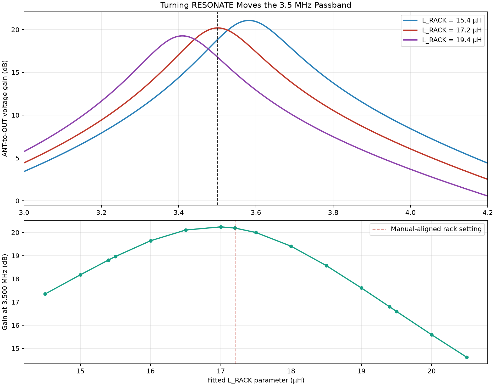

# Triton IV Model 540 reconstruction

## Project purpose

Recreate the Ten-Tec Triton IV Model 540 faithfully in KiCad, one original assembly and chassis section at a time. Preserve historical topology and reference designators while making uncertainty explicit.

## Source and evidence rules

- Treat `literature/540 Triton Owner Manual.pdf` as the primary source.
- Check the assembly schematic, service description, alignment procedure, main chassis wiring, and adjacent photographs before concluding that a value is undocumented.
- Separate conclusions into documented, calculated, inferred, and unknown.
- Cite the PDF page and printed manual page for significant findings.
- Prefer original manufacturer literature and component datasheets for external research.

## Repository layout and naming

The assembly number is the organizing key. Every discipline directory uses it
as its second level, so all of one board's material is reachable by number.

| Path | Holds |
|:--|:--|
| `<assembly>.md` | the board document, at the repository root |
| `<assembly>_<function>.kicad_sch` | the board's sub-sheet, at the root beside its document |
| `spice/studies/<assembly>/<study>/` | curated CSV evidence, `manifest.csv`, fixtures, figures |
| `spice/tools/run_<assembly>_<study>.py` | the runner that regenerates one study |
| `bench/<assembly>/` | hardware measurements: procedure, scripts, `data/`, `plots/` |

Schematic filenames are lowercase, assembly number first, so a board's document
and schematic sort together. Do not rename a sub-sheet without updating its
`Sheetfile` property in `triton_540.kicad_sch` and every runner that opens it
by name.

Simulation evidence and bench evidence are kept in separate trees on purpose.
A simulated result must never be presentable as a measured one. `bench/*/data/`
and `bench/*/plots/` are the measurement record and are deliberately versioned;
`spice/generated/` and `spice/runtime/` are disposable and never versioned.

`datasheets/` names the assembly that uses each part, so a device sheet can be
traced back to the board that needs it.

## Sheet names are load-bearing

KiCad derives SPICE net prefixes from a sheet's `Sheetname` property, not from
its filename. `RF_Amp_80166`, `IF-AGC_80279`, `VFO-80289`, and
`TX RX Mixer 80287` therefore appear as `/rf_amp_80166/...` and similar in every
exported netlist, are hard-coded in the study runners, and are baked into the
retained study CSVs.

Renaming a sheet invalidates that evidence and requires re-running every study
that depends on it. Treat `Sheetname` as fixed. Their inconsistent styles are
accepted deliberately; the filenames carry the convention instead.

## Simulation tooling

- Name a runner for the assembly it exercises: `run_<assembly>_<study>.py`.
- A runner named for one assembly must never provide infrastructure to another.
  Board-independent helpers — reading an ngspice ASCII raw file, converting a
  voltage ratio to decibels — belong in `spice/tools/ngspice_raw.py`, which any
  runner may import.
- Keep board-specific netlist edits and result summaries in that board's own
  runner, where the net names and component references are already specific.

## Component datasheets

Every transistor, integrated circuit, and diode in the design must have its
datasheet archived in `datasheets/` and linked from the schematic. Obsolete
1970s semiconductors disappear from the web; an external URL is not an archive.

- If the part has no local datasheet, find the original manufacturer document,
  prefer literature contemporary with the radio, and save a copy into
  `datasheets/`. Extract only the pages that cover the device and its package.
- Name the file `<Manufacturer>_<Part>_<Document>_<Year>.pdf`.
- Set the symbol's `Datasheet` field to `${KIPRJMOD}/datasheets/<file>` so the
  link resolves on any machine. Never leave it pointing at a bare URL.
- Set the field on the **placed symbol**, not only on the library symbol. KiCad
  shows and exports the instance's property, and a sheet's cached `lib_symbols`
  block can lag the library, so a part can look linked in the library and still
  be blank in the schematic.
- Add an entry to `datasheets/README.md` recording the file, manufacturer,
  document title, original publication, the pages extracted, the assembly that
  uses the part, the archive source URL, and the file's SHA-256. Verify the
  hash after downloading, and confirm the document really covers the part
  before linking it.
- Crystals, magnetics, and other custom or made-to-order parts have no
  manufacturer datasheet. Record what is known from the manual instead of
  linking an unrelated document.

## KiCad conventions

- Preserve Ten-Tec assembly numbers, reference designators, signal names, and connector labels.
- Use a stock symbol only when its electrical topology is correct. Create project-local symbols for legacy multi-tapped, permeability-tuned, or otherwise unusual components.
- Keep custom symbols in project-local `.kicad_sym` libraries and maintain `sym-lib-table`.
- Put estimated values in notes or fields that clearly say `estimated`; do not present them as factory specifications.
- Every placed symbol carries a unique reference. If two share one, identify
  from the manual which component genuinely owns it rather than assigning the
  next free number; a wrong designator is a silent error in the reconstruction.
  Multi-unit parts sharing one reference across units are correct and expected.
- Do not modernize the circuit, rename nets, or substitute components unless the user requests it.

## Editing safety

- Check `~*.lck` before editing a KiCad document. Do not rewrite a currently open schematic without user confirmation.
- Preserve unrelated user changes and never restore an autosave or backup over current work without approval.
- Inspect backups read-only unless a recovery is explicitly requested.
- Make the smallest coherent edit and keep schematic pin mappings aligned with footprints.

## Analysis and validation

- For tuned circuits, trace all off-board switched parts and include justified parasitic ranges in resonance calculations.
- Give likely ranges and confidence levels when exact magnetics or legacy parts are undocumented.
- After requested edits, run available KiCad CLI checks, ERC/exports, parsing checks, and `git diff --check` when applicable.
- If this directory is not a valid Git worktree, report that instead of assuming version-control protection.

## Board documents: audience and required content

A board document (`<assembly>.md`) is written for a **hobbyist restorer**, not for
an electrical engineer. Assume the reader knows what a resistor, capacitor, coil,
and transistor are, and knows how to use a meter, a signal generator, and an
oscilloscope. Assume nothing else.

Engineering terms are welcome — "darlington pair", "common emitter", "cascode",
"transconductance", "reactance" — but every one gets a short plain-language gloss
the first time it appears, in the same sentence or the next one. Write the gloss
for someone who will never look the term up.

Every board document must answer, in this order:

1. **What is this board for?** What job it does in the radio, and why the radio
   needs it done. Lead with function, not with topology.
2. **What are its pins?** A table of every board pin: name, what it carries, and
   whether it is a usable probe point. Say which pin carries what the reader might
   assume is a fixed supply but is not.
3. **How does it work, component by component?** Walk the signal path and explain
   the job of **every reference designator on the board** — not only the
   interesting ones. Bypass capacitors, decoupling resistors, bias dividers, and
   padding capacitors each get a sentence saying what they do and what would go
   wrong without them. Where a value is chosen rather than arbitrary, show the
   arithmetic that makes it obviously right (a capacitor's reactance at the
   working frequency, a divider ratio, a time constant).
4. **What does a healthy board look like?** A short checklist of observable
   behaviour, before any simulation or measurement appears.
5. **What is each alignment adjustment actually doing?** See below.
6. **Simulation evidence**, in the structure given below, each with its bench
   check.
7. **Evidence status and open questions.**

## Alignment sections

Wherever the manual gives an alignment or adjustment procedure, the board document
must explain what that procedure is *doing to the circuit*, not merely restate the
steps. For each procedure:

- Name the electrical problem the alignment exists to solve.
- Identify how many independent adjustments there are and what each one physically
  changes. If the procedure alternates between two settings, say why: usually two
  adjustments satisfying two conditions.
- Explain every instruction that looks arbitrary. Why a temporary component is
  fitted; why the signal level is raised or lowered between steps; why a particular
  band or frequency is used for a step that seems unrelated to it; why the manual
  warns that a null is sharp or that a meter must not deflect.
- Say what a *wrong* result looks like and which way to move which adjustment.
- Give the manual's own step numbers and page citations alongside the explanation.

## Board README simulation documentation

The board README explains how the radio works; detailed study READMEs and CSV
files hold exhaustive setup and machine-readable evidence.

Simulations exist to **show how the board operates** and **show what an alignment
is doing**. A simulation that only produces a number is not finished; it has to
earn a place in the narrative of how the circuit works. Two rules follow:

- **Model at the pins.** Any simulation that stands in for an oscilloscope
  measurement must present its results at the board's pins, because that is where
  a person can actually and safely put a probe. Internal nodes may be shown as
  additional insight, but they must be labelled as simulation-only, and the
  document must say why probing them on hardware is impractical (typically that a
  probe's capacitance would detune the node being reported).
- **Simulate the alignment itself.** Where the manual has an alignment procedure,
  model the procedure — including any temporary components it calls for — so the
  document can show the difference between the before and after states.

For every new simulation, and whenever an existing simulation section is
substantially revised, present the material in this order:

1. **How this part of the circuit works.** Trace the signal through the actual
   components and explain the job of the active devices, tuned circuits,
   coupling parts, bias parts, controls, and loads involved in the test.
2. **What a working circuit should show.** State the expected waveforms,
   frequencies, DC levels, relative amplitudes, gain or attenuation direction,
   timing, or spectral products before presenting results.
3. **How the simulation tests it.** Identify the source, load, operating state,
   swept variable, and observation points. Explain why the selected analysis
   answers the functional question.
4. **What the simulation showed.** Include the important plot or table and
   translate technical measurements into plain meaning. For example, convert
   representative decibel values to approximate voltage ratios and explain
   what a bandwidth or time constant means in the receiver.
5. **Does it meet expectations?** Give an explicit pass, partial pass, or fail;
   identify which expected behaviors were or were not reproduced and what that
   says about the board.
6. **Limits and evidence status.** Keep documented values, calculations,
   fitted model parameters, and unknown hardware behavior separate. Do not
   present simulated gain, bandwidth, attenuation, timing, or distortion as a
   factory specification unless the manual or measured hardware supports it.

Define specialized terms on first use, explain plot axes and sign conventions,
and do not lead with simulator settings or unexplained numerical tables. A
reader should understand why the tested circuit exists and recognize a healthy
result before encountering the detailed simulation data.

Report the resolution of the evidence. A peak read off a swept CSV is quantized
to that sweep's sample spacing, so do not quote an error smaller than one grid
step without saying that the sweep resolves it. State the spacing, or round to it.

## Every simulation gets a bench check

Each simulation section ends with a **bench check**: a proposed hardware
measurement that would corroborate it, followed by an empty results table. This is
required for new simulations and for any simulation section being revised.

A bench check contains:

1. **A setup table** — instruments, where each one connects (naming the board pin),
   drive level, radio control settings, and any safety constraint. Measure at board
   pins. Say explicitly when a control setting is part of the measurement, such as a
   gain control that supplies the stage under test.
2. **A procedure** — the run order, and what must not be disturbed between runs.
3. **An empty results table** with the simulated value already filled in beside a
   blank measured column, so the comparison is obvious once the data exists.
4. **A sentence on why the measurement matters** — which uncertain model parameter
   it would pin down.

Mark every unfilled bench check clearly, for example *"Not yet performed. This is
the proposal."* A board document must never let a proposal read as a result.
Keep the detailed instrument procedure in `bench/<assembly>/README.md` and
cross-link rather than duplicating it.

Gaps found during review are written up the same way, under a
"Simulations still to be done" heading: what it would show, method, expected
result, and the bench counterpart with its empty table. A documented factory
figure that no simulation tests — a stated gain reduction, a stated attenuation —
is always a gap worth listing.

## Prefer retained data over new runs

Before commissioning a new simulation to make a point, check whether the retained
CSVs under `spice/studies/<assembly>/` already contain the answer. Existing sweeps
frequently hold columns that were never plotted, and a new figure built from them
costs a plotting function rather than a simulator run and a fresh netlist export.

Add the new plotting function to that board's existing plot or run script, note
the new figure in the study README, and leave the run `manifest.csv` alone unless
new runs were actually made — the manifest records runs, not artifacts.

## Figure labeling

Label every figure `Figure XX-Y`, where `XX` is the last two digits of the
assembly number and `Y` identifies the figure within that assembly. Put the
label in a caption line directly beneath the image, followed by a short
description of what the figure shows:

```markdown


**Figure 66-1.** Changing the RESONATE rack moves the 3.5 MHz passband
```

The number belongs to the image, not to the document. One sequence runs across
every document covering an assembly, so a plot that appears in both a board
document and a study README carries the same number in both, and `Figure 79-3`
identifies one specific plot project-wide. A document therefore holds whatever
subset of the sequence it happens to show, and its numbers need not be
contiguous or start at 1.

Assign numbers in order of first appearance, reading the board document first,
then the study index README, then the sub-study READMEs. A new image takes the
next free number for its assembly; do not renumber existing figures to close a
gap, because their numbers are cited in prose.

Refer to figures by number in the prose that discusses them, so a reader can
find the plot being described. Keep the image's alt text as well as the caption.

## Reusable workflow

Use the project skill `$triton-540-restoration` for component identification, manual research, tuned-circuit estimates, custom-symbol decisions, schematic comparisons, and assembly validation.
