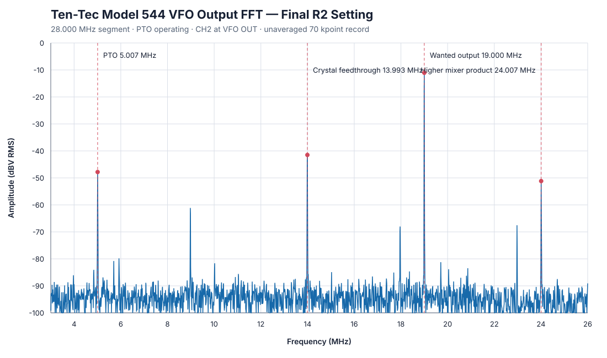

# Model 544 VFO mixer-balance measurement

This bench measurement documents adjustment of `R2 MIXER BAL.` in the
Ten-Tec Model 544 `80350 VFO`. The final setting suppresses the selected
crystal oscillator at the VFO output while preserving the wanted 19 MHz
mixer product on the 28.0 MHz band.

**Figure 50-1.** Final VFO-output FFT

## Result

The final result is the mean of two consecutive captures made without moving
R2. The two crystal-feedthrough readings were 8.221 and 8.426 mVrms; this
repeatability supports quoting the mean to about 0.1 mVrms rather than treating
the FFT-bin value as an exact component specification.

| Quantity | Before FFT-guided adjustment | Final setting | Change |
|:--|--:|--:|--:|
| 13.993 MHz crystal feedthrough | 41.60 mVrms | **8.32 mVrms** | **-13.97 dB** |
| 19.000 MHz wanted output | 226.99 mVrms | **280.53 mVrms** | +1.84 dB |
| Wanted / crystal ratio | 14.74 dB | **30.55 dB** | **+15.81 dB** |

The plotted final capture measured 8.426 mVrms at the 13.992857 MHz FFT bin
and 280.347 mVrms at the 19.000000 MHz bin, a ratio of 30.44 dB. Its total
time-domain reading was 832 mV peak-to-peak and 280.58 mVrms.

Ten-Tec specifies only adjustment of R2 for minimum crystal-oscillator
feedthrough; it does not give an acceptable residual voltage. Ten-Tec does
specify 200-300 mV for normal VFO output. The final 280.5 mVrms wanted output
is within that documented range.

## Measurement setup

| Item | Setting |
|:--|:--|
| Radio | Ten-Tec Model 544, receive mode |
| VFO assembly | 80350 |
| Band and dial | 28.0 MHz segment, approximately 28.000 MHz |
| PTO | Operating normally; no temporary bypass capacitor |
| Measurement point | VFO `OUT` to circuit ground |
| Oscilloscope | Siglent SDS1202X-E, firmware 1.3.28 |
| Input | Channel 2, 10x probe, AC coupling, 1 Mohm, bandwidth limit off |
| Vertical / horizontal | 100 mV/div, 10 us/div |
| Acquisition | Single unaveraged 70,000-point record at 500 MSa/s |
| FFT | Hann window, 7.143 kHz bin spacing; RMS amplitude scaling |

Acquisition averaging was deliberately disabled. The PTO and crystal are
independent oscillators, so their relative phase changes between triggers.
Averaging multiple records caused unstable and artificially low spectral
amplitudes. A single long record produced repeatable results.

## Alignment method and evidence status

**Documented:** The Model 544 manual directs the technician to connect an RF
voltmeter to VFO output, bypass the PTO output to chassis with 0.01 uF, select
28.0 MHz, and adjust R2 for minimum indication. See PDF page 29 / printed page
3-12 of the
[Model 544 manual](https://www.radiomanual.info/schemi/Vari/Ten-Tec_Triton-4_digital_544_user.pdf).
The 200-300 mV normal-output requirement is on PDF page 28 / printed page 3-11.

**Measured:** Long temporary alligator leads made the prescribed PTO bypass
inductive at 5 MHz, leaving enough wanted 19 MHz output to dominate a broadband
RF-voltmeter reading. The bench setup therefore left the PTO operating and
measured the 13.993 MHz FFT component selectively while R2 was adjusted.

**Calculated:** The final 30.55 dB suppression is
`20 log10(280.527 / 8.3235)`. It is a measured bench result for this radio, not
a Ten-Tec factory specification.

## Final FFT peak table

The chart and table below use the last unchanged final capture. Frequencies are
FFT-bin centers and inherit the 7.143 kHz bin spacing.

| Frequency | Identification | Level |
|--:|:--|--:|
| 5.007143 MHz | Residual PTO feedthrough | 4.062 mVrms |
| 8.978571 MHz | Difference product | 0.878 mVrms |
| 13.992857 MHz | Crystal-oscillator feedthrough | **8.426 mVrms** |
| 19.000000 MHz | Wanted VFO mixer product | **280.347 mVrms** |
| 24.007143 MHz | Higher mixer product | 2.767 mVrms |

R2 was left at this setting. Further movement was not justified because the
feedthrough measurement was stable, the wanted-to-crystal ratio exceeded
30 dB, and the normal VFO output remained within the manual's specified range.

## VFO-output survey after R2 adjustment

With R2 left unchanged, the wanted FFT component was measured at each band
edge and midpoint. The oscilloscope vertical scale was increased to 200 or
500 mV/div where necessary to prevent clipping. The manual's 200-300 mVrms
normal-output range is used as the pass criterion.

| Band / crystal segment | Dial frequency | Wanted component | Level | Result |
|:--|--:|--:|--:|:--|
| 28.0 segment | 28.000 MHz | 19.000 MHz | 277.6 mVrms | Pass |
| 28.0 segment | 28.250 MHz | 19.250 MHz | 263.9 mVrms | Pass |
| 28.0 segment | 28.500 MHz | 19.500 MHz | 259.7 mVrms | Pass |
| 28.5 segment | 28.500 MHz | 19.500 MHz | 226.5 mVrms | Pass |
| 28.5 segment | 28.750 MHz | 19.750 MHz | 231.9 mVrms | Pass |
| 28.5 segment | 29.000 MHz | 20.000 MHz | 246.9 mVrms | Pass |
| 29.0 segment | 29.000 MHz | 20.000 MHz | 225.5 mVrms | Pass |
| 29.0 segment | 29.250 MHz | 20.250 MHz | 247.7 mVrms | Pass |
| 29.0 segment | 29.500 MHz | 20.500 MHz | 275.1 mVrms | Pass |
| 29.5 segment | 29.500 MHz | 20.500 MHz | 154.2 mVrms | Low |
| 29.5 segment | 29.750 MHz | 20.750 MHz | 167.6 mVrms | Low |
| 29.5 segment | 30.000 MHz | 21.000 MHz | 170.7 mVrms | Low |
| 21 MHz | 21.000 MHz | 12.000 MHz | 468.3 mVrms | High |
| 21 MHz | 21.250 MHz | 12.250 MHz | 416.3 mVrms | High |
| 21 MHz | 21.500 MHz | 12.500 MHz | 462.8 mVrms | High |
| 14 MHz | 14.000 MHz | 5.000 MHz | 166.3 mVrms | Low |
| 14 MHz | 14.250 MHz | 5.250 MHz | 179.5 mVrms | Low |
| 14 MHz | 14.500 MHz | 5.500 MHz | 191.0 mVrms | Low |
| 7 MHz | 7.000 MHz | 16.000 MHz | 336.0 mVrms | High |
| 7 MHz | 7.250 MHz | 16.250 MHz | 297.1 mVrms | Pass |
| 7 MHz | 7.500 MHz | 16.500 MHz | 213.9 mVrms | Pass |
| 3.5 MHz | 3.500 MHz | 12.500 MHz | 417.5 mVrms | High |
| 3.5 MHz | 3.750 MHz | 12.750 MHz | 498.6 mVrms | High |
| 3.5 MHz | 4.000 MHz | 13.000 MHz | 371.3 mVrms | High |

Eleven of the 24 measured operating points pass. The measured range is
154.2-498.6 mVrms. R27 is a common level control and cannot correct this
spread: scaling 498.6 mVrms down to 300 mVrms would reduce the 154.2 mVrms
point to about 92.8 mVrms. Conversely, scaling 154.2 mVrms up to 200 mVrms
would raise the maximum to about 646.7 mVrms.

The most diagnostic comparison is at 29.500 MHz. Changing only from the 29.0
segment to the 29.5 segment changes the same 20.500 MHz wanted output from
275.1 to 154.2 mVrms. This directly documents a segment-dependent problem in
the switched crystal/injection/filter path. R27 should not be adjusted until
that path and the individual output-filter adjustments have been checked.
