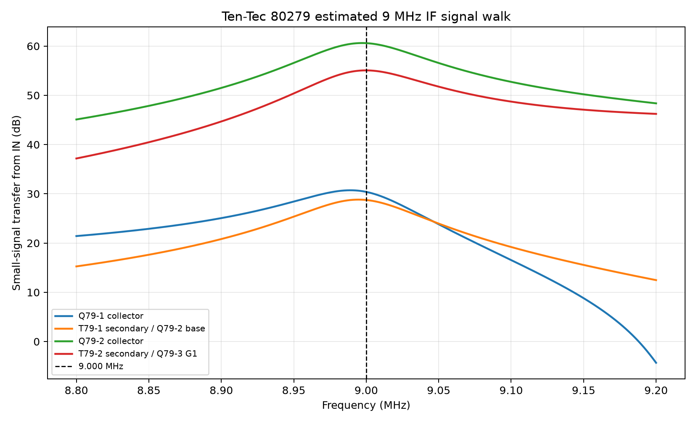

# Ten-Tec 80279 IF-AGC board: operation and simulation study

## Scope and status

This study explains the Model 540 assembly 80279 signal path and defines the
simulations used to demonstrate each function. Results are added to the
corresponding section as each simulation is completed.

| No. | Simulation | Status | Main question |
|---:|---|---|---|
| 1 | Receive/no-signal DC operating point | **Completed — partial pass; IC1 corrected, Q79-5 discrepancy remains** | Are the board rails and semiconductor bias points consistent with the service manual? |
| 2 | 9 MHz IF response and signal walk | **Completed — estimated transformer fit** | Do Q79-1, T79-1, Q79-2, and T79-2 amplify and select the 9 MHz IF? |
| 3 | PIN-diode AGC attenuation sweep | **Completed — open-loop functional pass** | How much does IF gain change as D79-1, D79-2, and D79-3 forward bias increases? |
| 4 | Product detector and audio recovery | Pending | Does Q79-3 convert a displaced 9 MHz IF and BFO into the expected audio difference frequency? |
| 5 | Audio-amplifier and AGC-detector path | Pending | Do the two MC1747 sections provide audio output and sufficient AGC-detector drive? |
| 6 | AGC attack, hold, and release | Pending | Does a strong-signal step reduce IF gain quickly and recover slowly without instability? |
| 7 | S-meter calibration and transmit inhibit | Pending | Does R79-20 set meter sensitivity, and does the T line remove meter drive/reset AGC on transmit? |

The primary sources are the Ten-Tec Model 540 owner/service manual, PDF page 32
/ printed page 3-16 for the functional description and voltage tables, and PDF
page 33 / printed page 3-17 for the schematic and IC-1 pin table. The KiCad
source of truth is `if-agc_80279.kicad_sch`.

## How the board works

### 9 MHz IF amplifier

The receiver mixer output first passes through the eight-pole crystal lattice
filter on the 80282 SSB Generator assembly. The resulting 9 MHz signal enters
80279 at `IN`.

Q79-1 and Q79-2 are the two gain-controlled IF stages. T79-1 couples the first
stage to the second, and T79-2 couples the second stage to the product detector.
The manual alignment procedure peaks T79-1 and T79-2 for maximum S-meter
reading while keeping the indication below S5 to minimize AGC action.

D79-1, D79-2, and D79-3 are HP 5082-3379 PIN diodes placed at the input,
interstage, and detector-input portions of the IF path. Increasing their common
forward-bias control increases RF shunting and reduces IF gain. The project
PIN-diode model implements this primarily as current-controlled RF resistance;
it is intended to show the attenuation trend at 9 MHz, not calibrated
distortion, noise, or temperature behavior.

The T79-1/T79-2 numerical model is an engineering alignment estimate:
L79-3 through L79-6 are 2.63 uH and the winding coupling is `K=0.25`. Absolute
gain, center frequency, and bandwidth must therefore be described as simulated
model behavior until the original transformers are measured.

### Product detector and filter loop

Q79-3 is the dual-gate 40823 product detector. The final IF transformer drives
the detector signal input, while the `BFO` terminal supplies the beat-frequency
oscillator. The detector produces the audio difference frequency.

Recovered audio leaves at `FILT IN` and returns at `FILT OUT`. A Model 245 CW
filter may be connected between those terminals. With no CW filter installed,
the manual specifies that the two terminals are jumpered at the filter socket.
The root schematic and the standalone simulation fixture use that jumper.

### Audio and AGC generation

One section of IC1, an MC1747 dual internally compensated op amp, amplifies the
returned audio and drives the `AUDIO` terminal. The second section amplifies the
same recovered audio further for AGC detection.

D79-6 and the associated storage network rectify the AGC-amplifier output.
Q79-4 and Q79-5 form the DC Darlington stage that drives the three PIN-diode
bias resistors and the S-meter path. C79-22 is 4.7 uF and R79-24 is 680 kOhm;
their simple product is about 3.20 seconds, although diode and transistor paths
alter the actual attack and release curves.

R79-20 is the S-meter calibration control. The manual calibrates S9 using a
50 uV signal at the radio antenna on 14.100 MHz. That is a whole-receiver
condition and must not be treated as a 50 uV signal at the 80279 `IN` terminal.

### Receive/transmit control

In receive/no-signal operation the manual gives `R=12.1 V` and `T=0.2 V`. In
transmit it gives `R=0 V` and `T=10.4 V`. Q79-6 responds to the T line to reset
or inhibit the AGC storage network, and D79-4 blocks the receive S-meter drive
during transmit.

## Schematic-native simulation fixture

The fixture is in the upper-right corner of `if-agc_80279.kicad_sch` inside a
red dashed rectangle marked **SIMULATION ONLY**. Its parts are excluded from
the BOM and PCB.

| Fixture item | Setting | Evidence or purpose |
|---|---:|---|
| V79-SIM1 | 13.8 V DC | Manual `+12` receive voltage |
| V79-SIM2 | 8.0 V DC | Manual `+REG` voltage |
| V79-SIM3 | 12.1 V DC | Manual `R` receive voltage |
| V79-SIM4 | 0.2 V DC | Manual `T` receive voltage |
| V79-SIM5 | `dc=0 ampl=1m f=9Meg ac=1` | Zero DC for operating point; starting IF source for later AC/transient studies |
| V79-SIM6 | `dc=6.5 ampl=100m f=9Meg ac=0` | Documented 6.5 V BFO DC level; 100 mV RF amplitude is an estimated starting value |
| I79-SIM1 | Disabled normally; current-controlled in Simulation 3 | Opens D79-5 and forces the common PIN-bias bus only for the open-loop sweep |
| R79-SIM1 | 25 kOhm | Root-sheet volume-control load seen by `AUDIO` |
| R79-SIM2 | 1 kOhm | Existing root-sheet S-meter simulation load |
| FILT jumper | `FILT IN` to `FILT OUT` | Manual no-CW-filter configuration |
| Solver option | `.options rshunt=1e12` | Gives capacitor-only DC islands a negligible reference path |

The 1 TOhm shunt is numerical stabilization, not an original Ten-Tec part.

## Simulation 1 — receive/no-signal DC operating point

### Purpose

This is the prerequisite simulation. It verifies supply and control fixtures,
checks model pin mappings, and compares the calculated no-signal bias against
the manual before RF gain or closed-loop AGC results are trusted.

### Analysis setup

- Circuit source: fresh KiCad 10 SPICE export of `if-agc_80279.kicad_sch`
- Simulator: ngspice 46
- Analysis: `.op`
- Temperature: 27 degrees C
- Mode: receive, no input signal
- Filter configuration: `FILT IN` jumpered to `FILT OUT`
- AUDIO load: 25 kOhm
- S-meter load: 1 kOhm
- Potentiometer R79-20: saved schematic position, 0.5
- Convergence: dynamic gmin stepping completed; one operating-point row and
  135 variables were produced

The complete curated result table is in
`dc-operating-point/data/80279-dc-operating-point.csv`. Disposable exported
netlists, raw data, and logs are under `spice/generated/80279/`.

### Board-terminal results

| Terminal | Manual receive/no-signal | Simulated | Result |
|---|---:|---:|---|
| IN | 0 V | 0 V | Pass |
| AUDIO | 0 V | 0 V | Pass |
| T | 0.2 V | 0.2 V | Pass |
| +12 | 13.8 V | 13.8 V | Pass |
| S MTR | 0 V | 0.732 uV | Pass; effectively zero |
| FILT IN / FILT OUT | 0 V | 0 V | Pass |
| R | 12.1 V | 12.1 V | Pass |
| +REG | 8.0 V | 8.0 V | Pass |
| BFO | 6.5 V | 6.5 V | Pass |

### IF-amplifier transistor results

| Device | Terminal | Manual | Simulated | Error | Result |
|---|---|---:|---:|---:|---|
| Q79-1 | C | 13.7 V | 13.638 V | -0.45% | Pass |
| Q79-1 | B | 1.0 V | 1.046 V | +4.59% | Pass |
| Q79-1 | E | 0.3 V | 0.362 V | +20.76% | Review; only 62 mV high |
| Q79-2 | C | 13.3 V | 13.323 V | +0.17% | Pass |
| Q79-2 | B | 1.8 V | 1.788 V | -0.68% | Pass |
| Q79-2 | E | 1.1 V | 1.070 V | -2.74% | Pass |

The empirical MPS3693 model and both IF-stage bias networks reproduce the
manual closely enough to proceed with the small-signal 9 MHz study.

### Product-detector and AGC transistor results

| Device | Terminal | Manual | Simulated | Error | Result |
|---|---|---:|---:|---:|---|
| Q79-3 | D | 3.0 V | 3.349 V | +11.64% | Pass |
| Q79-3 | G1 | 0.6 V | 0.641 V | +6.76% | Pass |
| Q79-3 | S | 2.0 V | 1.737 V | -13.13% | Pass |
| Q79-3 | G2 | 2.0 V | 1.737 V | -13.13% | Pass |
| Q79-4 | C/B/E | 13.8 / 1.2 / 0.8 V | 13.8 / 1.069 / 0.618 V | — | C passes; B/E low |
| Q79-5 | C/B/E | 13.8 / 0.8 / 0.2 V | 13.8 / 0.618 / 0.040 V | — | Emitter fails |
| Q79-6 | C/B/E | 1.2 / 0.05 / 0 V | 1.069 / 0.047 / 0 V | — | Pass |

Q79-3 now agrees with the manual within the 15 percent service-study tolerance.
The correction puts R79-13/C79-11/C79-12 on gate 1, C79-19 and R79-16 on gate
2, and R79-15/R79-16/C79-15/C79-16 on the source while preserving the RCA
physical order `1=D, 2=G2, 3=G1, 4=S/case`. The low Q79-5 emitter voltage
remains a separate low-current model finding.

### IC1 results

| IC1 pin | Function | Manual | Simulated | Result |
|---:|---|---:|---:|---|
| 1 | -IN A | 7.0 V | 6.882 V | Pass |
| 2 | +IN A | 6.8 V | 6.882 V | Pass |
| 4 | VEE | 0 V | 0 V | Pass |
| 6 | +IN B | 7.0 V | 6.890 V | Pass |
| 7 | -IN B | 7.0 V | 6.890 V | Pass |
| 9 | VCC B | 13.8 V | 13.8 V | Pass |
| 10 | OUT B | 6.8 V | 6.882 V | Pass |
| 12 | OUT A | 7.0 V | 6.866 V | Pass |
| 13 | VCC A | 13.8 V | 13.8 V | Pass |

After correction of the IC1 surrounding wiring, all nine documented connected
pins agree with the manual within 2 percent. The MC1747 DC prerequisite for
simulations 5 and 6 is therefore satisfied. The model limitations described
below still apply to dynamic results.

### Simulation 1 conclusion

**Partial pass.** The fixture, board terminals, Q79-1, Q79-2, Q79-3, Q79-6,
and all documented IC1 points are credible. The separate low-current Q79-4/
Q79-5 result remains under review, with Q79-5 emitter at 0.040 V versus the
manual's 0.2 V. All later simulations may now proceed, but AGC amplitude claims
must retain that model caveat until the Q79-5 discrepancy is resolved.

## Simulation 2 — 9 MHz IF response and signal walk

### Purpose and method

Run an AC sweep from approximately 8 to 10 MHz with the receive rails above.
Use V79-SIM5's `ac=1` excitation. Plot the input, Q79-1 collector, T79-1
secondary/Q79-2 base, Q79-2 collector, and T79-2 secondary. Record center
frequency, -3 dB bandwidth, stage gains, and total gain.

Repeat after adjusting the estimated transformer parameters only if the saved
values are clearly inconsistent with 9 MHz operation. Any fit remains an
engineering estimate until original transformer measurements exist.

### Results

Completed from a fresh KiCad SPICE export with ngspice 46. The final saved
alignment estimate uses 2.63 uH for L79-3 through L79-6 and `K=0.25` for both
transformers. The original 2.6 uH starting value peaked at 9.052 MHz and put
9.000 MHz about 4.9 dB below the peak. Increasing all four winding estimates
by 1.15 percent centers the modeled response without changing circuit
topology.

Run the study with:

```powershell
python spice/tools/run_80279_if_response.py
```

The runner exports `if-agc_80279.kicad_sch` afresh, runs a 4001-point linear
AC sweep from 8.8 to 9.2 MHz, and writes disposable netlists and logs below
`spice/generated/80279-if-response/`.

#### Response measurements

| Measurement | Simulated result |
|---|---:|
| Peak frequency | 8.9997 MHz |
| Peak `IN` to Q79-3 G1 gain | 55.066 dB |
| Gain at 9.000 MHz | 55.066 dB |
| Lower -3 dB frequency | 8.96291 MHz |
| Upper -3 dB frequency | 9.04615 MHz |
| -3 dB bandwidth | 83.240 kHz |
| Loaded Q from complete response | 108.1 |

#### 9 MHz signal walk

The AC source is 1 V for transfer normalization. Node gain is therefore the
small-signal voltage transfer from the board `IN` terminal. Incremental gain
is relative to the preceding row.

| Observation point | Gain from `IN` | Incremental gain |
|---|---:|---:|
| Q79-1 collector | 30.393 dB | +30.393 dB |
| T79-1 secondary / Q79-2 base | 28.747 dB | -1.646 dB |
| Q79-2 collector | 60.596 dB | +31.849 dB |
| T79-2 secondary / Q79-3 G1 | 55.066 dB | -5.530 dB |

The two transistor stages provide gain, while each transformer transfers and
selects the 9 MHz signal. With the fixture's later transient-source amplitude
of 1 mV peak, the linearized 9 MHz result corresponds to approximately 33 mV
at Q79-1 collector, 27 mV at Q79-2 base, 1.07 V at Q79-2 collector, and
0.567 V at Q79-3 G1. Those scaled values are AC predictions, not a substitute
for the later nonlinear transient test.



Curated numerical outputs are in `if-response-9mhz/data/`. The peak alignment,
absolute gain, bandwidth, and loaded Q are behavior of the estimated 2.63 uH,
`K=0.25` transformer model. The manual documents that T79-1 and T79-2 are
peaked at 9 MHz, but it does not document winding inductance, coupling,
resistance, Q, or parasitic capacitance. These numbers must not be presented
as Ten-Tec specifications until original transformers are measured.

## Simulation 3 — PIN-diode AGC attenuation sweep

### Purpose, method, and results

The normal D79-5 AGC-drive connection is opened and the disabled-by-default
I79-SIM1 fixture forces equal current through the three 1 kOhm PIN feed
branches. Current control avoids a multiple-solution artifact found when the
empirical current-controlled resistance model was driven from an ideal voltage
source. A 2,001-point 8.8–9.2 MHz AC sweep is run at twelve bias levels from
zero through 20 mA per diode.

At zero current the gain from board `IN` to Q79-3 G1 is 55.066 dB. The result
then falls monotonically: 10 uA per diode gives 46.178 dB, 100 uA gives
19.361 dB, 1 mA gives -32.491 dB, and 12 mA gives -77.593 dB. Relative to the
zero-current response, those points provide 8.888, 35.705, 87.557, and
132.659 dB of modeled attenuation respectively.


**Functional pass.** Increasing PIN forward current produces increasing 9 MHz
attenuation in the required AGC direction. The very large high-current figures
are idealized small-signal model isolation, not measured receiver AGC range.
The 20 mA model endpoint requires 20.87 V and is impossible from the board's
13.8 V supply; even the 12 mA/12.85 V point is an upper-bound checkpoint before
D79-5 drop and Q79-5 saturation are allowed for.

The complete method, plots, limitations, and machine-readable results are in
the [Simulation 3 README](pin-agc-sweep/README.md). Regenerate them with:

```powershell
python spice/tools/run_80279_pin_agc_sweep.py
```

## Simulation 4 — product detector and audio recovery

### Purpose and method

With Q79-3 DC bias corrected, drive `IN` at 9.001 MHz and `BFO` at 9.000 MHz.
Sweep BFO RF amplitude because the manual documents only its 6.5 V DC terminal
voltage. Plot T79-2 output, Q79-3 terminals, `FILT IN`, `FILT OUT`, and an FFT
of recovered audio. The expected wanted product is 1 kHz.

### Results

Pending; the Q79-3 operating-point prerequisite now passes.

## Simulation 5 — audio amplifier and AGC detector

### Purpose and method

After resolving IC1 DC bias, inject a controlled 1 kHz signal at `FILT OUT`.
Measure the gain and clipping margin of the first MC1747 section at `AUDIO`,
then the second section and the D79-6 rectifier/storage path. Also sweep audio
frequency over the expected receiver passband to show the board contribution
separately from the optional external CW filter.

### Results

Pending; the IC1 operating-point prerequisite now passes.

## Simulation 6 — closed-loop AGC attack and release

### Purpose and method

Apply a weak/strong/weak IF amplitude sequence while producing a stable audio
beat. Plot input and final IF envelopes, `AUDIO`, both MC1747 outputs, C79-22,
the common PIN-bias bus, individual PIN currents, and S-meter current. Measure
attack time, release time, overshoot, and residual audio-output change.

A literal multi-second transient resolving a 9 MHz carrier is unnecessarily
large. Use a short full-RF transient to validate attack and a slower recovered-
audio/envelope study for the long release. Cross-check the envelope result
against the open-loop gain-versus-PIN-bias data from Simulation 3.

### Results

Pending; the IC1 operating-point prerequisite now passes. Interpret absolute
AGC levels cautiously until the Q79-5 low-current discrepancy is resolved.

## Simulation 7 — S-meter calibration and transmit inhibit

### Purpose and method

With receive AGC working, sweep IF input level and R79-20 position and record
current through the 1 kOhm S-meter model. Do not label a board-input amplitude
as S9 from the manual's 50 uV antenna specification without simulating the
preceding receiver gain and filter loss.

Then establish a strong-signal AGC state and step from receive (`R=12.1 V`,
`T=0.2 V`) to transmit (`R=0 V`, `T=10.4 V`). Plot Q79-6, C79-22, D79-4, PIN
bias, and meter current to demonstrate AGC reset and meter disconnection.

### Results

Pending.

## Model limits and interpretation

- MPS3693, HP 5082-3379, and RCA 40823 models are empirical, not original
  manufacturer SPICE models.
- The MC1747 wrapper preserves the physical 14-pin package, but its imported
  five-pin core does not model offset-null behavior, production spread, noise,
  temperature drift, or inter-section coupling.
- T79-1 and T79-2 inductance, coupling, resistance, Q, and parasitics are not
  documented factory values.
- Passing a model regression or exporting a netlist is not evidence that the
  complete board simulation is numerically or historically validated.
- Estimates and fitted parameters must remain labeled as such in every result.
