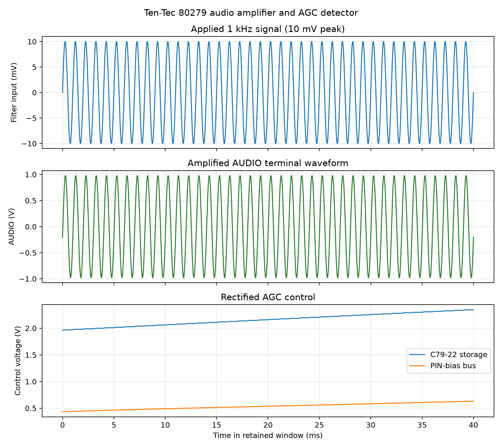

# 80279 Simulation 5: audio amplifier and AGC detector

## Question answered

Do the two MC1747 sections amplify recovered audio as intended, and can the
second section and D79-6 generate useful AGC control before the AUDIO output
clips?

## Circuit under test

The manual states that audio returning at `FILT OUT` is amplified by one IC1
section for the `AUDIO` terminal, while the second section supplies additional
gain for AGC generation. The component topology is on manual PDF page 33 /
printed page 3-17.

IC1 section B uses R79-31=1 kOhm and R79-32=100 kOhm, giving a calculated
non-inverting gain of 101. C79-26=430 pF reduces gain at high frequencies.
R79-33/R79-34 and C79-25 establish the half-supply AC reference. C79-21
couples the amplified signal to the 25 kOhm `AUDIO` load.

IC1 section A uses R79-27=4.7 kOhm and R79-28=10 kOhm for a calculated gain of
3.13. C79-23 couples that output to D79-6. Positive peaks charge C79-22 and
Q79-4/Q79-5 drive the PIN-bias bus.

## Reproduction

With KiCad closed, run from the project root:

```powershell
python spice/tools/run_80279_audio_agc.py
```

The runner exports `80279_if_agc.kicad_sch` afresh. In disposable netlist
copies it moves the existing simulation-only V79-SIM5 source from board `IN`
to the jumpered filter node and changes it to an audio source. No original
component or saved schematic connection is altered. BFO RF is set to zero
while its documented 6.5 V DC level is retained.

The AC study uses 100 points per decade from 1 Hz to 100 kHz. The transient
study applies 1 kHz at 0, 0.1, 0.3, 1, 3, 5, 10, 15, 20, 30, 50, 75, and
100 mV peak. Each case runs to 120 ms with a 2 us maximum internal timestep.
Control values are averaged over the last 5 ms.

## Frequency-response results

| Measurement | Result |
|---|---:|
| AUDIO gain at 1 kHz | 97.635 V/V, 39.792 dB |
| Calculated AUDIO gain | 101 V/V |
| AUDIO lower / upper -3 dB | 138.8 Hz / 2.965 kHz |
| Complete AGC gain at 1 kHz | 305.313 V/V, 49.695 dB |
| Calculated complete AGC gain | About 316 V/V |
| AGC lower / upper -3 dB | 140.4 Hz / 2.967 kHz |


**Figure 79-5.** Audio and AGC frequency response

The gain difference between the two curves in Figure 79-5 is approximately
10 dB, or a
3.16-times voltage ratio, matching section A's calculated 3.13-times gain.
The lower corner is influenced strongly by movement of the C79-25 half-supply
reference at low frequency. C79-26 and the op-amp model establish the upper
roll-off.

## Level, clipping, and detector results

| Input peak | AUDIO p-p | AUDIO THD | AGC store | PIN bus | One PIN branch |
|---:|---:|---:|---:|---:|---:|
| 0 | 0 | — | 1.069 V | 0.038 V | 0 |
| 1 mV | 0.195 V | 0.010% | 1.157 V | 0.038 V | effectively 0 |
| 5 mV | 0.976 V | 0.010% | 1.670 V | 0.218 V | about 0 |
| 10 mV | 1.953 V | 0.010% | 2.325 V | 0.620 V | 20.8 uA |
| 15 mV | 2.929 V | 0.011% | 2.983 V | 1.106 V | 393 uA |
| 20 mV | 3.897 V | 0.174% | 3.161 V | 1.261 V | 536 uA |
| 50 mV | 9.613 V | 0.352% | 3.175 V | 1.273 V | 547 uA |
| 75 mV | 11.235 V | 12.75% | 3.176 V | 1.275 V | 548 uA |
| 100 mV | 11.733 V | 19.58% | 3.177 V | 1.275 V | 549 uA |


**Figure 79-6.** Audio output and AGC response



**Figure 79-12.** Nominal 10 mV-peak waveforms

Figure 79-6 plots output level and AGC response against input, and Figure 79-12
shows the nominal 10 mV-peak waveforms. The AUDIO path remains nearly
proportional through 50 mV peak input and clips
between 50 and 75 mV peak. The AGC op amp reaches its modeled output limits
between 15 and 20 mV peak, causing D79-6 storage and PIN current to level off.
At 10 mV peak, the nominal 20.8 uA per PIN branch already lies in the useful
attenuation region established by Simulation 3; 15 mV peak produces hundreds
of microamperes per branch.

## Assessment and limits

**Functional pass.** Both amplifier sections have the expected gain, the
modeled frequency response covers the main speech range, the main AUDIO output
has substantial clean swing, and the rectifier generates useful monotonic AGC
control before AUDIO clipping.

The manual does not specify gain, audio bandwidth, distortion, clipping level,
detector threshold, or PIN current. These are model results, not factory
specifications. The imported MC1747 core omits noise, production spread,
temperature drift, offset-null behavior, and inter-section coupling. The ideal
source bypasses product-detector output impedance and the optional CW filter.
The absolute PIN values retain the Q79-5 low-current-model uncertainty.
Finally, 120 ms end values demonstrate detector drive but do not measure AGC
attack, hold, or release; those belong to Simulation 6.

## Retained evidence

`manifest.csv` lists the complete curated set. The main machine-readable files
are `data/80279-audio-frequency-response.csv`,
`data/80279-audio-level-sweep.csv`, and
`data/80279-audio-agc-summary.csv`. Disposable netlists, raw data, and logs are
under `spice/generated/80279-audio-agc/`.
