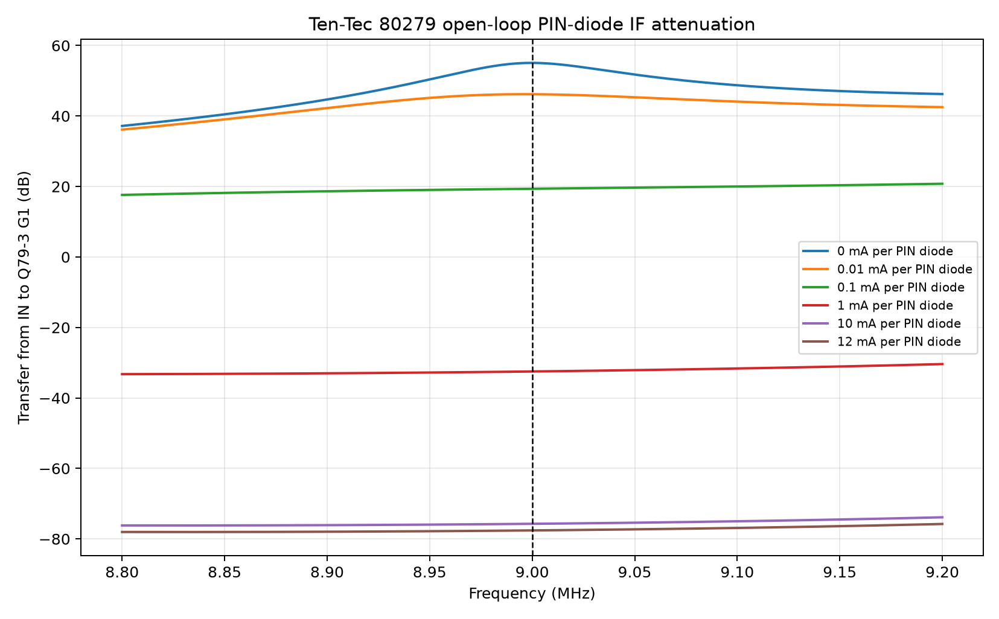
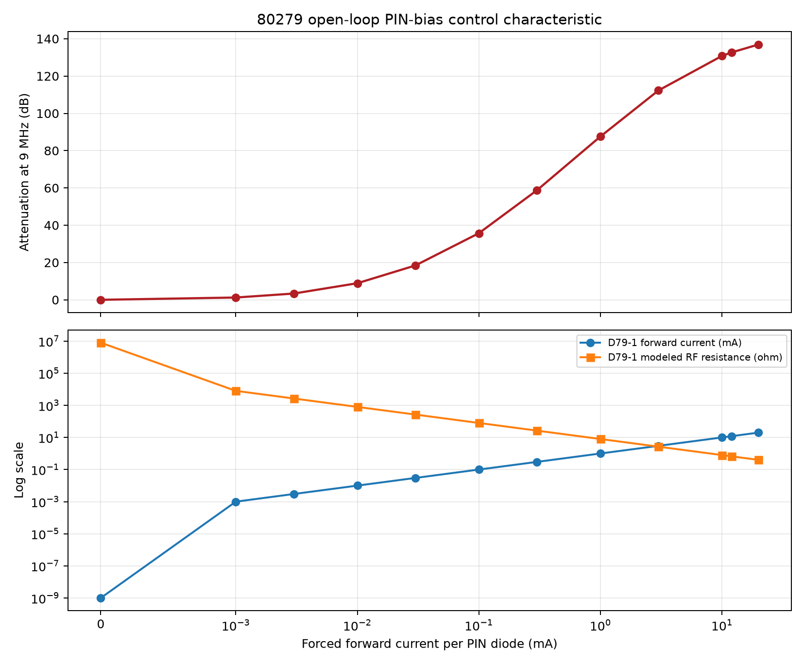

# 80279 Simulation 3: open-loop PIN-diode AGC sweep

## Purpose

This study isolates the common bias bus feeding D79-1, D79-2, and D79-3 and
measures how their forward current changes the two-stage 9 MHz IF response.
It answers the open-loop question: does increasing PIN-diode current reduce
IF gain in the direction required by the receiver AGC system?

It does not yet test the audio detector, Q79-4/Q79-5 driver, attack/release
timing, S-meter calibration, or closed-loop gain regulation. Those functions
belong to later simulations.

## KiCad fixture and method

`if-agc_80279.kicad_sch` remains the circuit source of truth. The red dashed
**SIMULATION ONLY** rectangle contains I79-SIM1, a disabled-by-default DC
current source connected to the labeled `PIN_BIAS` bus. It is excluded from
normal simulations so D79-5 and the original AGC circuit remain undisturbed.

For this study only:

1. D79-5 is excluded, opening the normal Q79-5-to-PIN-bus drive.
2. I79-SIM1 is enabled with its positive-current direction from ground into
   `PIN_BIAS`.
3. Its total current is set to three times the desired current per diode. The
   three matched 1 kOhm branches R79-17, R79-18, and R79-19 split it equally.
4. A 2,001-point linear AC sweep runs from 8.8 to 9.2 MHz at every bias point.
5. Gain is measured from board `IN` to Q79-3 gate 1. The DC bus voltage,
   individual diode currents, and the model's current-controlled RF
   resistance are retained with every response.

The current-controlled fixture is intentional. Voltage forcing exposed two
mathematical operating branches in the empirical PIN model near its conduction
knee because the modeled RF resistance is controlled by the device's own
current. HP characterizes PIN attenuation by forward current; forcing current
therefore gives a unique operating point and directly tests the model over its
supported variable.

Run the complete study from a fresh KiCad export with:

```powershell
python spice/tools/run_80279_pin_agc_sweep.py
```

Disposable netlists and logs are written below
`spice/generated/80279-pin-agc-sweep/`.

## Results

At zero forced current the 9 MHz gain is 55.066 dB, reproducing Simulation 2.
Increasing forward current monotonically reduces the modeled IF transfer:

| Current per PIN diode | `PIN_BIAS` voltage | Modeled RF resistance per diode | Gain at 9 MHz | Attenuation from zero bias |
|---:|---:|---:|---:|---:|
| 0 | 0 V | 8 MOhm numerical limit | 55.066 dB | 0.000 dB |
| 1 uA | 0.483 V | 8.00 kOhm | 53.844 dB | 1.222 dB |
| 3 uA | 0.527 V | 2.67 kOhm | 51.707 dB | 3.359 dB |
| 10 uA | 0.581 V | 800 Ohm | 46.178 dB | 8.888 dB |
| 30 uA | 0.644 V | 266.7 Ohm | 36.665 dB | 18.401 dB |
| 100 uA | 0.760 V | 80.0 Ohm | 19.361 dB | 35.705 dB |
| 300 uA | 1.003 V | 26.67 Ohm | -3.639 dB | 58.705 dB |
| 1 mA | 1.750 V | 8.00 Ohm | -32.491 dB | 87.557 dB |
| 3 mA | 3.793 V | 2.667 Ohm | -57.179 dB | 112.245 dB |
| 10 mA | 10.841 V | 0.800 Ohm | -75.718 dB | 130.784 dB |
| 12 mA | 12.848 V | 0.667 Ohm | -77.593 dB | 132.659 dB |
| 20 mA | 20.870 V | 0.400 Ohm model floor | -81.850 dB | 136.916 dB |

All three diode currents agree with their target to the precision retained in
the CSV. This is expected from the three equal feed resistors and matched
models; production diode and resistor mismatch is not represented.



The response family shows the intended action directly. At very small current
the tuned 9 MHz response remains visible. As the modeled PIN resistance falls,
the three shunts progressively load the input, interstage, and detector-input
nodes until almost no signal reaches Q79-3 gate 1.



## Interpretation and limits

Simulation 3 **passes its functional objective**: more forward current through
D79-1/D79-2/D79-3 gives monotonically greater 9 MHz attenuation.

The numerical attenuation at high current must not be treated as measured AGC
range. It is a small-signal result from three identical empirical shunt models
with ideal grounding and no PCB or transformer leakage path, generator noise,
receiver noise floor, device mismatch, package coupling beyond the saved
model, or instrument dynamic-range limit. Values above roughly 100 dB mainly
show that the modeled path is effectively off.

The 20 mA point is retained because it is an endpoint used in the device-model
validation, but its required 20.87 V bus voltage exceeds the radio's 13.8 V
supply and cannot be produced by the original board. The 12 mA point requires
12.85 V on `PIN_BIAS` and is a closer upper-bound checkpoint; the real D79-5
drop and Q79-5 saturation leave less available headroom. Therefore even the
12 mA result is a model boundary, not a demonstrated normal AGC operating
point.

The empirical HP 5082-3379 model uses the relation
`RRF = max(0.4 Ohm, 8 mV / IFWD)`. Its 0.4 pF capacitance, 1.3 us carrier
lifetime, breakdown, and package parasitics are manufacturer-data anchored,
but the continuous resistance law is an engineering interpolation. Original
board measurements are required to establish real attenuation, current
sharing, distortion, noise, and temperature behavior.

## Retained evidence

- [summary CSV](data/80279-pin-agc-sweep-summary.csv) — bias voltage, all three
  currents and modeled resistances, 9 MHz gain, attenuation, and peak data;
- [response-family CSV](data/80279-pin-agc-response-family.csv) — every AC
  point at every forced current;
- [manifest](manifest.csv) — curated output index.
