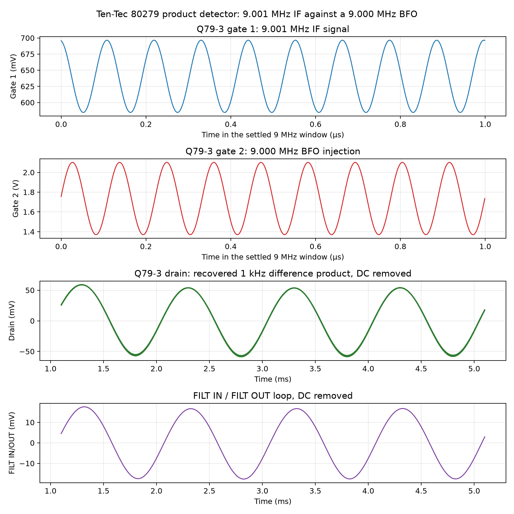
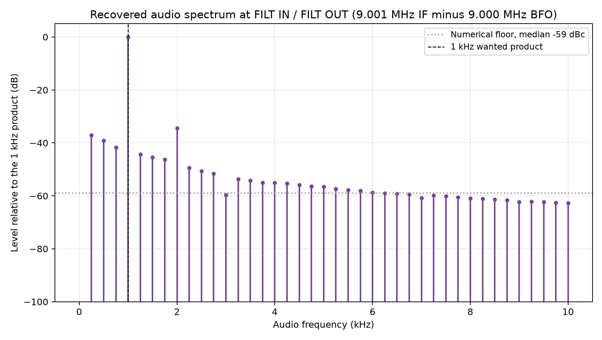
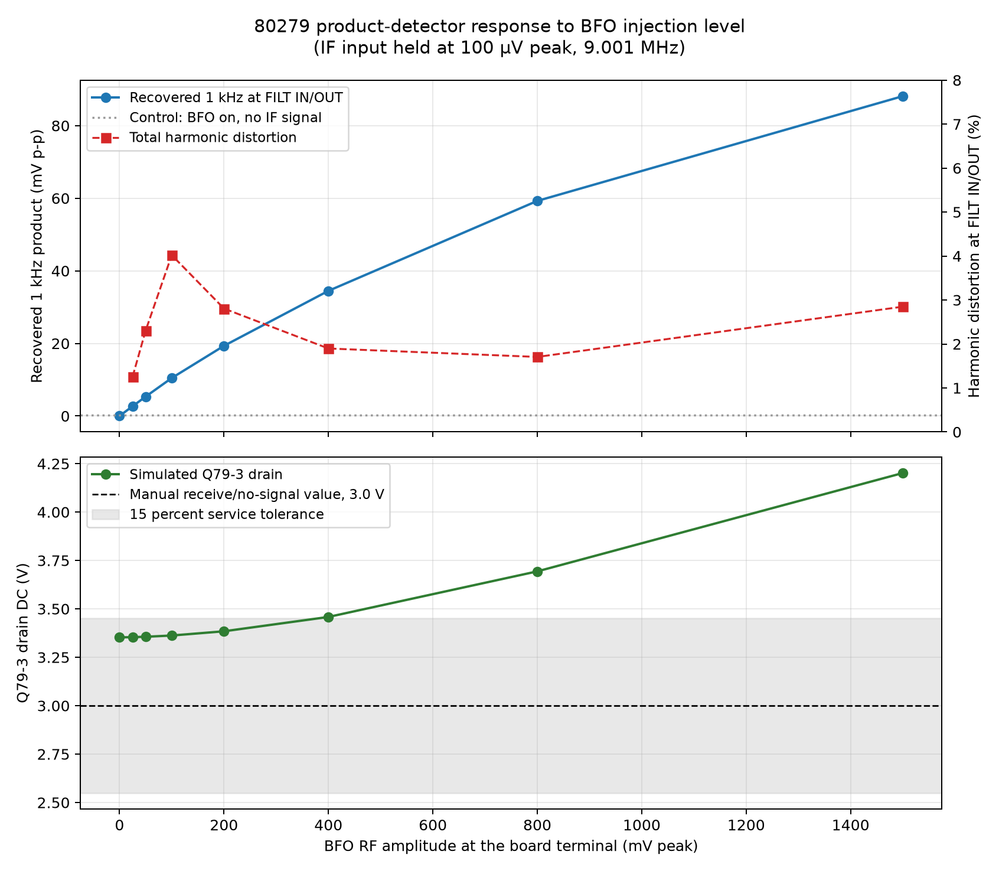

# 80279 Simulation 4: product detector and audio recovery

## Question answered

Does Q79-3 mix the 9 MHz IF with the BFO and recover the expected audio
difference frequency?

## Circuit and expected behavior

T79-2 applies the received IF to Q79-3 gate 1. C79-19 couples the BFO to gate
2. Q79-3 responds to both signals and produces their difference and sum
frequencies. R79-14/C79-17 reduce the remaining RF, C79-18 blocks the drain DC,
and the no-CW-filter jumper carries the recovered audio from `FILT IN` to
`FILT OUT`.

A 9.001 MHz IF and 9.000 MHz BFO should produce a 1 kHz difference tone. The
tone should become larger with BFO drive and should nearly disappear if either
RF input is removed.

## Reproduction

From the project root, with KiCad closed, run:

```powershell
python spice/tools/run_80279_product_detector.py
```

The script:

1. exports a fresh SPICE netlist from `80279_if_agc.kicad_sch` with KiCad 10;
2. verifies the expected Q79-3 wiring, transformer values, rails, and loads;
3. changes only the fixture source waveforms in disposable netlist copies;
4. runs ngspice 46 with `ngbehavior=ltpsa`;
5. rejects results whose Q79-3 gate-1 IF amplitude differs from Simulation 2
   by more than 3%; and
6. writes curated CSV evidence and figures in this directory.

The runner uses two transient windows per case. A 90-110 us window with a
1 ns maximum timestep measures RF amplitudes. A 1.1-5.1 ms window covers four
complete 1 kHz audio cycles and is resampled on a 0.2 us grid for audio and
spectrum measurements. The 1 ns internal timestep is necessary because 2 ns
understates the high-Q IF amplitude by about 3.6% and 5 ns by about 38%.

## Test cases

- Board input: 9.001 MHz, 100 uV peak, except for the no-IF control.
- BFO terminal: documented 6.5 V DC plus 0, 25, 50, 100, 200, 400, 800, or
  1,500 mV peak at 9.000 MHz.
- Nominal reporting case: 400 mV peak BFO.
- Control: 400 mV peak BFO with the IF source turned off.
- Receive rails and loads: the schematic-native Simulation 1 fixture.
- Filter loop: `FILT IN` jumpered to `FILT OUT`.

The 100 uV IF level, BFO RF sweep, and 400 mV nominal point are simulation
choices. The manual documents the BFO's 6.5 V DC terminal value but not its RF
amplitude.

## Results

| BFO RF amplitude | Q79-3 G1 IF | Recovered 1 kHz at filter loop | Modeled THD |
|---:|---:|---:|---:|
| 0 | 112.240 mV p-p | 0.0195 mV p-p | Control floor; THD ratio is not meaningful |
| 25 mV peak | 112.240 mV p-p | 2.690 mV p-p | 1.255% |
| 50 mV peak | 112.240 mV p-p | 5.343 mV p-p | 2.305% |
| 100 mV peak | 112.240 mV p-p | 10.471 mV p-p | 4.021% |
| 200 mV peak | 112.240 mV p-p | 19.336 mV p-p | 2.806% |
| 400 mV peak | 112.240 mV p-p | 34.490 mV p-p | 1.897% |
| 800 mV peak | 112.222 mV p-p | 59.270 mV p-p | 1.706% |
| 1.5 V peak | 112.223 mV p-p | 88.137 mV p-p | 2.849% |

With 400 mV-peak BFO and no IF input, the residual fitted 1 kHz component was
0.307 mV peak-to-peak. The nominal wanted result is therefore about 112 times
larger than this control. With the BFO removed, it is about 1,765 times larger
than the residual fitted component.

At the nominal point, Q79-3's drain contained 112.352 mV peak-to-peak at
1 kHz. The filter loop contained 34.490 mV peak-to-peak, its second harmonic
was 0.649 mV peak-to-peak, and modeled total harmonic distortion through the
fifth harmonic was 1.897%. Q79-3 drain DC was 3.458 V, 15.3% above the
manual's 3.0 V receive/no-signal service value and just outside the project's
informal 15% comparison band. The comparison is contextual rather than a
failure because this case applies both IF and BFO RF drive, unlike the
manual's no-signal voltage condition.







## Assessment

**Functional pass.** The modeled detector produces the predicted 1 kHz
difference signal, requires both RF inputs, and produces more recovered audio
as BFO drive increases. The gate-1 IF level agrees with Simulation 2 within
about 1%, supporting the transient timestep and tuned-path convergence.

This does not establish original-board conversion gain, distortion,
compression, or BFO injection amplitude. T79-1/T79-2 use fitted values, the
RCA 40823 model is empirical, and the input level is a test choice. Hardware
measurements are required before treating these amplitudes as Ten-Tec
performance specifications.

## Retained evidence

See `manifest.csv` for the complete list. The principal machine-readable file
is `data/80279-detector-sweep.csv`; the other CSV files retain the nominal RF
window, audio window, and audio spectrum. Disposable exported netlists, raw
ngspice data, and logs are under `spice/generated/80279-detector/`.
