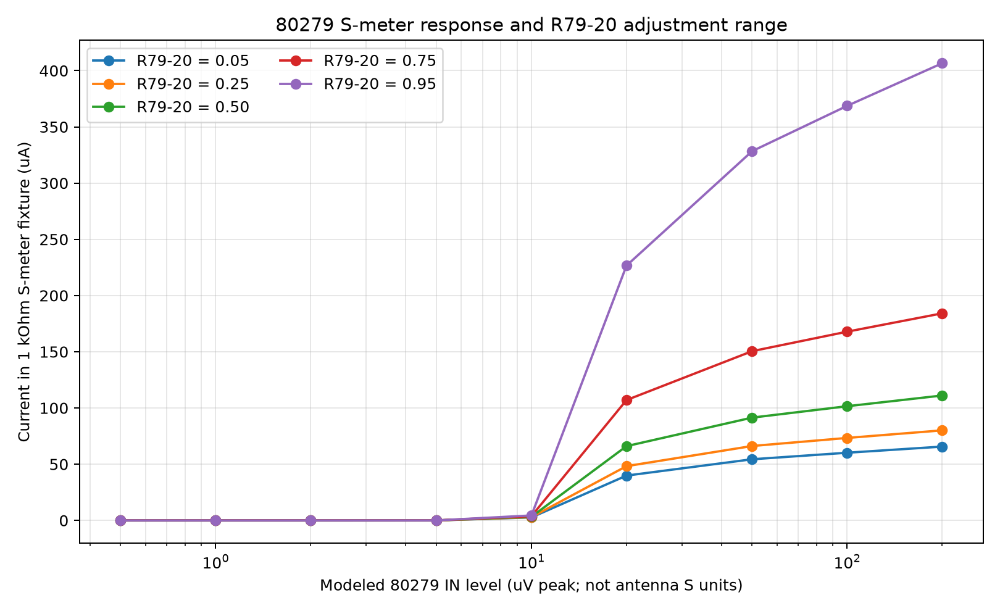
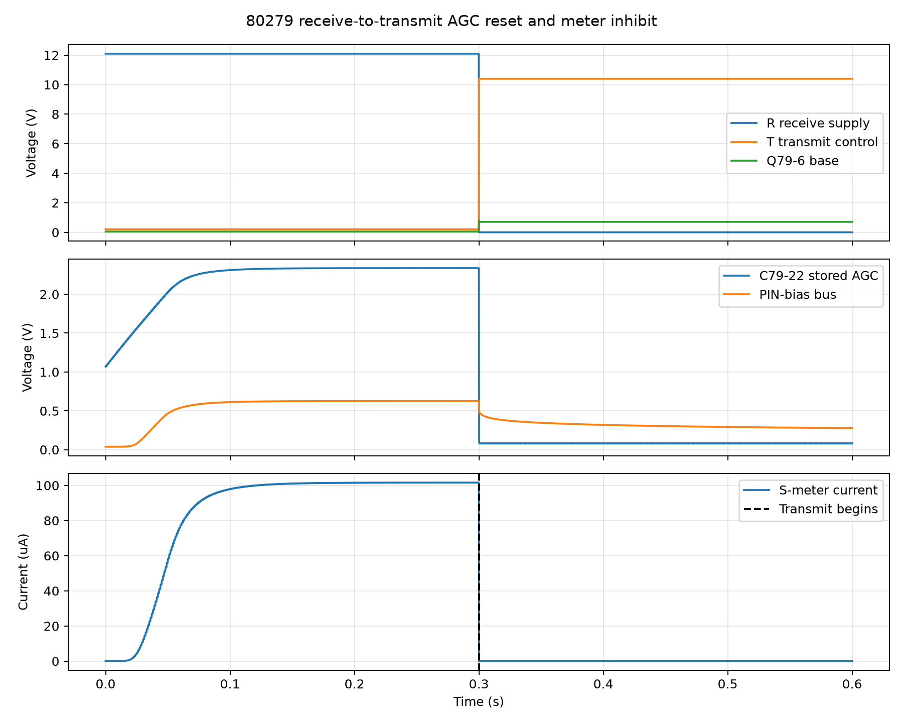

# 80279 Simulation 7: S-meter adjustment and transmit inhibit

## Question answered

Does the 80279 board make meter current rise with received-signal strength,
does R79-20 provide useful adjustment, and do Q79-6/D79-4 remove the receive
AGC and meter drive when the radio changes to transmit?

## Manual evidence

The board description on manual PDF page 32 / printed page 3-16 states that
the S meter is driven by the Q79-4/Q79-5 AGC Darlington during receive and is
disconnected during transmit by D79-4. The same page says R79-20 is adjusted
for S9 with a 50 uV signal at the **ANTENNA** terminal on 14.100 MHz. Manual
PDF page 13 / printed page 2-8 repeats the 50 uV antenna-level condition and
says the RF gain control must be fully clockwise.

The antenna condition is not the same as 50 uV at the 80279 `IN` pin. The RF
amplifier, receiver mixer, and eight-pole crystal filter lie between those
points and their combined gain/loss is not included in this study. Results
are therefore meter current versus modeled board input, never claimed S units.

## How the tested circuit works

Received audio is amplified by both IC1 sections and rectified by D79-6.
C79-22 stores the resulting AGC voltage. Q79-4 and Q79-5 amplify this control
current; their output feeds the PIN-diode bus through D79-5 and also feeds the
meter path through R79-20 and D79-4.

R79-20 is wired as an adjustable series resistance. It changes how much of
the available AGC current reaches the meter without being the element that
creates the AGC voltage. D79-4 passes receive meter current in one direction.

On transmit, `T` rises through R79-22 and turns on Q79-6. Q79-6 rapidly pulls
C79-22 toward ground, removing the stored receive AGC. At the same time `R`
falls to zero, removing receive bias from Q79-1 and Q79-2. The Q79-4/Q79-5
meter drive disappears, and D79-4 isolates this receive path from the meter
circuit used for transmit SWR indication elsewhere in the radio.

## Reproduction

With KiCad closed, run from the project root:

```powershell
python spice/tools/run_80279_s_meter_tx.py
```

The runner exports `80279_if_agc.kicad_sch` afresh. It reuses the sources in
the red **SIMULATION ONLY** box and alters them only in disposable netlists
below `spice/generated/80279-s-meter-tx/`.

The multi-second test uses the Simulation 4 product-detector scale and the
Simulation 3 attenuation-versus-PIN-bias curve, as established for Simulation
6. The actual IC1, D79-6, C79-22, Q79-4/Q79-5, Q79-6, D79-5, R79-20, D79-4,
PIN-bias, and 1 kOhm meter-load circuits remain in the simulation.

For the meter sweep, modeled 80279 input is increased through 0.5, 1, 2, 5,
10, 20, 50, 100, and 200 uV peak. Each level is held for 350 ms and measured
over the final 50 ms. R79-20 positions 0.05, 0.25, 0.50, 0.75, and 0.95 are
run separately.

For the switching test, a 100 uV-peak modeled board input first establishes a
strong receive state. At 300 ms, the documented supplies change together from
`R=12.1 V`, `T=0.2 V` to `R=0 V`, `T=10.4 V` while the signal remains applied.

A separate DC cross-check reuses red-box source V79-SIM5 to hold the external
`S MTR` terminal at 1 V in the transmit state. It checks whether D79-4 prevents
that transmit-side voltage from feeding backward into the receive AGC path.

## S-meter sweep results

At the saved R79-20 midpoint:

| Modeled 80279 `IN` | Meter-fixture current | C79-22 | One PIN branch |
|---:|---:|---:|---:|
| 1 uV peak | 0.00087 uA | 1.079 V | approximately 0 |
| 10 uV peak | 3.270 uA | 1.540 V | 0.00064 uA |
| 20 uV peak | 66.054 uA | 2.090 V | 1.764 uA |
| 50 uV peak | 91.424 uA | 2.267 V | 11.853 uA |
| 100 uV peak | 101.567 uA | 2.336 V | 22.977 uA |
| 200 uV peak | 111.092 uA | 2.402 V | 39.520 uA |

The meter current rises monotonically, but increasingly strong signals cause
smaller changes because the AGC loop is simultaneously reducing IF gain. That
compression is why an S meter can cover a broad signal range.

At the 100 uV-peak modeled board test level, R79-20 changes meter current from
60.20 uA at position 0.05 to 368.68 uA at position 0.95, a 6.12-to-1 range.
C79-22 changes only from 2.335 to 2.345 V across those settings, and per-branch
PIN current changes by less than 1%. R79-20 therefore has strong authority over
the meter indication without materially changing AGC action in this test.



The horizontal axis is modeled voltage at the 80279 board input, not the radio
antenna. The vertical axis is current through the 1 kOhm meter fixture. Each
curve is one R79-20 setting.

## Receive-to-transmit results

| Measurement | Receive | Transmit |
|---|---:|---:|
| `R` / `T` lines | 12.1 / 0.2 V | 0 / 10.4 V |
| Q79-6 base | 0.047 V | 0.707 V |
| C79-22 stored AGC | 2.336 V | 0.0805 V |
| PIN-bias bus | 0.626 V | 0.285 V |
| One PIN branch | 22.96 uA | 0.00627 uA |
| Meter-fixture current | 101.56 uA | effectively zero |

C79-22 completes 90% of its receive-to-transmit fall in 168 us. Meter current
falls to the model's femtoampere leakage floor, while PIN current falls by more
than three thousand times. The strong envelope source remains applied, so the
collapse is caused by the documented T/R control action rather than removal of
the test signal.



The top plot shows the commanded R and T states and Q79-6 turning on. The
middle plot shows stored AGC and PIN bias collapsing. The lower plot shows the
receive meter current disappearing at the transmit edge.

With 1.000 V applied externally to `S MTR` in the separate transmit-state
check, D79-4's board-side anode remains at 3.01 uV. The diode has nearly 1 V
reverse bias, C79-22 remains reset at 0.0806 V, and the settled PIN-bias bus is
0.0000006 V. The external meter voltage therefore does not back-feed the
receive AGC circuit in this model.

## Assessment and limits

**Functional pass with factory-calibration qualification.** Modeled meter
current rises with signal level, R79-20 provides substantial adjustment while
barely disturbing the AGC loop, and the documented transmit state turns on
Q79-6, resets C79-22 rapidly, removes PIN current, and disconnects receive
meter drive. The independent 1 V reverse-bias check confirms D79-4 isolation.

This is not a completed S9 calibration. The study does not include the
antenna-to-80279 transfer or the original meter movement's full-scale current,
ballistics, scale law, and chassis transmit-meter switching. The 168 us reset
and all absolute currents depend on empirical semiconductor models and retain
the Q79-5 low-current caveat. They are model predictions, not Ten-Tec factory
specifications.

## Retained evidence

`manifest.csv` lists the curated files:

- `data/80279-s-meter-sweep.csv`
- `data/80279-receive-to-transmit.csv`
- `data/80279-sim7-summary.csv`
- `figures/80279-s-meter-sweep.png`
- `figures/80279-receive-to-transmit.png`

Disposable netlists, logs, and raw data remain under
`spice/generated/80279-s-meter-tx/`.
